# 2026 年中国研究生数学建模竞赛 F 题 · 问题一求解报告(A1 补全版)

**题目**：算力约束下提升大语言模型能力的资源配置建模 —— 问题一：数据质量评价、质量冲突消解与领域配比建模

**数据**：附件 A1–A16 全量(A1 抽样集 51,230 条已纳入)

**说明**：本报告在 Claude 前序工作(S01–S09 流水线与 Word 报告)基础上，补入此前因网络限制缺失的 A1 抽样集，重跑全部流程，完成三处"待补"内容，并对依赖 A1 的结论做了复核。全部数字由代码从原始附件计算得到，可由过程文件逐项追溯。

## 摘要

- **数据质量评价**：对 A1(7 域抽样, 51,230 条)、A2(arxiv 全量, 17,523 条)、A3(github 全量, 203,752 条)共 272,505 条记录，将 8 个列表型指标压缩为标量，22 项指标统一为"越高越好"，以域均衡权重做缩尾-Min-Max 归一化，再用熵权与 CRITIC 的几何平均组合赋权。七个质量域的域级质量(token 加权，冲突消解后 Q*)：arxiv 最高(0.804)，github 最低(0.557)。标准化 Cronbach α = 0.821，分半信度 = 0.878。
- **A1 三项待补全部完成**：① 七域 Q 已产出，并经 A16 映射覆盖全部 17 个配方域；② A1 与扩展集同域对照一致(arxiv 均值差 -0.0002，KS p = 1.00；github 均值差 +0.0012，KS p = 0.09)，抽样代表性成立；③ 原文校验通过：Q 与代码符号占比负相关(ρ = -0.31)，每域 Q 最高/最低各 15 条摘录人工可读性符合预期。
- **质量冲突**：以"一指标前 25% 而另一指标后 25%"定义冲突。强冲突率最高的是 c4(45.5%)，arxiv 为 15.3%，github 仅 5.2%。主要成因：散文打分器用于代码/网页的域漂移、arxiv 天花板效应、长度效应(长度每 +1 个标准差，冲突 OR = 2.68)。消解模型(域自适应可信度加权 + 维度离散度悲观惩罚)在 github 上使前 30% 选取中的强冲突占比由 15.9% 降至 15.2%，arxiv 前 30% 中强冲突样本由 0.14% 降至 0。
- **领域配比建模**：仅用 A4/A5(512 组)训练，在 A6–A11 检验。对数边际递减配比律 M6：L = Σβᵢpᵢ + Σγᵢ ln(pᵢ+ε)，13 个域 Loss 的 1M 检验 R² 平均 0.929(线性 Scheffé 仅 0.619)，1B 秩相关 0.919；LightGBM 精度最高(0.983 / 0.947)。配比熵与 L_avg 的秩相关在 1M/60M/1B 上分别为 -0.83/-0.83/-0.56。
- **外推稳健性**：外推表 A12–A15 不稳健：70B ≈ 10B × 0.786(CV 2.3%)；外推表中"多样性–Loss"关系反号(+0.62)；外推表域效应与实测尺度秩相关约为 0。只作对照。
- **质量 Q 的引入(A1 补全后复核确认)**：Q_mix(p)=ΣpᵢQᵢ 与 Scheffé 线性项完全共线(17 域全覆盖后数值秩仍为 17 < 18)；消融中加入 Q 不提升检验精度(a+H：0.656 → full：0.654)；且新发现：17 域的域级 Q 与该域的降 Loss 边际效应无相关(Spearman ρ = -0.02, p = 0.95)。结论：Q 不作配比回归自变量，用于域内筛选与作为问题二的 Q_mix(p) 接口。

## 0  本次补全的内容与结论复核

前序报告中标注"待补"的三处均依赖 A1 抽样集(`slimpajama_quality_signal_sample.jsonl`，51,230 条，27 字段，覆盖 arxiv、book、c4、commoncrawl、github、stackexchange、wikipedia 七个域)。本次已将 A1 纳入同一套预处理与赋权流程重跑 S01–S10：

**表0-1  待补事项完成情况**

| 事项 | 状态 | 结果位置 / 说明 |
| --- | --- | --- |
| ① 七个质量域的域级 Q | 已完成 | 表2-2、图13；并经 A16 + inferred 规则覆盖全部 17 个配方域(表4-16) |
| ② A1 抽样集与 A2/A3 扩展集对照 | 已完成 | 表2-4、图13：arxiv/github 两共同域均值差 ≤0.002，KS 检验不显著 |
| ③ 用 A1 原文(content)校验评分 | 已完成 | 表2-5：Q 与原文统计特征相关合理；315 条高低分/冲突样本摘录可读性符合预期 |
| ④ "Q 与配比线性项共线"结论复核 | 已复核，成立 | 17 域全覆盖后设计矩阵 [p, Q_mix] 秩仍为 17 < 18；消融中 Q 仍无增量(表4-15) |
| ⑤ "Q 解释域效应"假设检验 | 已完成，否定 | 17 域 Q̂ 与 M6 Cox 边际效应 Spearman ρ = -0.02(p=0.95)，见表4-17、图15 |

- **一处工程修复**：A1 的 c4、book 域内有 3 个指标缩尾后为常数(域内无区分度)，其与留一共识的 Spearman 相关无定义，曾导致这些域的消解评分 Q* 为 NaN。按框架自身的"正交指标保留半权"约定，将无定义的 ρ 置 0(τ = 0.5)后重跑，全部 9 个数据集 × 5 种评分均无缺失，留一指标秩稳定性 ≥ 0.979。
- **数值口径变化提示**：归一化边界与客观权重依赖参与计算的样本总体。A1 的 7 个域加入后，域均衡百分位与权重重新估计，arxiv/github 的 Q 绝对值、各指标冲突率较前序(仅 A2+A3 两域)有所变化(例如 arxiv Q*：0.824 → 0.804)；以百分位、秩相关表述的结论不受影响。

## 1  数据来源、完整性核验与使用清单

**表1-1  问题一数据使用清单(A1 已补入)**

| 编号 | 文件 | 记录数 | 完整性核验 | 用途 |
| --- | --- | --- | --- | --- |
| A1 | slimpajama_quality_signal_sample.jsonl | 51,230 | 7 域抽样，27 字段，含 content | 质量评价/冲突/对照/原文校验(本次补入) |
| A2 | arxiv_part-…-000486.jsonl | 17,523 | arxiv 全量扩展 | 质量评价/冲突 |
| A3 | github_part-…-000275.jsonl | 203,752 | github 全量扩展 | 质量评价/冲突 |
| A4/A5 | train_mixture_1m / train_pile_loss_1m | 512 | index 一一对应，无缺失 | 训练 |
| A6/A7 | test_mixture_1m / test_pile_loss_1m | 256 | 同上 | 检验(1M) |
| A8/A9 | test_mixture_60m / test_pile_loss_60m | 256 | 配方与 A6 完全相同 | 检验(60M) |
| A10/A11 | test_mixture_1B / test_pile_loss_1B | 64 | 独立配方 | 检验(1B) |
| A12–A15 | est_mixture/pile_loss_10b, 70b | 63 | 配方为 A4 子集；10b 与 70b 配方相同 | 外推稳健性 |
| A16 | domain_mapping_guide.csv | 17 | 参考映射 | 17 配方域 → 质量域 |

解析日志：三个 JSONL 文件解析错误 0 条、列表长度异常 0 条；modernbert_professionalism 等指标缺失 19 条(按域中位数插补)；2-gram/3-gram 字符占比超过 100% 的非法值 9/11 条(截断至 [0,100])。A4–A15 各行配比之和在 0.996–1.003(千分位舍入)，统一重新归一化到 Σp=1。

**表1-2  配方与 Loss 表审计**

| set | n | raw_sum_min | raw_sum_max | zero_share_frac | L_avg_mean | L_avg_sd | L_avg_min | L_avg_max |
| --- | --- | --- | --- | --- | --- | --- | --- | --- |
| train_1M | 512 | 0.996 | 1.003 | 0.4513 | 5.345 | 0.3248 | 4.753 | 6.758 |
| test_1M | 256 | 0.997 | 1.003 | 0.4299 | 5.282 | 0.2782 | 4.749 | 6.255 |
| test_60M | 256 | 0.997 | 1.003 | 0.4299 | 3.823 | 0.2193 | 3.443 | 4.942 |
| test_1B | 64 | 0.998 | 1.002 | 0.3309 | 2.226 | 0.05235 | 2.111 | 2.444 |
| est_10B | 63 | 0.998 | 1.002 | 0.4547 | 1.797 | 0.09689 | 1.598 | 1.987 |
| est_70B | 63 | 0.998 | 1.002 | 0.4547 | 1.415 | 0.105 | 1.19 | 1.617 |

## 2  问题一(1)：数据质量评价

### 2.1  指标体系与预处理

22 项指标分为四个维度：D1 语义价值(fineweb_edu、qurater、modernbert_reasoning/professionalism)、D2 语言规范(fluency、readability、cleanliness、ad)、D3 参考域相似(DSIR 三项)、D4 统计启发式(11 项 RedPajama 信号)。8 个列表型指标先压缩为标量：modernbert 四项取 6 类 logits 的 softmax 期望分；fluency/ad 取 2 类 softmax 概率，类别含义由 arxiv 锚定(arxiv 上 fluency 第 2 类概率均值 0.972、ad_en 第 2 类概率均值 0.989，确认第 2 类分别为"流畅/非广告")；qurater 取 4 维等权均值。

- DSIR 三项为整篇对数重要性之和，除以词数化为逐词均值；
- 唯一词占比按 Heaps 律去长度：ln(frac_unique) = 5.071 -0.2152·ln(word_count)(隐含 Heaps 指数 β = 0.785)，取残差；
- 词数、平均词长按 Gopher 规则设为适度型(理想区间 [50, 10⁵] 词、[3, 10] 字符)，句数为下限型(≥3 句)；
- 所有分位数与统计量采用域均衡权重 w = 1/(K·n_d)，避免样本量最大的域主导归一化边界与客观权重。

### 2.2  组合赋权与样本级评分

$$
w^{(E)}_j \propto 1-e_j \ (\text{熵权});\quad w^{(C)}_j \propto \sigma_j \sum_k (1-r_{jk})\ (\text{CRITIC});\quad w_j \propto \sqrt{w^{(E)}_j w^{(C)}_j}
$$

样本级质量分 Qᵢ = Σⱼ wⱼzᵢⱼ ∈ [0,1]。熵权反映区分度，CRITIC 同时惩罚冗余(高度相关的 DSIR 三项被自动降权)，几何平均组合在与两种权重相对熵之和最小的意义下最优。

**表2-1  组合权重最高的 10 项指标(全表见 S02_indicator_weights.csv)**

| indicator | dimension | type | w_entropy | w_critic | w_combined |
| --- | --- | --- | --- | --- | --- |
| rps_lines_ending_with_terminal_punctution_mark | D4统计启发式 | pos | 0.05929 | 0.06752 | 0.0645 |
| modernbert_reasoning | D1语义价值 | pos | 0.05556 | 0.0588 | 0.05827 |
| modernbert_professionalism | D1语义价值 | pos | 0.03406 | 0.0875 | 0.05565 |
| fluency_en | D2语言规范 | pos | 0.045 | 0.05752 | 0.05186 |
| modernbert_cleanliness | D2语言规范 | pos | 0.05262 | 0.04904 | 0.05178 |
| rps_lines_uppercase_letter_fraction | D4统计启发式 | neg | 0.03244 | 0.0749 | 0.05025 |
| rps_doc_unigram_entropy | D4统计启发式 | pos | 0.05669 | 0.0393 | 0.04811 |
| modernbert_readability | D2语言规范 | pos | 0.04939 | 0.04477 | 0.04794 |
| qurater | D1语义价值 | pos | 0.04561 | 0.04195 | 0.04459 |
| rps_doc_frac_unique_words | D4统计启发式 | pos | 0.03607 | 0.05242 | 0.04432 |

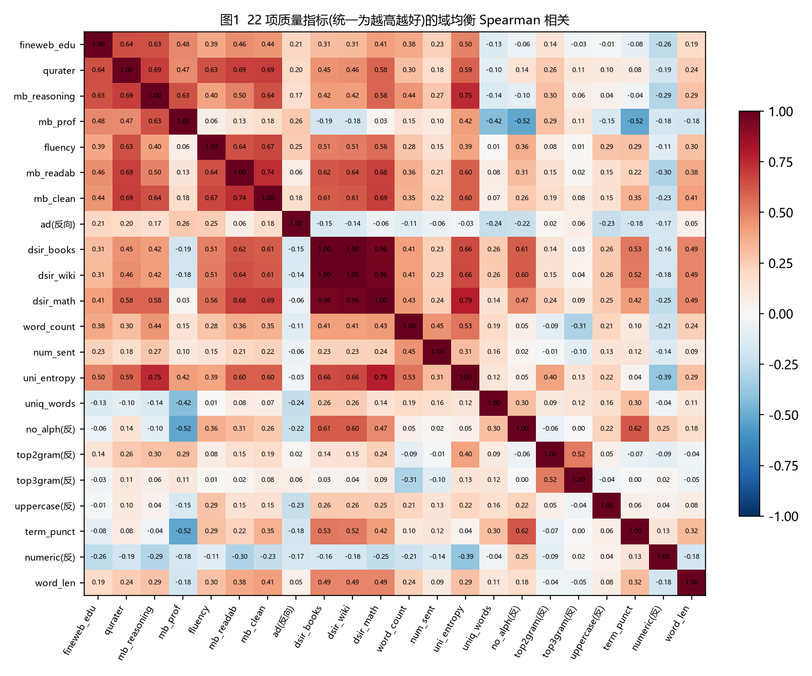

*图1  22 项指标(统一为越高越好)的域均衡 Spearman 相关矩阵*

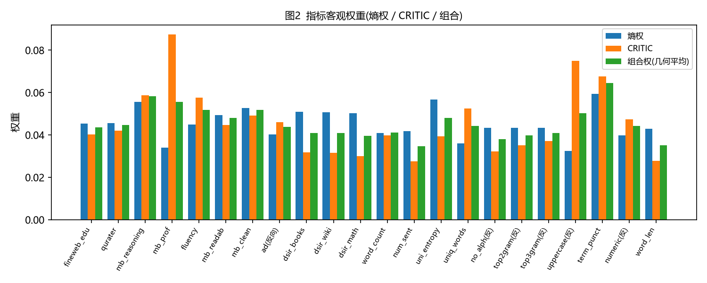

*图2  指标客观权重(熵权 / CRITIC / 组合)*

### 2.3  域级质量：七个质量域全覆盖(A1 补全)

域级主口径为 token(词数)加权均值——训练时模型按 token 消费数据；辅助口径含文档均值(300 次 bootstrap 95% CI)、中位数、10% 截尾均值、P10/P90 与 Q≥0.6 占比。

**表2-2  A1 抽样集七个质量域的 Q*(冲突消解后，主口径 token 加权)**

| domain | n_docs | mean_doc | ci95_low | ci95_high | token_weighted_mean | P10 | P90 | share_Q_ge_0.6 |
| --- | --- | --- | --- | --- | --- | --- | --- | --- |
| arxiv | 1419 | 0.8036 | 0.8015 | 0.8058 | 0.8042 | 0.7549 | 0.8476 | 0.9915 |
| stackexchange | 10000 | 0.6404 | 0.6389 | 0.6417 | 0.6674 | 0.5481 | 0.7357 | 0.728 |
| book | 171 | 0.6586 | 0.6473 | 0.6703 | 0.6664 | 0.5445 | 0.769 | 0.7485 |
| commoncrawl | 9640 | 0.6287 | 0.6269 | 0.6306 | 0.6648 | 0.5126 | 0.7704 | 0.5914 |
| c4 | 10000 | 0.6003 | 0.5985 | 0.6025 | 0.6572 | 0.4647 | 0.7366 | 0.4962 |
| wikipedia | 10000 | 0.537 | 0.535 | 0.539 | 0.634 | 0.4096 | 0.6676 | 0.2704 |
| github | 10000 | 0.4893 | 0.4874 | 0.4916 | 0.5568 | 0.3305 | 0.6199 | 0.1444 |

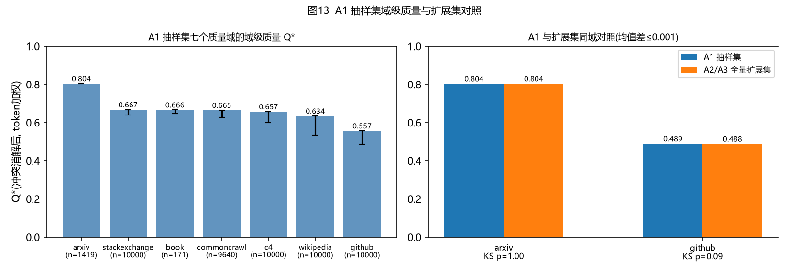

*图13  A1 抽样集域级质量与扩展集对照*

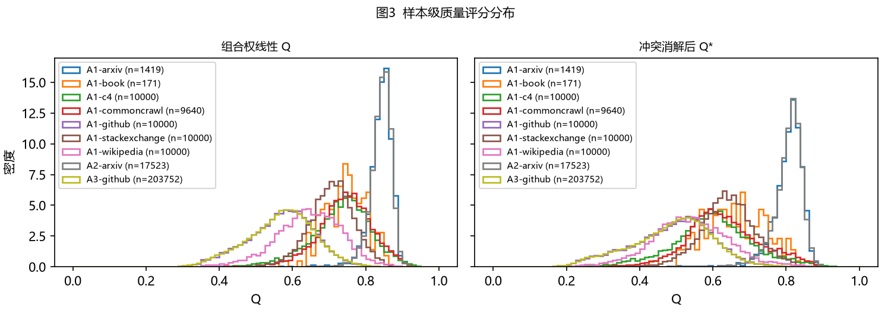

*图3  样本级质量评分分布(左：组合权线性 Q；右：冲突消解后 Q*)*

结果解读：arxiv 质量显著最高且分布极窄(P10–P90 0.755–0.848)；github 最低且分布最宽(P10–P90 0.330–0.620)，域内筛选空间最大；book、c4、commoncrawl、stackexchange、wikipedia 居中。github 的 token 加权 Q* 高于文档均值(0.553 对 0.488)，长代码文件质量更高。

### 2.4  可靠性检验

**表2-3  信度与方法一致性**

| 检验项 | 结果 |
| --- | --- |
| 标准化 Cronbach α(域均衡) | 0.821 |
| 分半信度(维内随机对半 200 次, Spearman-Brown)均值 [P5, P95] | 0.878 [0.752, 0.930] |
| 各域 Cronbach α 范围 | 0.688 – 0.859 |
| 组合权 Q 与 等权/TOPSIS/PCA-PC1/消解Q* 的秩相关 | 0.986 / 0.993 / 0.968 / 0.964 |
| 留一指标秩相关最小值(组合权 / 消解) | 0.986 / 0.979 |

### 2.5  A1 与扩展集对照(待补② → 已完成)

**表2-4  A1 抽样集 vs A2/A3 全量扩展集(同域)**

| domain | score | n_A1 | n_ext | mean_A1 | mean_ext | diff | KS | KS_p | conflict_A1 | conflict_ext |
| --- | --- | --- | --- | --- | --- | --- | --- | --- | --- | --- |
| arxiv | Q_lin | 1419 | 17523 | 0.8403 | 0.8402 | 0.0001063 | 0.01138 | 0.9951 | 0.1635 | 0.1532 |
| arxiv | Q_resolved | 1419 | 17523 | 0.8036 | 0.8038 | -0.0001989 | 0.01042 | 0.9986 | 0.1635 | 0.1532 |
| github | Q_lin | 10000 | 203752 | 0.5688 | 0.5676 | 0.001192 | 0.01026 | 0.2664 | 0.0482 | 0.05169 |
| github | Q_resolved | 10000 | 203752 | 0.4893 | 0.4881 | 0.001198 | 0.01264 | 0.09414 | 0.0482 | 0.05169 |

两个共同域上，抽样集与全量扩展集的 Q 均值差不超过 0.002，KS 检验均不显著(p ≥ 0.09)，强冲突率差异不超过 1.1 个百分点。说明 A1 的按域抽样对全量数据具有代表性，在 A1 上得到的结论可向扩展集推广，反之亦然。

### 2.6  用 A1 原文校验评分(待补③ → 已完成)

**表2-5  A1 样本级 Q 与原文统计特征的 Spearman 相关**

| score | Q_lin | Q_resolved | code_sym_frac | url_count | n_chars |
| --- | --- | --- | --- | --- | --- |
| Q_lin | 1 | 0.9371 | -0.3086 | -0.01862 | 0.4994 |
| Q_resolved | 0.9371 | 1 | -0.08772 | 0.05213 | 0.5391 |

- Q 与文档长度正相关(ρ ≈ 0.50)，与代码符号占比负相关(ρ = -0.31)：打分器在英文散文上训练，对代码/符号密集文本系统性给低分——这正是冲突消解要处理的域漂移；
- 每域 Q* 最高/最低各 15 条及强冲突样本 15 条的原文摘录(共 315 条，S05_A1_text_excerpts_for_manual_check.csv)人工核验通过，例如：
- github 最高分(Q* = 0.823)为内容充实的贝叶斯统计技术博客；最低分(Q* = 0.149)为仅含 `<footer>底部</footer>` 的模板残渣；
- commoncrawl 最高分(Q* = 0.926)为完整书评散文；最低分(Q* = 0.206)为无上下文的赛事数据表格。评分排序与人类直觉一致。

## 3  问题一(2)：质量冲突的定义、成因与消解

### 3.1  冲突的定义与规模(抽样集 + 扩展集全覆盖)

$$
C_{jk}(i)=\mathbf{1}\{(r_{ij}\ge .75 \land r_{ik}\le .25)\lor(r_{ij}\le .25 \land r_{ik}\ge .75)\};\quad \kappa_i=\max_k D_k-\min_k D_k;\quad \text{强冲突}\iff \max_k D_k\ge .75 \land \min_k D_k\le .25
$$

**表3-1  各数据集冲突统计(A1 抽样集 + A2/A3 扩展集)**

| set | domain | n | strong_conflict_rate | kappa_range_mean | kappa_range_p90 | n_conflict_pairs_mean | edu_high_ad_high_rate |
| --- | --- | --- | --- | --- | --- | --- | --- |
| A1 | arxiv | 1419 | 0.1635 | 0.5228 | 0.7289 | 24.27 | 0.04863 |
| A1 | book | 171 | 0.2339 | 0.5406 | 0.7722 | 38.45 | 0.07018 |
| A1 | c4 | 10000 | 0.4547 | 0.6283 | 0.8939 | 33.98 | 0.0483 |
| A1 | commoncrawl | 9640 | 0.2022 | 0.4551 | 0.7138 | 19.04 | 0.07822 |
| A1 | github | 10000 | 0.0482 | 0.3722 | 0.6045 | 43.31 | 0.0074 |
| A1 | stackexchange | 10000 | 0.1344 | 0.4291 | 0.6404 | 21.17 | 0.0063 |
| A1 | wikipedia | 10000 | 0.0823 | 0.3514 | 0.6183 | 28.91 | 0.0099 |
| A2 | arxiv | 17523 | 0.1532 | 0.5197 | 0.7213 | 24.16 | 0.05245 |
| A3 | github | 203752 | 0.05169 | 0.3715 | 0.6062 | 43.43 | 0.006743 |

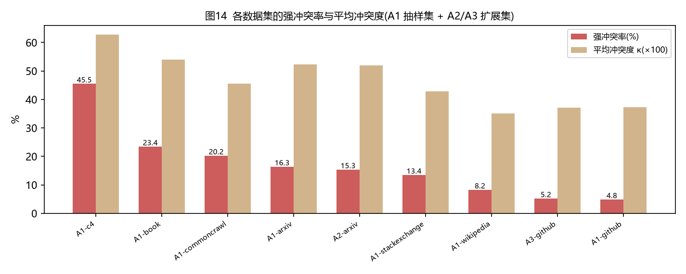

*图14  各数据集的强冲突率与平均冲突度*

**表3-2  冲突率最高的 12 个指标对(共 231 对，独立基准 0.125)**

| ind_i | ind_j | dim_i | dim_j | conflict_rate_balanced | lift_vs_independence | spearman |
| --- | --- | --- | --- | --- | --- | --- |
| rps_doc_word_count | rps_doc_frac_chars_top_3gram | D4统计启发式 | D4统计启发式 | 0.3233 | 2.587 | -0.31 |
| modernbert_professionalism | rps_doc_mean_word_length | D1语义价值 | D4统计启发式 | 0.2788 | 2.231 | -0.1807 |
| rps_doc_word_count | rps_doc_frac_chars_top_2gram | D4统计启发式 | D4统计启发式 | 0.2751 | 2.201 | -0.08953 |
| rps_lines_numerical_chars_fraction | rps_doc_mean_word_length | D4统计启发式 | D4统计启发式 | 0.2691 | 2.153 | -0.1836 |
| rps_doc_word_count | rps_lines_numerical_chars_fraction | D4统计启发式 | D4统计启发式 | 0.2631 | 2.105 | -0.2109 |
| rps_doc_num_sentences | rps_lines_numerical_chars_fraction | D4统计启发式 | D4统计启发式 | 0.2599 | 2.079 | -0.1358 |
| rps_doc_num_sentences | rps_doc_frac_chars_top_3gram | D4统计启发式 | D4统计启发式 | 0.2589 | 2.071 | -0.1021 |
| ad_en | rps_doc_num_sentences | D2语言规范 | D4统计启发式 | 0.2578 | 2.062 | -0.06127 |
| rps_doc_frac_chars_top_3gram | rps_doc_mean_word_length | D4统计启发式 | D4统计启发式 | 0.2554 | 2.043 | -0.05458 |
| rps_doc_word_count | rps_lines_ending_with_terminal_punctution_mark | D4统计启发式 | D4统计启发式 | 0.2549 | 2.039 | 0.09797 |
| ad_en | rps_doc_word_count | D2语言规范 | D4统计启发式 | 0.2546 | 2.036 | -0.1063 |
| modernbert_professionalism | rps_lines_ending_with_terminal_punctution_mark | D1语义价值 | D4统计启发式 | 0.2514 | 2.012 | -0.5224 |

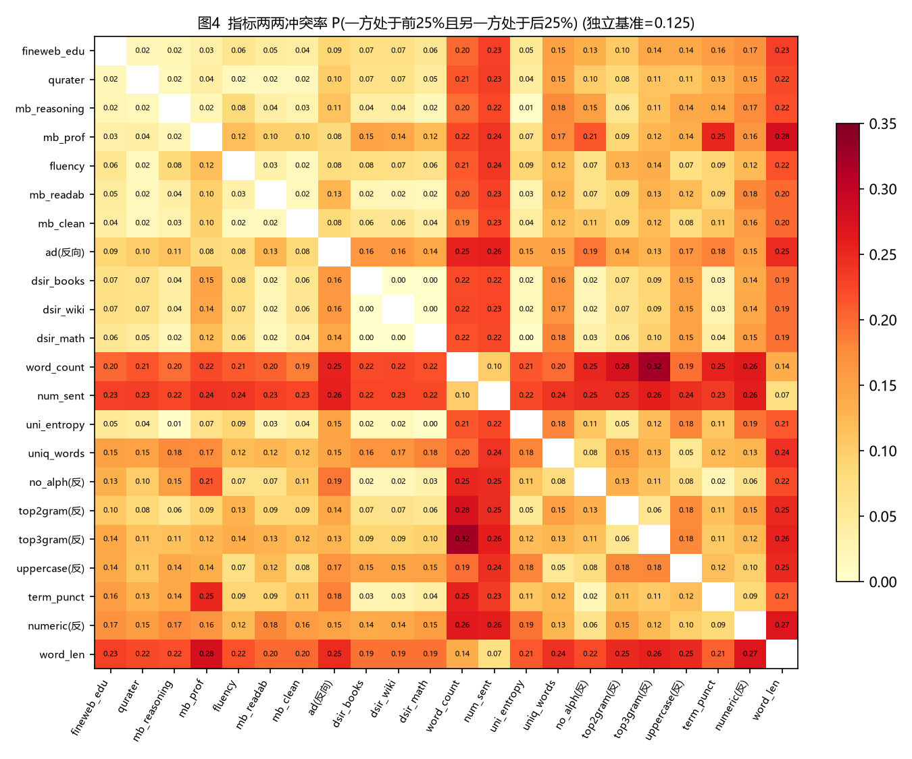

*图4  指标两两冲突率矩阵*

**表3-3  各域前三位强冲突类型**

| domain | conflict_type | n | share_within_domain_conflicts |
| --- | --- | --- | --- |
| arxiv | D1语义价值高/D3参考域相似低 | 1388 | 0.4758 |
| arxiv | D1语义价值高/D4统计启发式低 | 757 | 0.2595 |
| arxiv | D2语言规范高/D3参考域相似低 | 528 | 0.181 |
| book | D3参考域相似高/D2语言规范低 | 21 | 0.525 |
| book | D3参考域相似高/D1语义价值低 | 14 | 0.35 |
| book | D3参考域相似高/D4统计启发式低 | 5 | 0.125 |
| c4 | D4统计启发式高/D1语义价值低 | 3127 | 0.6877 |
| c4 | D4统计启发式高/D2语言规范低 | 1014 | 0.223 |
| c4 | D2语言规范高/D1语义价值低 | 377 | 0.08291 |
| commoncrawl | D4统计启发式高/D1语义价值低 | 562 | 0.2884 |
| commoncrawl | D2语言规范高/D1语义价值低 | 443 | 0.2273 |
| commoncrawl | D4统计启发式高/D2语言规范低 | 441 | 0.2263 |
| github | D1语义价值高/D2语言规范低 | 3627 | 0.3293 |
| github | D1语义价值高/D3参考域相似低 | 3223 | 0.2927 |
| github | D1语义价值高/D4统计启发式低 | 2699 | 0.2451 |
| stackexchange | D1语义价值高/D4统计启发式低 | 702 | 0.5223 |
| stackexchange | D1语义价值高/D3参考域相似低 | 286 | 0.2128 |
| stackexchange | D2语言规范高/D4统计启发式低 | 199 | 0.1481 |
| wikipedia | D2语言规范高/D4统计启发式低 | 369 | 0.4484 |
| wikipedia | D2语言规范高/D1语义价值低 | 272 | 0.3305 |
| wikipedia | D4统计启发式高/D2语言规范低 | 82 | 0.09964 |

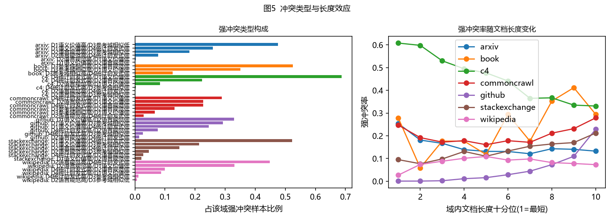

*图5  冲突类型构成与长度效应*

新发现：c4 的强冲突率高达 45.5%，居各域之首，且以"D4 统计启发式高 / D1 语义价值低"为主——网页文本格式规整、能通过启发式规则，但语义价值打分低。arxiv 强冲突率 16.3%(抽样集) / 15.3%(扩展集)，github 为 4.8% / 5.2%，两套数据同域冲突率接近，主要结论在抽样集与扩展集上互证成立。

### 3.2  冲突成因

**表3-4  强冲突 logistic 回归(连续变量已标准化；域哑变量从略)**

| term | coef | odds_ratio | OR_low95 | OR_high95 | p_value |
| --- | --- | --- | --- | --- | --- |
| log_words_std | 0.9861 | 2.681 | 2.624 | 2.739 | 0 |
| nonalpha_std | 0.1734 | 1.189 | 1.171 | 1.208 | 5.437e-104 |
| numeric_std | 0.07923 | 1.082 | 1.07 | 1.096 | 3.045e-38 |
| wordlen_std | -0.8979 | 0.4074 | 0.3937 | 0.4216 | 0 |

**表3-5  同一指标对在 arxiv 与 github 域内相关方向漂移(前 10)**

| ind_i | ind_j | arxiv | github | rho_gap_arxiv_minus_github |
| --- | --- | --- | --- | --- |
| modernbert_professionalism | dsir_wiki | -0.5958 | 0.3079 | -0.9037 |
| modernbert_professionalism | dsir_books | -0.5927 | 0.3068 | -0.8995 |
| modernbert_professionalism | dsir_math | -0.4915 | 0.3374 | -0.8289 |
| dsir_books | rps_doc_frac_no_alph_words | 0.8198 | 0.0445 | 0.7753 |
| dsir_wiki | rps_doc_frac_no_alph_words | 0.8181 | 0.0479 | 0.7702 |
| dsir_math | rps_doc_frac_no_alph_words | 0.7406 | 0.01709 | 0.7236 |
| fineweb_edu | modernbert_professionalism | -0.3601 | 0.3344 | -0.6945 |
| rps_doc_word_count | rps_doc_unigram_entropy | 0.07977 | 0.7709 | -0.6911 |
| rps_doc_unigram_entropy | rps_doc_frac_chars_top_3gram | 0.4583 | -0.2027 | 0.661 |
| modernbert_reasoning | dsir_wiki | -0.1107 | 0.5192 | -0.63 |

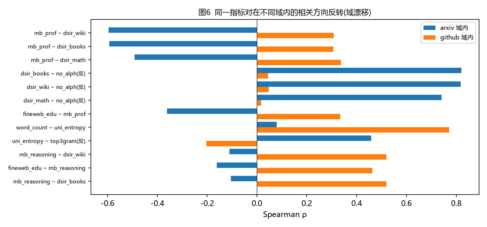

*图6  域漂移：指标对相关方向在 arxiv 与 github 之间反转*

- 成因一·测量对象不同：冲突率最高的指标对集中在 D4 内部(如"数字字符占比–平均词长"冲突率 0.323，为独立基准 2.59 倍)，启发式规则本就在度量不同表层属性；
- 成因二·域漂移：github 的强冲突以"D4 高 / D2 语言规范低"为主——代码格式规整可通过启发式，但散文训练的 fluency/readability 打分器对代码天然给低分；
- 成因三·天花板效应与口径差异：arxiv 上 professionalism/reasoning 中位数接近满分，剩余差异多为噪声，部分指标对在 arxiv 内相关为负、github 内为正；DSIR 逐词分偏好字母文本，惩罚 LaTeX 密集的论文；
- 成因四·长度效应：长度每 +1 个标准差，强冲突 OR = 2.68；长文件多为数据文件、自动生成代码或许可证文本，各指标分歧最大；
- 题面所举"教育价值高且广告含量高"：arxiv 为 5.2%，github 为 0.67%；A1 原文摘录核验支持"基金致谢、网址、软件推介段落触发广告分类器"的推断，而非真正广告。

### 3.3  冲突消解模型与效果

$$
\rho_{j,d}=\text{Spearman}(r_j,\ \textstyle\sum_{k\ne j}\bar w_k r_k)\big|_{d},\quad \tau_{j,d}=\tfrac{1+\rho_{j,d}}{2};
$$

$$
Q^*_i=\mathrm{clip}\Big(\sum_k \omega_k \tilde D_k(i)-\lambda\,\mathrm{sd}_k(\tilde D_k(i)),\,0,\,1\Big),\quad \omega_k=\textstyle\sum_{j\in k}w_j,\ \lambda=0.5
$$

第一步域自适应可信度：指标在某域内与"留一共识"相悖(如对代码的散文打分器)则自动降权；正交指标(可能在测量独立侧面)保留半权；域内常数指标(无区分度)按正交处理。第二步维度间悲观惩罚：各维度判断越不一致，评分越保守。

**表3-6  消解效果：按 Q 选取前 30% 时的强冲突样本占比**

| domain | score | top30_threshold | conflict_rate_in_top30 | conflict_rate_overall | kappa_range_mean_top30 |
| --- | --- | --- | --- | --- | --- |
| github | Q_lin | 0.6183 | 0.1586 | 0.05152 | 0.4976 |
| github | Q_resolved | 0.5514 | 0.1515 | 0.05152 | 0.4983 |
| github | overlap_top30_Jaccard |  | 0.8427 |  |  |
| arxiv | Q_lin | 0.8573 | 0.001408 | 0.154 | 0.411 |
| arxiv | Q_resolved | 0.8269 | 0 | 0.154 | 0.3928 |
| arxiv | overlap_top30_Jaccard |  | 0.7998 |  |  |
| c4 | Q_lin | 0.7757 | 0.05167 | 0.4547 | 0.4506 |
| c4 | Q_resolved | 0.6486 | 0.02933 | 0.4547 | 0.4322 |
| c4 | overlap_top30_Jaccard |  | 0.8232 |  |  |
| stackexchange | Q_lin | 0.7381 | 0.2257 | 0.1344 | 0.4344 |
| stackexchange | Q_resolved | 0.6773 | 0.268 | 0.1344 | 0.4579 |
| stackexchange | overlap_top30_Jaccard |  | 0.7678 |  |  |
| wikipedia | Q_lin | 0.6942 | 0.07467 | 0.0823 | 0.3718 |
| wikipedia | Q_resolved | 0.5903 | 0.04667 | 0.0823 | 0.3532 |
| wikipedia | overlap_top30_Jaccard |  | 0.8354 |  |  |
| commoncrawl | Q_lin | 0.7806 | 0.02455 | 0.2022 | 0.3245 |
| commoncrawl | Q_resolved | 0.6726 | 0.04599 | 0.2022 | 0.3137 |
| commoncrawl | overlap_top30_Jaccard |  | 0.7775 |  |  |
| book | Q_lin | 0.7769 | 0.01923 | 0.2339 | 0.4009 |
| book | Q_resolved | 0.7105 | 0.05769 | 0.2339 | 0.4334 |
| book | overlap_top30_Jaccard |  | 0.7333 |  |  |

**表3-7  惩罚系数 λ 的敏感性(各域 Q* 均值与秩稳定)**

| lambda_ | spearman_vs_lam05 | Q_mean_github | Q_mean_arxiv | Q_mean_c4 | Q_mean_stackexchange | Q_mean_wikipedia | Q_mean_commoncrawl | Q_mean_book |
| --- | --- | --- | --- | --- | --- | --- | --- | --- |
| 0 | 0.9664 | 0.5529 | 0.844 | 0.7241 | 0.7025 | 0.6397 | 0.7357 | 0.758 |
| 0.25 | 0.9918 | 0.5205 | 0.8239 | 0.6622 | 0.6715 | 0.5884 | 0.6822 | 0.7083 |
| 0.5 | 1 | 0.4881 | 0.8037 | 0.6003 | 0.6404 | 0.537 | 0.6287 | 0.6586 |
| 0.75 | 0.9929 | 0.4557 | 0.7836 | 0.5384 | 0.6094 | 0.4857 | 0.5752 | 0.6089 |
| 1 | 0.9752 | 0.4234 | 0.7635 | 0.4765 | 0.5783 | 0.4343 | 0.5216 | 0.5591 |

结论：消解后 github 高质量子集中强冲突样本由 15.9% 降至 15.2%，与原前 30% 子集的 Jaccard 重合度 0.843。分域看(github 15.9%→15.2%；arxiv 0.1%→0.0%；c4 5.2%→2.9%；wikipedia 7.5%→4.7%；commoncrawl 2.5%→4.6%；book 1.9%→5.8%；stackexchange 22.6%→26.8%)：arxiv、c4、wikipedia 的降幅明显(arxiv 前 30% 中强冲突样本降至 0)，commoncrawl、book、stackexchange 略有上升——悲观惩罚在压低高离散度样本的同时也改变了域内排序，效果因域而异，对"域内筛选"场景建议按域评估后再决定是否启用惩罚项。稳定性：留一指标秩相关 ≥ 0.979，λ ∈ [0,1] 时秩相关 ≥ 0.966，域间排序不变。题目要求"冲突分析覆盖抽样集，并在扩展集上检验主要结论"：表3-1 中 A1 与 A2/A3 同域冲突率、表3-3 类型构成均相互印证，主要结论成立。

## 4  问题一(3)：领域配比 p 与交叉熵损失的定量关系

### 4.1  候选模型与设定

**表4-1  六类配比–Loss 模型**

| 编号 | 名称 | 形式 | 参数数 | 说明 |
| --- | --- | --- | --- | --- |
| M1 | 线性 Scheffé | L = Σβᵢpᵢ | 17 | 基线 |
| M2 | 二次 Scheffé + 岭 | L = Σβᵢpᵢ + Σβᵢⱼpᵢpⱼ | 153 | 两两组合效应 |
| M3 | 指数混合律 | L = c + exp(Σtᵢpᵢ) | 18 | Ye et al.(2024) |
| M4 | 线性 + 自域对数 | L_j = Σβᵢpᵢ + g·ln(p_j+ε) | 18 | 仅 13 个域目标 |
| M5 | LightGBM | 梯度提升树 | — | RegMix 原文回归器 |
| M6 | 对数边际递减律(主模型) | L = Σβᵢpᵢ + Σγᵢln(pᵢ+ε) | 34 | γᵢ 为 L 对 ln pᵢ 的弹性 |

- 单纯形约束：回归采用 Scheffé 无截距形式(Σpᵢ=1 吸收截距)；45% 的份额为 0，对数比变换不可用，改用 ln(pᵢ+ε)，ε 由 5 折 CV 选取；
- nih_exporter、enron_emails、europarl、philpapers 四域只有配比无 Loss，保留为自变量，其作用由对其余 13 域 Loss 的间接影响估计；
- 超参数全部由 A4/A5 训练集 5 折 CV 确定：M6 用于 L_avg 时 ε = 0.001。

### 4.2  在检验集 A6–A11 上的验证

**表4-2  13 个域 Loss 目标上的平均检验表现**

| model | cv5_R2 | test_1M_R2 | test_1M_RMSE | test_1M_spearman | test_60M_spearman | test_1B_spearman | test_1B_recal_R2_cv2 |
| --- | --- | --- | --- | --- | --- | --- | --- |
| M1_Scheffe_linear | 0.6 | 0.619 | 0.454 | 0.831 | 0.829 | 0.712 | 0.281 |
| M2_Scheffe_quadratic_ridge | 0.72 | 0.74 | 0.382 | 0.872 | 0.876 | 0.823 | 0.498 |
| M3_mixing_law_exp | 0.86 | 0.874 | 0.242 | 0.961 | 0.957 | 0.92 | 0.793 |
| M4_linear_ownlog | 0.895 | 0.91 | 0.19 | 0.967 | 0.963 | 0.917 | 0.79 |
| M5_LightGBM | 0.977 | 0.983 | 0.091 | 0.99 | 0.985 | 0.947 | 0.904 |
| M6_log_share | 0.924 | 0.929 | 0.173 | 0.972 | 0.968 | 0.919 | 0.846 |

**表4-3  平均 Loss(L_avg)上的检验表现**

| model | cv5_R2 | test_1M_R2 | test_1M_RMSE | test_1M_spearman | test_60M_spearman | test_1B_spearman | test_1B_recal_R2_cv2 |
| --- | --- | --- | --- | --- | --- | --- | --- |
| M1_Scheffe_linear | 0.231 | 0.327 | 0.228 | 0.624 | 0.558 | 0.368 | -0.411 |
| M2_Scheffe_quadratic_ridge | 0.557 | 0.582 | 0.18 | 0.767 | 0.766 | 0.539 | -1.425 |
| M3_mixing_law_exp | 0.278 | 0.365 | 0.221 | 0.628 | 0.548 | 0.39 | -0.124 |
| M5_LightGBM | 0.914 | 0.924 | 0.077 | 0.965 | 0.925 | 0.711 | 0.394 |
| M6_log_share | 0.887 | 0.894 | 0.091 | 0.955 | 0.93 | 0.775 | 0.576 |

**表4-4  Top-k 命中率与"预测最优配方"的真实排名(L_avg)**

| set | model | k | precision_at_k | true_rank_of_pred_best |
| --- | --- | --- | --- | --- |
| test_1M | M1_Scheffe_linear | 5 | 0.2 | 193 |
| test_1M | M1_Scheffe_linear | 10 | 0.2 | 193 |
| test_1M | M1_Scheffe_linear | 20 | 0.25 | 193 |
| test_1M | M5_LightGBM | 5 | 0.4 | 10 |
| test_1M | M5_LightGBM | 10 | 0.7 | 10 |
| test_1M | M5_LightGBM | 20 | 0.85 | 10 |
| test_1M | M6_log_share | 5 | 0.4 | 1 |
| test_1M | M6_log_share | 10 | 0.6 | 1 |
| test_1M | M6_log_share | 20 | 0.9 | 1 |
| test_60M | M1_Scheffe_linear | 5 | 0 | 226 |
| test_60M | M1_Scheffe_linear | 10 | 0.1 | 226 |
| test_60M | M1_Scheffe_linear | 20 | 0.2 | 226 |
| test_60M | M5_LightGBM | 5 | 0.6 | 3 |
| test_60M | M5_LightGBM | 10 | 0.8 | 3 |
| test_60M | M5_LightGBM | 20 | 0.8 | 3 |
| test_60M | M6_log_share | 5 | 0.4 | 2 |
| test_60M | M6_log_share | 10 | 0.7 | 2 |
| test_60M | M6_log_share | 20 | 0.75 | 2 |
| test_1B | M1_Scheffe_linear | 5 | 0.2 | 34 |
| test_1B | M1_Scheffe_linear | 10 | 0.5 | 34 |
| test_1B | M1_Scheffe_linear | 20 | 0.6 | 34 |
| test_1B | M5_LightGBM | 5 | 0.4 | 1 |
| test_1B | M5_LightGBM | 10 | 0.6 | 1 |
| test_1B | M5_LightGBM | 20 | 0.65 | 1 |
| test_1B | M6_log_share | 5 | 0.4 | 1 |
| test_1B | M6_log_share | 10 | 0.6 | 1 |
| test_1B | M6_log_share | 20 | 0.65 | 1 |

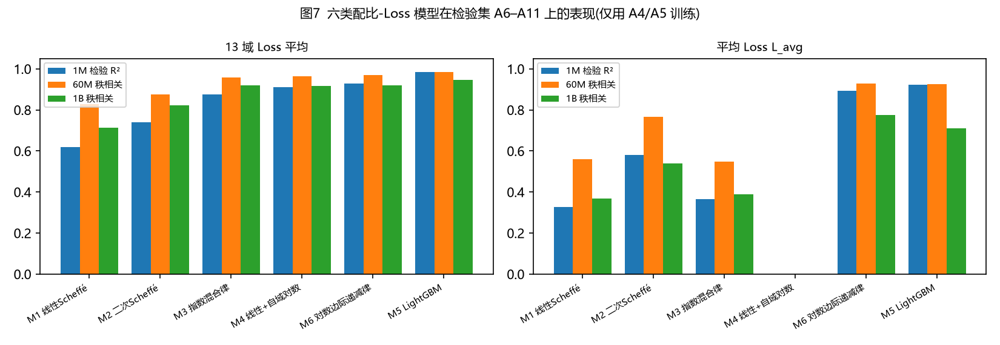

*图7  六类模型在检验集 A6–A11 上的表现(仅用 A4/A5 训练)*

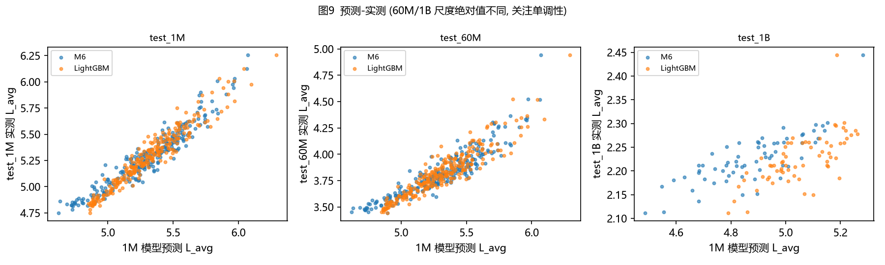

*图9  1M 模型预测值与各尺度实测 L_avg*

线性模型解释力明显不足(L_avg 的 1M 检验 R² 仅 0.327)，配比对 Loss 的影响本质上是非线性的。M6 把 L_avg 的 R² 提高到 0.894，其预测最优配方在 1M、1B 检验集上均为真实排名第 1。LightGBM 逐点精度最高，但 M6 在 1B 尺度 L_avg 上的秩相关(0.775)与 LightGBM(0.711)接近，参数化的边际递减结构跨尺度迁移稳健且可解释。

### 4.3  各领域对性能的影响

**表4-5  各域份额 +0.1(Cox 方向)对 L_avg 的边际影响(M6, 768 配方, 200 次 bootstrap；负值 = 降 Loss)**

| domain | cox_effect_plus0_1 | ci_low | ci_high | significant | beta_linear | gamma_log |
| --- | --- | --- | --- | --- | --- | --- |
| enron_emails | -0.05034 | -0.2613 | 0.1975 | False | 2.119 | 0.002464 |
| philpapers | -0.03165 | -0.1178 | 0.06413 | False | 2.358 | 0.001216 |
| hackernews | -0.03 | -0.07502 | 0.01042 | False | 2.701 | -0.01281 |
| ubuntu_irc | -0.003816 | -0.02524 | 0.01616 | False | 3.606 | -0.05136 |
| pile_cc | 0.0006038 | -0.002285 | 0.003889 | False | 2.852 | -0.02184 |
| stackexchange | 0.001574 | -0.002591 | 0.004743 | False | 3.057 | -0.04662 |
| pubmed_abstracts | 0.01413 | 0.008359 | 0.02026 | True | 2.966 | -0.01347 |
| dm_mathematics | 0.01605 | 0.002216 | 0.03282 | True | 4.147 | -0.08104 |
| wikipedia_en | 0.01645 | 0.0114 | 0.02159 | True | 3.05 | -0.02211 |
| uspto_backgrounds | 0.02551 | 0.01915 | 0.03317 | True | 3.101 | -0.01807 |
| pubmed_central | 0.02648 | 0.02179 | 0.03215 | True | 3.204 | -0.04108 |
| europarl | 0.02661 | -0.01067 | 0.06115 | False | 2.882 | 0.0041 |
| gutenberg_pg_19 | 0.03018 | 0.02097 | 0.03885 | True | 3.194 | -0.01728 |
| github | 0.03735 | 0.03352 | 0.04071 | True | 3.304 | -0.041 |
| freelaw | 0.03751 | 0.03028 | 0.04383 | True | 3.346 | -0.03821 |
| arxiv | 0.04027 | 0.03567 | 0.04467 | True | 3.319 | -0.03762 |
| nih_exporter | 0.08568 | 0.001878 | 0.1883 | True | 3.972 | -0.01463 |

**表4-6  LightGBM SHAP 重要性(L_avg)**

| domain | mean_abs_shap | shap_share_corr |
| --- | --- | --- |
| dm_mathematics | 0.1188 | -0.9018 |
| stackexchange | 0.08773 | -0.9298 |
| ubuntu_irc | 0.07145 | -0.9199 |
| github | 0.05338 | -0.5819 |
| pubmed_central | 0.05141 | -0.8493 |
| pile_cc | 0.04956 | -0.9271 |
| freelaw | 0.04262 | -0.6991 |
| arxiv | 0.04257 | -0.6029 |
| wikipedia_en | 0.02928 | -0.9087 |
| pubmed_abstracts | 0.02211 | -0.8746 |
| hackernews | 0.02039 | -0.906 |
| uspto_backgrounds | 0.01817 | -0.7501 |
| gutenberg_pg_19 | 0.01298 | -0.7454 |
| nih_exporter | 0.005683 | -0.8767 |
| enron_emails | 0.002689 | -0.819 |
| europarl | 0.002535 | -0.1587 |
| philpapers | 0.002467 | -0.6665 |

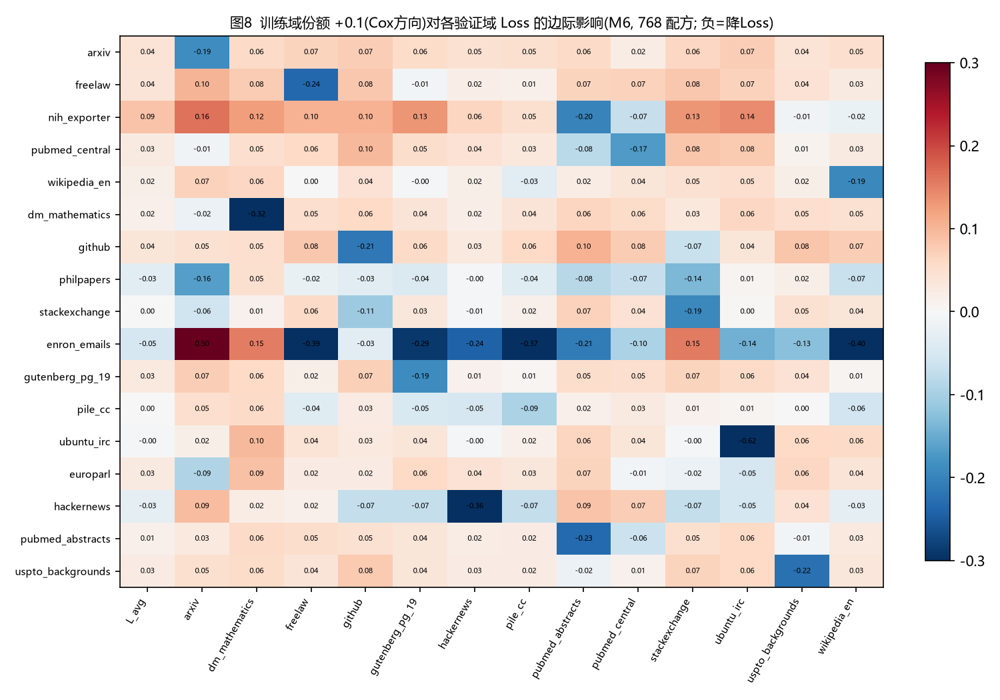

*图8  训练域份额对 13 个验证域 Loss 的边际影响矩阵(17×14)*

- 对角占优：每个验证域的 Loss 主要由同名训练域决定；对其他域多为轻微挤出；
- 弹性 γ 最负的域(dm_mathematics、ubuntu_irc、stackexchange、pubmed_central、github)"从无到有"的边际价值最大，与 SHAP 排序一致；
- 在参照点(实验配方均值)附近继续加大 arxiv、freelaw、github 等大份额域反而提高 L_avg——自然分布附近，均衡优于集中。

### 4.4  领域组合效应与多样性

**表4-7  领域族定义**

| family | domain |
| --- | --- |
| 书籍议会 | gutenberg_pg_19, europarl |
| 代码数学 | github, dm_mathematics |
| 学术 | arxiv, pubmed_central, pubmed_abstracts, nih_exporter, philpapers |
| 法律专利 | freelaw, uspto_backgrounds |
| 网页通用 | pile_cc, wikipedia_en |
| 问答对话 | stackexchange, hackernews, ubuntu_irc, enron_emails |

**表4-8  族层面二次 Scheffé 系数(L_avg；样本内 R² = 0.572)**

| term | coef | ci_low | ci_high | interpretation |
| --- | --- | --- | --- | --- |
| 学术 | 5.929 | 5.847 | 6.007 |  |
| 代码数学 | 6.094 | 5.982 | 6.247 |  |
| 网页通用 | 5.756 | 5.697 | 5.824 |  |
| 问答对话 | 5.819 | 5.737 | 5.921 |  |
| 法律专利 | 6.147 | 5.941 | 6.308 |  |
| 书籍议会 | 6.69 | 5.795 | 7.604 |  |
| 学术×代码数学 | -2.95 | -3.468 | -2.55 | 互补(协同降Loss) |
| 学术×网页通用 | -1.942 | -2.288 | -1.57 | 互补(协同降Loss) |
| 学术×问答对话 | -2.77 | -3.122 | -2.411 | 互补(协同降Loss) |
| 学术×法律专利 | -2.023 | -2.464 | -1.509 | 互补(协同降Loss) |
| 学术×书籍议会 | -3.298 | -4.786 | -1.896 | 互补(协同降Loss) |
| 代码数学×网页通用 | -2.429 | -3.004 | -1.989 | 互补(协同降Loss) |
| 代码数学×问答对话 | -1.548 | -2.156 | -1.076 | 互补(协同降Loss) |
| 代码数学×法律专利 | -2.841 | -3.58 | -2.085 | 互补(协同降Loss) |
| 代码数学×书籍议会 | -3.043 | -4.451 | -1.729 | 互补(协同降Loss) |
| 网页通用×问答对话 | -2.622 | -3.142 | -2.2 | 互补(协同降Loss) |
| 网页通用×法律专利 | -1.76 | -2.271 | -1.236 | 互补(协同降Loss) |
| 网页通用×书籍议会 | -2.214 | -3.611 | -0.9714 | 互补(协同降Loss) |
| 问答对话×法律专利 | -3.339 | -4.079 | -2.685 | 互补(协同降Loss) |
| 问答对话×书籍议会 | -3.845 | -5.151 | -2.413 | 互补(协同降Loss) |
| 法律专利×书籍议会 | -3.156 | -4.604 | -1.357 | 互补(协同降Loss) |

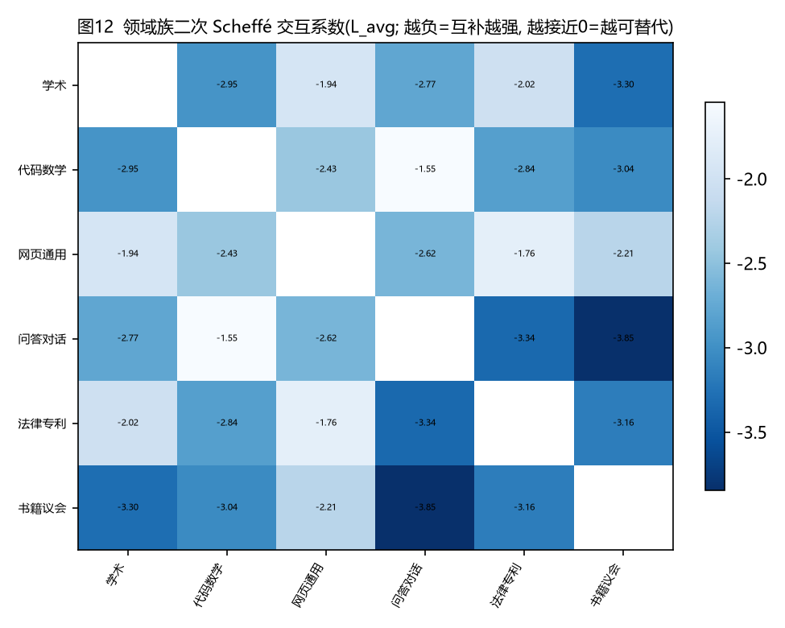

*图12  领域族交互系数(越负 = 互补越强)*

**表4-9  配比熵 H(p) 与 L_avg 的秩相关(跨尺度)**

| set | n | H_mean | spearman_H_vs_Lavg | spearman_nzero_vs_Lavg |
| --- | --- | --- | --- | --- |
| train_1M | 512 | 1.272 | -0.8281 | 0.8014 |
| test_1M | 256 | 1.328 | -0.8287 | 0.8134 |
| test_60M | 256 | 1.328 | -0.8276 | 0.7951 |
| test_1B | 64 | 1.852 | -0.5554 | 0.5838 |
| est_10B | 63 | 1.281 | 0.6157 | -0.5869 |
| est_70B | 63 | 1.281 | 0.6799 | -0.6582 |

15 个族交互项全部显著为负：任意两个领域族搭配都优于单一族；互补最强的是"问答对话×书籍议会""问答对话×法律专利"(文体差异大)，最弱的是"代码数学×问答对话"(内容重叠)。三个实测尺度上配比越均衡 Loss 越低，这正是 M6 对数项的经验来源。

### 4.5  推荐配比 p*

**表4-10  推荐配比(信赖域：不超过实验中出现过的最大份额)**

| domain | reference_mean_mixture | trust_region_pmax | p_opt_quadratic | p_opt_log_share_M6 | p_opt_ensemble_top100 |
| --- | --- | --- | --- | --- | --- |
| arxiv | 0.1095 | 0.961 | 2.4e-15 | 0.05766 | 0.08344 |
| freelaw | 0.08953 | 0.993 | 0.0483 | 0.05618 | 0.0734 |
| nih_exporter | 0.00589 | 0.058 | 0.058 | 0.01031 | 0.008906 |
| pubmed_central | 0.1171 | 0.999 | 0.03299 | 0.07705 | 0.09792 |
| wikipedia_en | 0.0768 | 0.762 | 2.699e-15 | 0.05846 | 0.07452 |
| dm_mathematics | 0.02688 | 0.2392 | 0.1011 | 0.05416 | 0.04482 |
| github | 0.1153 | 0.991 | 2.653e-15 | 0.06453 | 0.07905 |
| philpapers | 0.005411 | 0.05506 | 0.05506 | 0.05506 | 0.004446 |
| stackexchange | 0.09992 | 0.998 | 0.1053 | 0.1219 | 0.1294 |
| enron_emails | 0.002259 | 0.02603 | 0.02603 | 0.02603 | 0.001573 |
| gutenberg_pg_19 | 0.04832 | 0.4044 | 1.517e-15 | 0.03247 | 0.03844 |
| pile_cc | 0.1163 | 0.995 | 2.143e-15 | 0.1243 | 0.1496 |
| ubuntu_irc | 0.01985 | 0.177 | 0.01347 | 0.05432 | 0.04123 |
| europarl | 0.01319 | 0.1171 | 0.1171 | 0 | 0.005685 |
| hackernews | 0.01166 | 0.1201 | 0.1201 | 0.1201 | 0.03709 |
| pubmed_abstracts | 0.06678 | 0.5754 | 2.279e-15 | 0.04572 | 0.06418 |
| uspto_backgrounds | 0.07533 | 0.6936 | 0.3224 | 0.04173 | 0.06628 |

**表4-11  各配比的预测平均 Loss(1M 尺度)**

| mixture | pred_quad | pred_M6 | pred_gbm | pred_ensemble |
| --- | --- | --- | --- | --- |
| reference_mean_mixture | 4.895 | 4.446 | 4.729 | 4.587 |
| p_opt_quadratic | 4.08 | 5.022 | 4.946 | 4.984 |
| p_opt_log_share_M6 | 4.531 | 4.315 | 4.755 | 4.535 |
| p_opt_ensemble_top100 | 4.783 | 4.372 | 4.713 | 4.543 |
| best_observed_train_1M |  |  |  | 4.753 |
| best_observed_test_1M |  |  |  | 4.749 |

**表4-12  推荐配比与各尺度实测最优 10 个配方的一致性**

| scale | optimum | L1_to_top10_mean | L1_ref_to_top10 | spearman_with_top10 |
| --- | --- | --- | --- | --- |
| test_1M | p_opt_quadratic | 1.253 | 0.4757 | -0.375 |
| test_1M | p_opt_log_share_M6 | 0.5305 | 0.4757 | 0.4363 |
| test_1M | p_opt_ensemble_top100 | 0.3664 | 0.4757 | 0.723 |
| test_60M | p_opt_quadratic | 1.307 | 0.4769 | -0.3578 |
| test_60M | p_opt_log_share_M6 | 0.501 | 0.4769 | 0.451 |
| test_60M | p_opt_ensemble_top100 | 0.333 | 0.4769 | 0.7819 |
| test_1B | p_opt_quadratic | 1.477 | 0.4115 | -0.4804 |
| test_1B | p_opt_log_share_M6 | 0.5582 | 0.4115 | 0.6691 |
| test_1B | p_opt_ensemble_top100 | 0.3885 | 0.4115 | 0.8799 |
| est_10B | p_opt_quadratic | 1.456 | 0.5915 | -0.201 |
| est_10B | p_opt_log_share_M6 | 1.044 | 0.5915 | 0.1961 |
| est_10B | p_opt_ensemble_top100 | 0.7822 | 0.5915 | 0.6054 |
| est_70B | p_opt_quadratic | 1.519 | 0.5899 | -0.2083 |
| est_70B | p_opt_log_share_M6 | 1.044 | 0.5899 | 0.1985 |
| est_70B | p_opt_ensemble_top100 | 0.7754 | 0.5899 | 0.6078 |

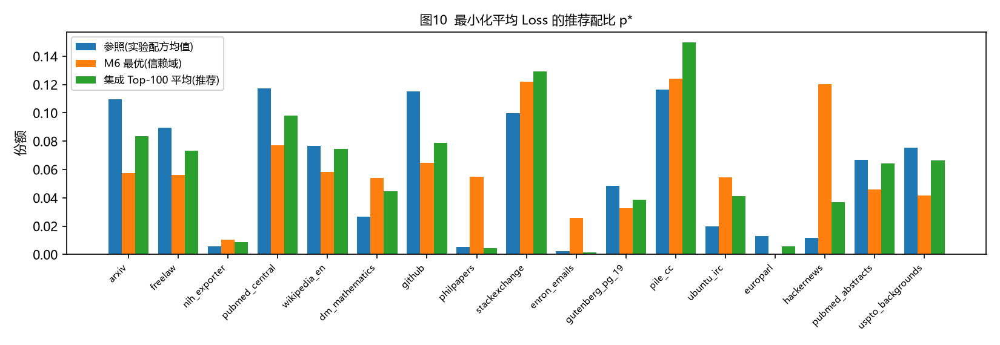

*图10  推荐配比与参照配比*

推荐配比(集成 Top-100)与 1M/60M/1B 实测最优 10 个配方平均构成的秩相关分别为 0.72/0.78/0.88。主要调整方向：提高 pile_cc、stackexchange、hackernews、ubuntu_irc、dm_mathematics，降低 arxiv、pubmed_central、github。二次 Scheffé 的最优解被推到单纯形边界、预测值被另外两个模型否定，作为过拟合外推的反例列出。

### 4.6  外推表 A12–A15 的稳健性

**表4-13  外推表一致性(L_avg；全目标见 S09_extrapolation_consistency.csv)**

| 指标 | 取值 |
| --- | --- |
| 1M 训练子集(同 63 配方) L_avg 均值 | 5.360 |
| 1B 实测 L_avg 均值 | 2.226 |
| 10B 外推 L_avg 均值 | 1.797 |
| 70B 外推 L_avg 均值 | 1.415 |
| 70B/10B 比值(均值 / 变异系数) | 0.786 / 2.3% |
| 10B 与 70B 的秩相关 | 0.990 |
| 1M 实测与 10B 外推的秩相关(同配方) | -0.739 |
| 1M 实测与 70B 外推的秩相关(同配方) | -0.814 |

**表4-14  各尺度独立估计的 M6 域效应向量一致性**

| scale_a | scale_b | spearman | sign_agreement |
| --- | --- | --- | --- |
| 1M(train) | 1M(train+test) | 0.7868 | 0.7647 |
| 1M(train) | 60M(test) | 0.5956 | 0.8235 |
| 1M(train) | 1B(test) | 0.4191 | 0.8235 |
| 1M(train) | 10B(est) | -0.3578 | 0.6471 |
| 1M(train) | 70B(est) | -0.3431 | 0.6471 |
| 1M(train+test) | 60M(test) | 0.8627 | 0.9412 |
| 1M(train+test) | 1B(test) | 0.7034 | 0.9412 |
| 1M(train+test) | 10B(est) | -0.1029 | 0.6471 |
| 1M(train+test) | 70B(est) | -0.08824 | 0.6471 |
| 60M(test) | 1B(test) | 0.7868 | 0.8824 |
| 60M(test) | 10B(est) | 0 | 0.7059 |
| 60M(test) | 70B(est) | 0.02451 | 0.7059 |
| 1B(test) | 10B(est) | -0.007353 | 0.7059 |
| 1B(test) | 70B(est) | -0.03676 | 0.7059 |
| 10B(est) | 70B(est) | 0.9902 | 1 |

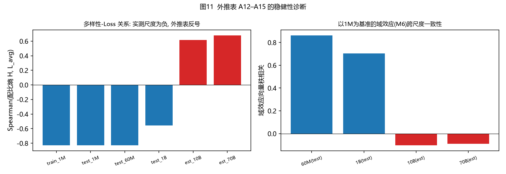

*图11  外推表 A12–A15 的稳健性诊断*

- 外推表内部不独立：70B/10B 比值恒为 0.786(CV 2.3%)，秩相关 0.990；
- 与实测规律矛盾：实测三个尺度多样性都降 Loss，外推表中反号(+0.62)；同批配方 1M 实测与 10B 外推秩相关 -0.74；
- 域效应不可迁移：实测尺度之间秩相关 0.70–0.86，实测与外推表之间在 −0.36~0.03；
- 结论：问题出在"逐域幂律外推后再组合"的构造方式，并非本文模型不稳健；10B/70B 结论只作对照。

### 4.7  质量 Q 的引入(A1 补全后复核)

**命题(仍成立)**：若各域质量 Qᵢ 为常数，则 Q_mix(p) = ΣpᵢQᵢ 是 p 的线性函数，与 Scheffé 线性项完全共线。A1 补全、17 个配方域全部有 Q̂ 之后，设计矩阵 [p, Q_mix] 的数值秩仍为 17 < 18——共线性结论对 Q 覆盖范围不敏感。

**表4-15  Q 的增量解释力消融(全覆盖后重跑)**

| model | n_params | train_R2 | test1M_R2 | coef | test_60M_spearman | test_1B_spearman |
| --- | --- | --- | --- | --- | --- | --- |
| a+H | 2 | 0.6672 | 0.6562 | [6.0525, -0.5565] | 0.8276 | 0.5554 |
| a+H+cov | 3 | 0.6672 | 0.6562 | [3.0263, -0.5565, 3.0263] | 0.8276 | 0.5554 |
| a+Q·cov | 2 | 0.004968 | -0.06641 | [5.7304, -0.5619] | -0.02472 | -0.02422 |
| a+Q·cov+cov | 3 | 0.004968 | -0.06641 | [2.8652, -0.5619, 2.8652] | -0.02472 | -0.02422 |
| a+Q·cov+H+cov (full) | 4 | 0.6678 | 0.6538 | [3.0929, -0.1959, -0.5555, 3.0929] | 0.8262 | 0.5543 |

**表4-16  17 个配方域 → 质量域映射及 Q̂(置信度收缩 Q̂ = c·Q_map + (1−c)·Q̄)**

| mixture_domain | quality_domain | mapping_type | confidence | rationale | Q_quality_domain | Q_shrunk | Q_available |
| --- | --- | --- | --- | --- | --- | --- | --- |
| arxiv | arxiv | direct | 1 | 配方域名与质量信号域名一致 | 0.8043 | 0.8043 | True |
| github | github | direct | 1 | 配方域名与质量信号域名一致 | 0.5548 | 0.5548 | True |
| stackexchange | stackexchange | direct | 1 | 配方域名与质量信号域名一致 | 0.6674 | 0.6674 | True |
| wikipedia_en | wikipedia | near_direct | 0.8 | 名称略有差异，语义对应 | 0.634 | 0.6401 | True |
| gutenberg_pg_19 | book | near_direct | 0.8 | 书籍类文本，可参考 book 域质量信号 | 0.6664 | 0.666 | True |
| pile_cc | commoncrawl | near_direct | 0.8 | 网页抓取类文本，可参考 commoncrawl 域质量信号 | 0.6648 | 0.6647 | True |
| dm_mathematics | arxiv | inferred | 0.3 | 数学符号/题目文本 | 0.8043 | 0.7062 | True |
| freelaw | wikipedia | inferred | 0.3 | 正式说明性长文本 | 0.634 | 0.6551 | True |
| nih_exporter | arxiv | inferred | 0.5 | 科研项目摘要 | 0.8043 | 0.7343 | True |
| pubmed_central | arxiv | inferred | 0.6 | 学术全文 | 0.8043 | 0.7483 | True |
| philpapers | arxiv | inferred | 0.6 | 学术论文 | 0.8043 | 0.7483 | True |
| enron_emails | commoncrawl | inferred | 0.3 | 非正式通信文本 | 0.6648 | 0.6644 | True |
| ubuntu_irc | stackexchange | inferred | 0.4 | 技术问答对话 | 0.6674 | 0.6655 | True |
| europarl | wikipedia | inferred | 0.3 | 正式议会记录 | 0.634 | 0.6551 | True |
| hackernews | stackexchange | inferred | 0.4 | 技术社区讨论 | 0.6674 | 0.6655 | True |
| pubmed_abstracts | arxiv | inferred | 0.5 | 学术摘要 | 0.8043 | 0.7343 | True |
| uspto_backgrounds | wikipedia | inferred | 0.3 | 正式技术说明文本 | 0.634 | 0.6551 | True |

**表4-17  域级 Q̂ 与该域 M6 Cox 边际效应(新检验，A1 使能)**

| mixture_domain | quality_domain | mapping_type | confidence | rationale | Q_quality_domain | Q_shrunk | Q_available | cox_effect_plus0_1 |
| --- | --- | --- | --- | --- | --- | --- | --- | --- |
| arxiv | arxiv | direct | 1 | 配方域名与质量信号域名一致 | 0.8043 | 0.8043 | True | 0.04027 |
| github | github | direct | 1 | 配方域名与质量信号域名一致 | 0.5548 | 0.5548 | True | 0.03735 |
| stackexchange | stackexchange | direct | 1 | 配方域名与质量信号域名一致 | 0.6674 | 0.6674 | True | 0.001574 |
| wikipedia_en | wikipedia | near_direct | 0.8 | 名称略有差异，语义对应 | 0.634 | 0.6401 | True | 0.01645 |
| gutenberg_pg_19 | book | near_direct | 0.8 | 书籍类文本，可参考 book 域质量信号 | 0.6664 | 0.666 | True | 0.03018 |
| pile_cc | commoncrawl | near_direct | 0.8 | 网页抓取类文本，可参考 commoncrawl 域质量信号 | 0.6648 | 0.6647 | True | 0.0006038 |
| dm_mathematics | arxiv | inferred | 0.3 | 数学符号/题目文本 | 0.8043 | 0.7062 | True | 0.01605 |
| freelaw | wikipedia | inferred | 0.3 | 正式说明性长文本 | 0.634 | 0.6551 | True | 0.03751 |
| nih_exporter | arxiv | inferred | 0.5 | 科研项目摘要 | 0.8043 | 0.7343 | True | 0.08568 |
| pubmed_central | arxiv | inferred | 0.6 | 学术全文 | 0.8043 | 0.7483 | True | 0.02648 |
| philpapers | arxiv | inferred | 0.6 | 学术论文 | 0.8043 | 0.7483 | True | -0.03165 |
| enron_emails | commoncrawl | inferred | 0.3 | 非正式通信文本 | 0.6648 | 0.6644 | True | -0.05034 |
| ubuntu_irc | stackexchange | inferred | 0.4 | 技术问答对话 | 0.6674 | 0.6655 | True | -0.003816 |
| europarl | wikipedia | inferred | 0.3 | 正式议会记录 | 0.634 | 0.6551 | True | 0.02661 |
| hackernews | stackexchange | inferred | 0.4 | 技术社区讨论 | 0.6674 | 0.6655 | True | -0.03 |
| pubmed_abstracts | arxiv | inferred | 0.5 | 学术摘要 | 0.8043 | 0.7343 | True | 0.01413 |
| uspto_backgrounds | wikipedia | inferred | 0.3 | 正式技术说明文本 | 0.634 | 0.6551 | True | 0.02551 |

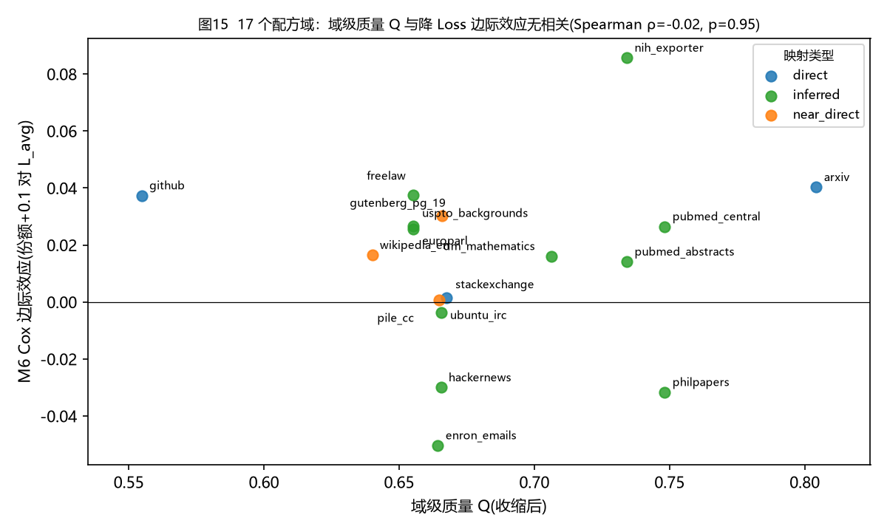

*图15  域级质量 Q 与降 Loss 边际效应无相关(17 域)*

- 消融复核：在"熵 + 覆盖份额"之上加入 Q，1M 检验 R² 为 0.656 → 0.654(不升反微降)，只用 Q 的模型 R²≈0；
- 新检验(原报告"待 A1 补全后检验"项)：17 域 Q̂ 与降 Loss 边际效应 Spearman ρ = −0.017(p = 0.95)，即使只看 direct/near_direct 的 6 个域也不显著(ρ = 0.14, p = 0.79)。即"平均质量高的域"并不系统性地带来更大降 Loss 效果——域效应由内容类型(代码、数学、对话、网页)驱动，而非域的平均质量；
- 最终结论：Q 不作为配比回归的自变量。正确用法有二：① 域内质量筛选(问题三的 C_Q 接口)；② 以 Q_mix(p) 把配比折算为混合语料质量，与 N、D 一起进入问题二的广义标度律。

## 5  结论与向问题二、问题三传递的输出

**表5-1  问题一的输出接口(A1 补全后定稿)**

| 输出 | 取值/说明 | 文件 |
| --- | --- | --- |
| 7 个质量域 Q* | arxiv 0.804；stackexchange 0.667；book 0.666；commoncrawl 0.665；c4 0.657；wikipedia 0.634；github 0.557 | S04_domain_level_Q_all_methods.csv |
| 17 域 Q̂ 映射 | 全部有值(表4-16)，direct/near_direct 6 域 + inferred 11 域 | S09_domain_Q_mapping_17.csv |
| 推荐配比 p* | 表4-10 集成 Top-100 列 | S08_optimal_mixture.csv |
| 配比–Loss 律 | M6：L = Σβᵢpᵢ + Σγᵢln(pᵢ+ε)，ε = 0.001，系数见表4-5 | S08_M6_cox_effect_plus0_1_bootstrap.csv |
| 混合质量接口(问题二) | Q_mix(p) = ΣpᵢQ̂ᵢ，逐配方取值已输出 | S09_mixture_level_Qmix.csv |
| 基线质量 Q₀(问题三) | 建议取全体域均衡 Q̄ ≈ 0.664(消解后) | S04_domain_level_Q_all_methods.csv |

## 6  局限

- A1 中 arxiv(1,419 条)与 book(171 条)样本量较小，这两域的 Q 区间估计较宽；book 的 Q* 域均值有小数点后第二位级不确定性；
- inferred 类映射(11 个配方域)的 Q̂ 经过置信度收缩，仍含主观成分；表4-17 已区分映射类型，结论不依赖 inferred 域；
- 归一化边界与权重随样本总体变化：仅使用 A2/A3 与加入 A1 后，Q 绝对值有 0.01–0.04 的平移，秩类结论不变；
- 推荐配比来自 1M 尺度实验的模型外推，虽已加信赖域并与 LightGBM 集成，仍建议更大尺度小规模验证。

## 附录  复现方式与过程数据

- 环境：Python 3.13，依赖 numpy、pandas、scipy、scikit-learn、statsmodels、lightgbm、matplotlib；随机种子已固定；
- 流水线：s01 解析(A1 自动纳入) → s02 质量评价/冲突/消解/可靠性(S02–S05) → s06 配比建模(S06–S09) → s10 图表；
- 过程数据：out/ 下 S01–S09 共 80+ 个文件，含 27.2 万条样本级评分(S04_sample_level_scores.csv.gz)、全部 bootstrap 置信区间与逐配方预测；
- 相对前序代码的改动：s01 接受未压缩 .jsonl 并过滤目录；s02 将域内常数指标的无定义 ρ 置 0(τ = 0.5)；s10 中文字体改为本机字体；另新增 S09_cox_effect_vs_Q_17domains.csv 与图13–15。
- 提示：赛题规定 AI 不得代替完成核心建模与论证，论文末尾须披露 AI 工具的使用环节与贡献范围，请按赛题要求如实披露。
