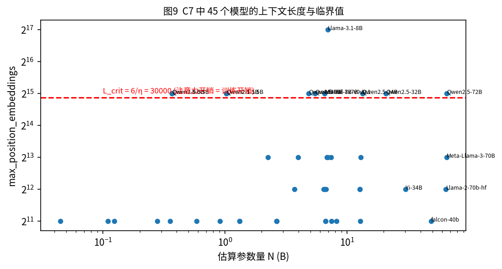
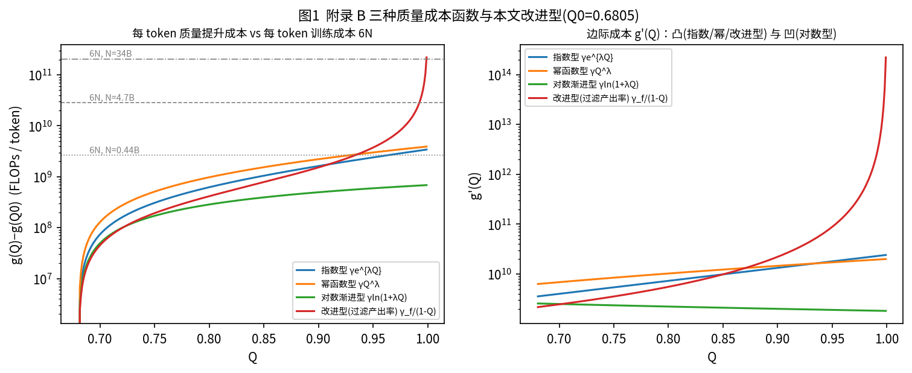
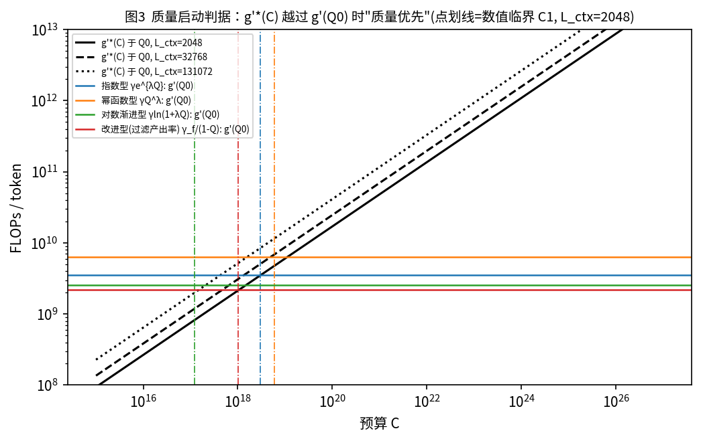
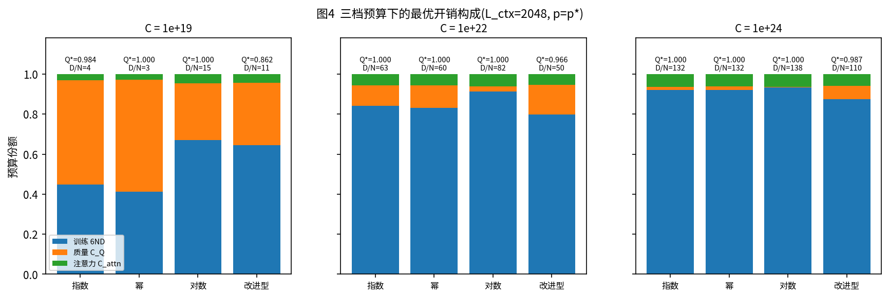
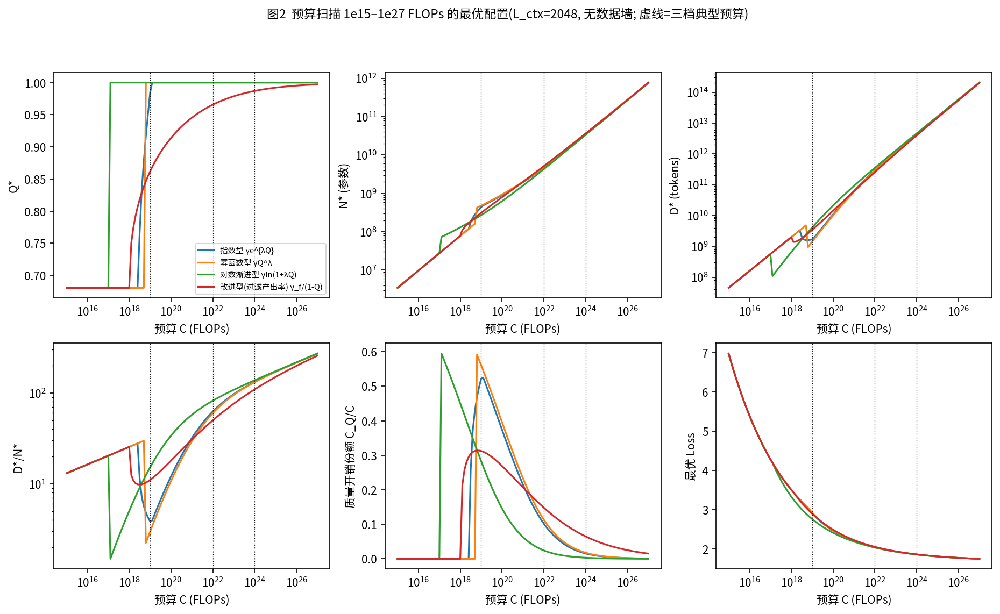
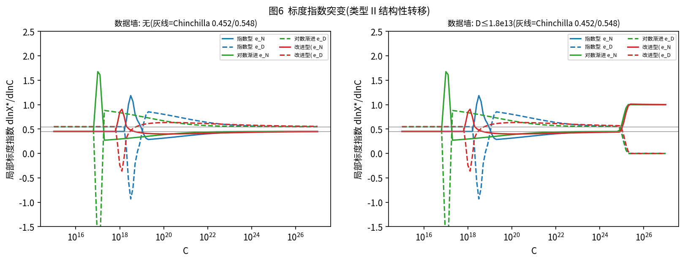
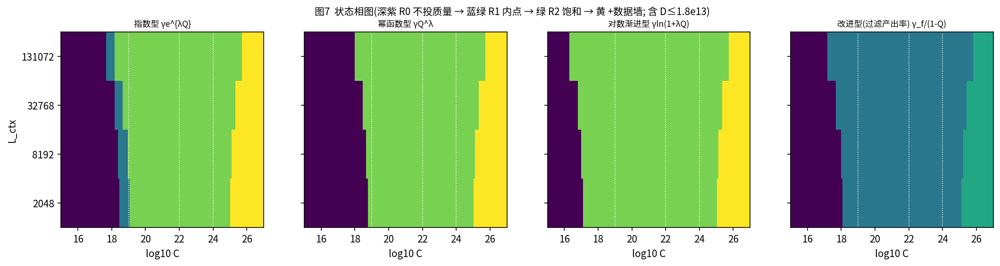
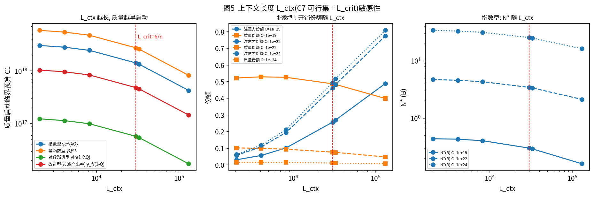
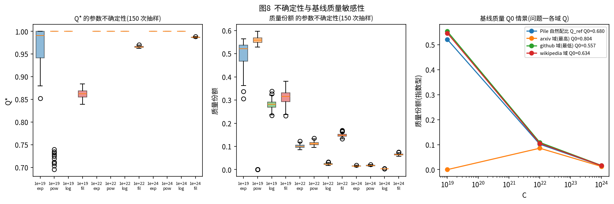
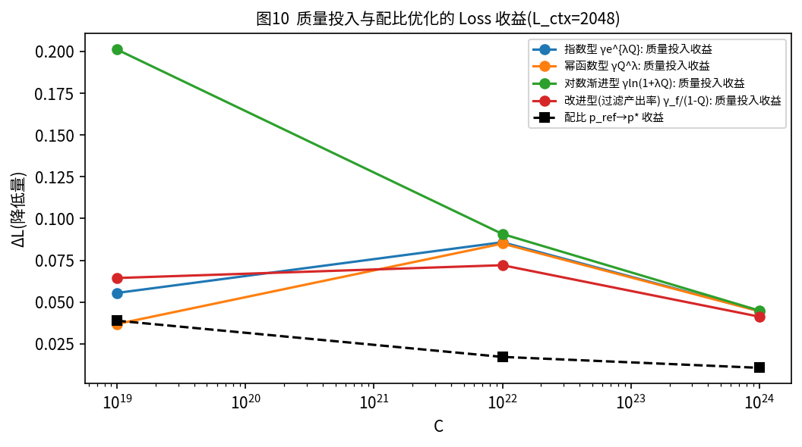

# 2026 年研究生数学建模竞赛 F 题 · 问题三求解报告
## 算力约束下的多维资源联合优化与结构性转移

> 输入：问题二的广义标度律与参数(`T06_generalized_law_params.json`)、问题一的推荐配比 p* 与各域质量 Q(A1 补全版)、附件 C7(`model_architecture_metadata.csv`)。全部数字由 `code/` 下的脚本计算，可逐项追溯到 `out/V01–V06` 的过程文件。数据核对：问题一、二的输出取自仓库 `AI output/Claude/` 目录，C7 取自 `real_attachments/`；经逐文件比对，与计算中使用的文件完全一致。C7 的 `training_data_TB` 字段数值与各模型公开的训练 token 数(以万亿计)吻合(如 Pythia 0.3 即 300B tokens、Llama-3 为 15T、Qwen2.5 为 18T)，本文按"万亿 token"解读。

## 摘要

1. **模型**。决策变量为 (N, D, Q)。目标函数采用问题二的广义标度律 L(N,D,Q,p)；约束为 6ND + D[g(Q)−g(Q₀)]₊ + ηNDL_ctx ≤ C。把注意力开销并入训练开销后，约束可写成 k(L)·ND + D·Δg(Q) ≤ C，其中 k(L) = 6(1+L/L_crit)。解析推出 **L_crit = 6/η = 30000**：C7 可行集 {2048, 4096, 8192, 32768, 131072} 中，前三档的注意力开销只有训练开销的 7%–27%，后两档则达到 1.09 倍和 4.37 倍。
2. **配比 p 不必随预算联立求解**。广义律中配比项的系数 κ(R/R_1M)^η 对任意 (N,D,Q) 都为正，所以使 L 最小的 p 就是 argmin M6(p)，与预算无关(支配性论证，并已数值验证：5 个预算下 6 种候选配比的排序完全相同)。p 因此取问题一的推荐配比 p*。它在 C=10¹⁹、10²²、10²⁴ 时分别比 Pile 自然配比低 0.0389、0.0172、0.0107。
3. **三档预算的最优解**(指数型成本，L_ctx=2048)。C=10¹⁹：N*=0.440B，D*=1.70B，Q*=0.984，**质量开销占 52.2%**，D/N 仅为 3.9。C=10²²：Q*=1，质量份额降到 10.2%，D/N=63。C=10²⁴：质量份额 1.6%，D/N=132，N*=34.1B。与"不投质量"的基线相比，Loss 分别降低 0.0555、0.0858、0.0446。
4. **存在明确的结构性转移**。本文定义了三类转移：Ⅰ 约束集切换，Ⅱ 标度指数突变，Ⅲ 边际优先序反转。沿预算增加依次出现："只扩规模(R0)"→"质量优先、压缩数据量换质量(R1/R2，质量份额峰值 31%–59%)"→"质量饱和，预算回流到规模，D/N 从 4 回升到 130+"→(若存在数据墙 1.8×10¹³ tokens)"D 触墙，N 的标度指数由约 0.5 跳到 1"。质量启动的临界预算 C₁ 在 10¹⁷–10¹⁹ 之间：指数型 3.02e+18，幂函数型 5.85e+18，对数型 1.23e+17，改进型 1.03e+18。所以题目给定的三档预算中，10¹⁹ 恰好落在转移区，而 10²² 与 10²⁴ 处于同一结构状态。
5. **成本函数决定转移的"形态"**。指数型和本文提出的改进型(过滤产出率 γ_f/(1−Q))属于连续型转移：解析的一阶判据 g′(Q₀)=g′*(C) 与数值解相差 1%–3%。幂函数型和对数型属于跳跃型：Q* 从 Q₀ 直接跳到 1，由"等值切换条件" L*(Q₀) = L*(1) 给出，与数值解相差 <0.3%。改进型的 Q 永远达不到 1，所以在高预算下仍保留 6.5% 的质量开销，更符合"完美数据不可得"的现实。
6. **L_ctx 的影响**：L_ctx 越长，训练(含注意力)越贵，而质量成本不受注意力影响，因此质量越早启动。从 2048 到 131072，C₁ 下降约 7 倍；在 131072 且 C=10²⁴ 时，注意力开销占预算的 81%。参数不确定性(c_N、c_D 自助、η、Q_ref)不改变 10²² 与 10²⁴ 下的状态判定；在 10¹⁹ 处，指数型有 47% 的抽样落在 R2，说明这一档恰好位于转移边界附近。

## 1  输入与数据

| 输入           | 来源                                                                      | 取值                                                                                               |
|:-------------|:------------------------------------------------------------------------|:-------------------------------------------------------------------------------------------------|
| 广义标度律参数      | 问题二 T06_generalized_law_params.json                                     | E=1.6901, A₁=301.99, α=0.3400, B₁=342.00, β=0.2801, h_N=1.0822, h_D=0.6335, κ=0.9021, η_p=0.6599 |
| 基线质量 Q₀      | 问题二 Q_ref(Pile 自然配比混合质量，A 口径)                                           | 0.6805；情景分析另取问题一各域 Q                                                                             |
| 配比 p         | 问题一 S08_optimal_mixture.csv 集成 Top-100                                  | ΔM6(p*) = -0.0736(相对 p_ref)                                                                      |
| c_N、c_D 自助分布 | 问题二 T04b_bootstrap_cN_cD.csv                                            | 300 次单元簇自助，用于不确定性传播                                                                              |
| C7 上下文长度     | real_attachments/C_efficiency_evolution/model_architecture_metadata.csv | 45 个模型；可行集 [2048, 4096, 8192, 32768, 131072]；最大训练 token 18T(数据墙锚点)                               |
| 成本函数         | 附录 B                                                                    | 指数型 γ=10⁷, λ=6；幂函数型 γ=5×10⁹, λ=4；对数型 γ=2×10⁹, λ=10                                               |

## 2  模型建立

### 2.1  优化模型

$$\min_{N,D,Q}\; L(N,D,Q,p)=E+A_1[1+h_N(1-Q)]N^{-\alpha}+B_1[1+h_D(1-Q)]D^{-\beta}+\kappa\,\Delta M6(p)\Big(\tfrac{R}{R_{1M}}\Big)^{\eta_p}$$

$$\text{s.t.}\quad \underbrace{6ND}_{C_{train}}+\underbrace{D\,[g(Q)-g(Q_0)]_+}_{C_Q}+\underbrace{\eta N D L_{ctx}}_{C_{attn}}\le C,\qquad Q_0\le Q\le 1,\; N,D>0\;(\text{情景: } D\le D_{max})$$

令 **k(L) = 6 + ηL = 6(1 + L/L_crit)**，约束可改写为 k(L)·N·D + D·Δg(Q) ≤ C。由此得到两点：(1) 注意力开销等价于把每个"参数·token"的训练单价放大到 k(L)/6 倍，而质量成本只与 D 成比例、不含 N，所以 L 越大，质量相对越便宜；(2) 目标函数随 N、D、Q 单调下降，最优解处预算约束一定取等号，于是 N 可以用 D、Q 表示为 N = (C − D·Δg(Q))/(k·D)，问题降为关于 (ln D, Q) 的二维优化。
### 2.2  临界上下文长度

$$C_{attn}=C_{train}\iff \eta N D L=6ND\iff L^{crit}_{ctx}=\frac{6}{\eta}=\frac{6}{2\times10^{-4}}=30000$$

C7 中 45 个模型的上下文长度(表1)只有 5 个取值，其中 26.7% 的模型 ≥ L_crit，即这些模型的注意力开销超过训练开销。敏感性分析取 C7 的全部 5 个可行值，另加 L_crit 本身。

|   L_ctx |   n_models | 最早代表                                           |   训练tokens_T_median |   L/L_crit |   k(L)/6 |   C_attn/C_train |
|--------:|-----------:|:-----------------------------------------------|--------------------:|-----------:|---------:|-----------------:|
|    2048 |         18 | pythia-70m; pythia-160m; pythia-410m           |                1.45 |    0.06827 |    1.068 |          0.06827 |
|    4096 |          8 | Llama-2-7b-hf; Llama-2-13b-hf; Llama-2-70b-hf  |                2.5  |    0.1365  |    1.137 |          0.1365  |
|    8192 |          7 | Meta-Llama-3-8B; Meta-Llama-3-70B; gemma-2-2b  |                8    |    0.2731  |    1.273 |          0.2731  |
|   32768 |         11 | Mistral-7B-v0.1; Mixtral-8x7B-v0.1; Qwen2-0.5B |               18    |    1.092   |    2.092 |          1.092   |
|  131072 |          1 | Llama-3.1-8B                                   |               15    |    4.369   |    5.369 |          4.369   |

*图9  C7 中各模型的上下文长度与临界值 L_crit*

### 2.3  领域配比 p：由前两问确定，不参与联立

**命题**：设 R(N,D,Q) = A₁[1+h_N(1−Q)]N^−α + B₁[1+h_D(1−Q)]D^−β > 0。对任意可行的 (N,D,Q)，L 关于 ΔM6(p) 严格递增(系数 κ(R/R_1M)^η > 0)。并且配比只改变数据的组成、不消耗算力(p 不出现在成本式中)。所以对任意预算 C，联合最优解中的 p 都等于 argmin_p M6(p)，与 C、L_ctx、成本函数无关。
实际取值上，argmin M6 在单纯形边界附近需要外推，因此采用问题一给出的、有信赖域约束的集成推荐配比 p*。M6 信赖域最优解作为敏感性对照。数值验证(表2)：5 个预算量级下 6 种候选配比的 Loss 排序完全一致。

| mixture      |   C=1e+17 |   C=1e+19 |   C=1e+22 |   C=1e+24 |   C=1e+26 |
|:-------------|----------:|----------:|----------:|----------:|----------:|
| p*(Q1集成)     |    4.2811 |    2.9034 |    2.0375 |    1.8564 |    1.7705 |
| p_M6opt(信赖域) |    4.2316 |    2.8733 |    2.0241 |    1.8481 |    1.7653 |
| p_ref        |    4.3449 |    2.9423 |    2.0547 |    1.8671 |    1.7772 |
| 单一 github    |    5.8004 |    3.8287 |    2.4474 |    2.1108 |    1.9298 |
| 单一 pile_cc   |    5.5238 |    3.6603 |    2.3727 |    2.0645 |    1.9008 |
| 均匀 1/17      |    4.2999 |    2.9149 |    2.0426 |    1.8596 |    1.7725 |

### 2.4  质量成本函数：附录 B 三种形式与本文的改进型

附录 B 的三种 g(Q) 在 Q=1 处都是有限值，即"完美数据"的代价有限。实际的数据筛选中，若只保留质量达到 Q 的那部分数据，保留比例 f 会随 Q→1 趋于 0，每得到一个合格 token 需要处理 1/f 个原始 token。取 f ∝ (1−Q)，得到本文提出的**改进型(过滤产出率模型)**：
$$g_f(Q)=\frac{\gamma_f}{1-Q},\qquad \gamma_f=g_{exp}(0.9)\times0.1=2.214e+08$$

标定方式是让它在 Q=0.9 处与指数型取值相同，以便比较。四种形式中，指数型、幂函数型和改进型的边际成本 g′ 递增(凸)，对数型的 g′ 递减(凹)。

*图1  质量成本函数及其边际成本*

### 2.5  求解方法、KKT 条件与解析临界值

**求解**：在 (ln D, Q) 上做 260×161 的网格搜索，再用 L-BFGS-B 局部精修。另外用独立的 SLSQP 求解器在 (ln N, ln D, Q) 上带显式预算约束、多起点求解作为核验：48 个核验点的 |ΔL| 最大为 2.5e-13(`V02_optimal_allocation_full_grid.csv`)。
**KKT 条件**：定义每 FLOP 的边际降 Loss 为 μ_N = −L_N/(kD)，μ_D = −L_D/(kN+Δg)，μ_Q = −L_Q/(D·g′(Q))。最优解满足 μ_N = μ_D = λ；当 Q 为内点时 μ_Q = λ，在上界时 μ_Q ≥ λ，在下界时 μ_Q ≤ λ。表3 在 12 个主解上逐一核验：内点解的 μ_Q/μ_N = 1.0000，上界解均 ≥1.28，μ_N 与 μ_D 的相对差为 0，预算约束恰好取等号。

|     C | g_form   |         N |         D |      Q |   rel_gap_N_D |   lamQ_over_lamN |   budget_slack | Q_status       |
|------:|:---------|----------:|----------:|-------:|--------------:|-----------------:|---------------:|:---------------|
| 1e+19 | exp      | 4.395e+08 | 1.697e+09 | 0.9842 |     2.945e-07 |            1     |       2.22e-16 | 内点(应有 λ_Q≈λ_N) |
| 1e+19 | power    | 4.797e+08 | 1.428e+09 | 1      |     6.653e-08 |            1.281 |       0        | 上界(应有 λ_Q≥λ_N) |
| 1e+19 | log      | 2.714e+08 | 4.122e+09 | 1      |     1.771e-08 |            6.063 |       0        | 上界(应有 λ_Q≥λ_N) |
| 1e+19 | filter   | 3.117e+08 | 3.442e+09 | 0.8617 |     4.412e-08 |            1     |       0        | 内点(应有 λ_Q≈λ_N) |
| 1e+22 | exp      | 4.733e+09 | 2.961e+11 | 1      |     3.166e-07 |            7.145 |       0        | 上界(应有 λ_Q≥λ_N) |
| 1e+22 | power    | 4.802e+09 | 2.881e+11 | 1      |     8.244e-08 |            8.825 |       0        | 上界(应有 λ_Q≥λ_N) |
| 1e+22 | log      | 4.298e+09 | 3.541e+11 | 1      |     7.799e-08 |           83.37  |       0        | 上界(应有 λ_Q≥λ_N) |
| 1e+22 | filter   | 5.155e+09 | 2.578e+11 | 0.9656 |     1.743e-07 |            1     |       0        | 内点(应有 λ_Q≈λ_N) |
| 1e+24 | exp      | 3.405e+10 | 4.511e+12 | 1      |     4.398e-07 |           49.42  |       0        | 上界(应有 λ_Q≥λ_N) |
| 1e+24 | power    | 3.414e+10 | 4.49e+12  | 1      |     2.888e-08 |           60.01  |       1.11e-16 | 上界(应有 λ_Q≥λ_N) |
| 1e+24 | log      | 3.356e+10 | 4.634e+12 | 1      |     2.126e-07 |          645.1   |       0        | 上界(应有 λ_Q≥λ_N) |
| 1e+24 | filter   | 3.649e+10 | 3.998e+12 | 0.9869 |     3.202e-09 |            1     |       0        | 内点(应有 λ_Q≈λ_N) |

**解析临界值**：在"不投质量"(Q=Q₀)的最优分配处，质量更划算的条件是 μ_Q > μ_N，即
$$g'(Q_0) < g'^{*}(C)\equiv k\,\frac{\partial L/\partial Q}{\partial L/\partial N}\approx \frac{k\,[h_NA_1N^{-\alpha}+h_DB_1D^{-\beta}]}{\alpha a_Q A_1N^{-\alpha}}\,N$$

g′* 近似与最优参数量 N*(C) 成正比，随预算单调增长(图3)。因此一定存在一个临界预算 C₁：在它之上，质量的边际收益超过规模。对凸的 g(指数型、改进型)，Q* 在 C₁ 处连续地离开 Q₀，C₁ 由 g′(Q₀) = g′*(C₁) 确定。对边际成本增长缓慢的幂函数型和凹的对数型，最优 Q 在 C₁ 之前就会从 Q₀ 直接跳到 1，此时临界点由两个受限最优解的等值条件 L*(Q₀; C) = L*(1; C) 确定(跳跃型转移)。
| g_form   |   L_ctx | transition_type     |   C1_analytic_Q_leaves_Q0 |   C_jump_equal_value_Q0_vs_Qtop |   C1_numeric |   C2_analytic_Q_reaches_top |   C2_numeric |
|:---------|--------:|:--------------------|--------------------------:|--------------------------------:|-------------:|----------------------------:|-------------:|
| exp      |    2048 | 连续型(Q* 连续离开 Q0)     |                 3.123e+18 |                       4.359e+18 |    3.024e+18 |                   1.123e+19 |    1.115e+19 |
| exp      |    4096 | 连续型(Q* 连续离开 Q0)     |                 2.896e+18 |                       4.043e+18 |    2.805e+18 |                   1.042e+19 |    1.034e+19 |
| exp      |    8192 | 连续型(Q* 连续离开 Q0)     |                 2.524e+18 |                       3.523e+18 |    2.445e+18 |                   9.078e+18 |    9.011e+18 |
| exp      |   32768 | 连续型(Q* 连续离开 Q0)     |                 1.381e+18 |                       1.928e+18 |    1.339e+18 |                   4.966e+18 |    4.93e+18  |
| exp      |  131072 | 连续型(Q* 连续离开 Q0)     |                 4.398e+17 |                       6.139e+17 |    4.257e+17 |                   1.582e+18 |    1.57e+18  |
| exp      |   30000 | 连续型(Q* 连续离开 Q0)     |                 1.458e+18 |                       2.036e+18 |    1.414e+18 |                   5.246e+18 |    5.207e+18 |
| power    |    2048 | 跳跃型(Q* 由 Q0 直接跳到 1) |                 1.106e+19 |                       5.843e+18 |    5.855e+18 |                   2.124e+18 |    5.855e+18 |
| power    |    4096 | 跳跃型(Q* 由 Q0 直接跳到 1) |                 1.026e+19 |                       5.42e+18  |    5.417e+18 |                   1.97e+18  |    5.417e+18 |
| power    |    8192 | 跳跃型(Q* 由 Q0 直接跳到 1) |                 8.942e+18 |                       4.722e+18 |    4.734e+18 |                   1.716e+18 |    4.734e+18 |
| power    |   32768 | 跳跃型(Q* 由 Q0 直接跳到 1) |                 4.892e+18 |                       2.584e+18 |    2.587e+18 |                   9.39e+17  |    2.587e+18 |
| power    |  131072 | 跳跃型(Q* 由 Q0 直接跳到 1) |                 1.558e+18 |                       8.229e+17 |    8.228e+17 |                   2.991e+17 |    8.228e+17 |
| power    |   30000 | 跳跃型(Q* 由 Q0 直接跳到 1) |                 5.168e+18 |                       2.729e+18 |    2.729e+18 |                   9.918e+17 |    2.729e+18 |
| log      |    2048 | 跳跃型(Q* 由 Q0 直接跳到 1) |                 1.509e+18 |                       1.228e+17 |    1.231e+17 |                             |    1.231e+17 |
| log      |    4096 | 跳跃型(Q* 由 Q0 直接跳到 1) |                 1.399e+18 |                       1.139e+17 |    1.138e+17 |                             |    1.138e+17 |
| log      |    8192 | 跳跃型(Q* 由 Q0 直接跳到 1) |                 1.219e+18 |                       9.924e+16 |    9.939e+16 |                             |    9.939e+16 |
| log      |   32768 | 跳跃型(Q* 由 Q0 直接跳到 1) |                 6.671e+17 |                       5.429e+16 |    5.431e+16 |                             |    5.431e+16 |
| log      |  131072 | 跳跃型(Q* 由 Q0 直接跳到 1) |                 2.125e+17 |                       1.729e+16 |    1.73e+16  |                             |    1.73e+16  |
| log      |   30000 | 跳跃型(Q* 由 Q0 直接跳到 1) |                 7.046e+17 |                       5.735e+16 |    5.738e+16 |                             |    5.738e+16 |
| filter   |    2048 | 连续型(Q* 连续离开 Q0)     |                 1.043e+18 |                       7.208e+24 |    1.033e+18 |                             |              |
| filter   |    4096 | 连续型(Q* 连续离开 Q0)     |                 9.673e+17 |                       6.685e+24 |    9.586e+17 |                             |              |
| filter   |    8192 | 连续型(Q* 连续离开 Q0)     |                 8.429e+17 |                       5.825e+24 |    8.352e+17 |                             |              |
| filter   |   32768 | 连续型(Q* 连续离开 Q0)     |                 4.611e+17 |                       3.187e+24 |    4.559e+17 |                             |    7.9e+27   |
| filter   |  131072 | 连续型(Q* 连续离开 Q0)     |                 1.469e+17 |                       1.015e+24 |    1.455e+17 |                             |    2.516e+27 |
| filter   |   30000 | 连续型(Q* 连续离开 Q0)     |                 4.871e+17 |                       3.366e+24 |    4.814e+17 |                             |    8.344e+27 |

*图3  质量启动判据：g′*(C) 随预算增长，越过 g′(Q₀) 后质量优先*

## 3  三档预算下的最优配置

|     C | g_form   |         N |         D |      Q |   tokens_per_param |     L |   share_train |   share_quality |   share_attn | regime           |   L_noQ |   gain_vs_noQ |
|------:|:---------|----------:|----------:|-------:|-------------------:|------:|--------------:|----------------:|-------------:|:-----------------|--------:|--------------:|
| 1e+19 | exp      | 4.395e+08 | 1.697e+09 | 0.9842 |              3.861 | 2.903 |        0.4475 |         0.522   |      0.03055 | R1 质量内点(Q0<Q*<1) |   2.959 |       0.0555  |
| 1e+19 | power    | 4.797e+08 | 1.428e+09 | 1      |              2.977 | 2.922 |        0.411  |         0.5609  |      0.02806 | R2 质量饱和(Q*=1)    |   2.959 |       0.03691 |
| 1e+19 | log      | 2.714e+08 | 4.122e+09 | 1      |             15.19  | 2.758 |        0.6713 |         0.2829  |      0.04583 | R2 质量饱和(Q*=1)    |   2.959 |       0.2011  |
| 1e+19 | filter   | 3.117e+08 | 3.442e+09 | 0.8617 |             11.04  | 2.895 |        0.6436 |         0.3125  |      0.04394 | R1 质量内点(Q0<Q*<1) |   2.959 |       0.06442 |
| 1e+22 | exp      | 4.733e+09 | 2.961e+11 | 1      |             62.56  | 2.037 |        0.8407 |         0.1019  |      0.05739 | R2 质量饱和(Q*=1)    |   2.123 |       0.08583 |
| 1e+22 | power    | 4.802e+09 | 2.881e+11 | 1      |             59.99  | 2.038 |        0.8302 |         0.1132  |      0.05667 | R2 质量饱和(Q*=1)    |   2.123 |       0.08502 |
| 1e+22 | log      | 4.298e+09 | 3.541e+11 | 1      |             82.39  | 2.033 |        0.9133 |         0.0243  |      0.06235 | R2 质量饱和(Q*=1)    |   2.123 |       0.09077 |
| 1e+22 | filter   | 5.155e+09 | 2.578e+11 | 0.9656 |             50.01  | 2.051 |        0.7974 |         0.1481  |      0.05444 | R1 质量内点(Q0<Q*<1) |   2.123 |       0.07208 |
| 1e+24 | exp      | 3.405e+10 | 4.511e+12 | 1      |            132.5   | 1.856 |        0.9216 |         0.01552 |      0.06291 | R2 质量饱和(Q*=1)    |   1.901 |       0.04462 |
| 1e+24 | power    | 3.414e+10 | 4.49e+12  | 1      |            131.5   | 1.856 |        0.9196 |         0.01764 |      0.06278 | R2 质量饱和(Q*=1)    |   1.901 |       0.04456 |
| 1e+24 | log      | 3.356e+10 | 4.634e+12 | 1      |            138.1   | 1.856 |        0.9331 |         0.00318 |      0.0637  | R2 质量饱和(Q*=1)    |   1.901 |       0.04495 |
| 1e+24 | filter   | 3.649e+10 | 3.998e+12 | 0.9869 |            109.6   | 1.86  |        0.8753 |         0.06493 |      0.05975 | R1 质量内点(Q0<Q*<1) |   1.901 |       0.0413  |

*图4  三档预算下的开销构成*

**解读**
- **低预算 C=10¹⁹**：预算处在质量启动区。指数型和改进型取内点 Q*(分别为 0.984 和 0.862)，幂函数型和对数型直接取 Q*=1。质量开销占 28%–56%。为了给质量腾出预算，D* 被大幅压缩(指数型 D/N=3.9，远低于 Chinchilla 的约 20–30)，即"少而精"。这一档对成本函数的选择最敏感：对数型比指数型的 Loss 低 0.146。
- **中预算 C=10²²**：四种形式都达到或接近质量饱和(改进型 Q*=0.966)，质量份额降到 2%–15%，D/N 回升到 50–82。
- **高预算 C=10²⁴**：质量份额只有 0.3%–6.5%，配置接近"质量已饱和的 Chinchilla 分配"(D/N≈110–138)。成本函数带来的 Loss 差异 < 0.0036，已可忽略。
- **成本函数选择的影响**集中在低、中预算：它决定质量何时启动(C₁ 相差约 50 倍)、以连续还是跳跃方式启动、以及高预算下是否仍保留质量开销(只有改进型会保留)。

## 4  结构性转移：定义、识别与结果

### 4.1  数学定义

记最优解为 x*(C) = (ln N*, ln D*, Q*)，约束活跃集为 𝒜(C) ⊆ {Q=Q₀, Q=1, D=D_max}，预算份额向量为 s(C) = (C_train, C_Q, C_attn)/C。若在区间 I 上同时满足 (i) 𝒜(C) 不变，(ii) 局部标度指数 e_X(C) = d ln X*/d ln C 连续，(iii) 在"不投质量"分配处，各资源的边际收益排序不变，则称最优配置在 I 上**结构稳定**(此时最优策略是同一族幂律，只随预算按比例放大)。在 C† 处出现以下任一情况即为**结构性转移**：
- **类型 Ⅰ 约束集切换**：𝒜(C) 在 C† 处改变(R0 不投质量 → R1 质量内点 → R2 质量饱和 → +数据墙)；
- **类型 Ⅱ 标度指数突变**：分段幂律 ln X* = a + b ln C + Σⱼ cⱼ(ln C − ln C†ⱼ)₊ 经 BIC 选出显著断点，且斜率变化 |cⱼ| > 0.1；
- **类型 Ⅲ 边际优先序反转**：sign(μ_Q − μ_N) 在 C† 处改变，即"下一个 FLOP 该投给谁"发生反转。

识别方法：在 10¹⁵–10²⁷ 上取 121 个对数等距预算点求解，用状态序列的变化定位类型 Ⅰ，再用二分法把转移点精确到 10⁻¹³ 相对精度(表4)；类型 Ⅱ 用 0–2 个断点的分段回归，按 BIC 选择断点数；类型 Ⅲ 逐点计算边际收益的排序。

### 4.2  识别结果

| g_form   |   L_ctx | wall     | type        | from_state       | to_state               |     C_low |    C_high |
|:---------|--------:|:---------|:------------|:-----------------|:-----------------------|----------:|----------:|
| exp      |    2048 | D≤1.8e13 | I 约束集切换     | R0 不投质量(Q*=Q0)   | R1 质量内点(Q0<Q*<1)       | 2.512e+18 | 3.162e+18 |
| exp      |    2048 | D≤1.8e13 | I 约束集切换     | R1 质量内点(Q0<Q*<1) | R2 质量饱和(Q*=1)          | 1e+19     | 1.259e+19 |
| exp      |    2048 | D≤1.8e13 | I 约束集切换     | R2 质量饱和(Q*=1)    | R2 质量饱和(Q*=1) + 数据墙    | 1e+25     | 1.259e+25 |
| exp      |    2048 | 无        | I 约束集切换     | R0 不投质量(Q*=Q0)   | R1 质量内点(Q0<Q*<1)       | 2.512e+18 | 3.162e+18 |
| exp      |    2048 | 无        | I 约束集切换     | R1 质量内点(Q0<Q*<1) | R2 质量饱和(Q*=1)          | 1e+19     | 1.259e+19 |
| filter   |    2048 | D≤1.8e13 | I 约束集切换     | R0 不投质量(Q*=Q0)   | R1 质量内点(Q0<Q*<1)       | 1e+18     | 1.259e+18 |
| filter   |    2048 | D≤1.8e13 | I 约束集切换     | R1 质量内点(Q0<Q*<1) | R1 质量内点(Q0<Q*<1) + 数据墙 | 1.259e+25 | 1.585e+25 |
| filter   |    2048 | 无        | I 约束集切换     | R0 不投质量(Q*=Q0)   | R1 质量内点(Q0<Q*<1)       | 1e+18     | 1.259e+18 |
| log      |    2048 | D≤1.8e13 | I 约束集切换     | R0 不投质量(Q*=Q0)   | R2 质量饱和(Q*=1)          | 1e+17     | 1.259e+17 |
| log      |    2048 | D≤1.8e13 | I 约束集切换     | R2 质量饱和(Q*=1)    | R2 质量饱和(Q*=1) + 数据墙    | 1e+25     | 1.259e+25 |
| log      |    2048 | 无        | I 约束集切换     | R0 不投质量(Q*=Q0)   | R2 质量饱和(Q*=1)          | 1e+17     | 1.259e+17 |
| power    |    2048 | D≤1.8e13 | I 约束集切换     | R0 不投质量(Q*=Q0)   | R2 质量饱和(Q*=1)          | 5.012e+18 | 6.31e+18  |
| power    |    2048 | D≤1.8e13 | I 约束集切换     | R2 质量饱和(Q*=1)    | R2 质量饱和(Q*=1) + 数据墙    | 1e+25     | 1.259e+25 |
| power    |    2048 | 无        | I 约束集切换     | R0 不投质量(Q*=Q0)   | R2 质量饱和(Q*=1)          | 5.012e+18 | 6.31e+18  |
| exp      |    2048 | 无        | III 边际优先序反转 | 规模优先             | 质量优先                   | 2.512e+18 | 3.162e+18 |
| power    |    2048 | 无        | III 边际优先序反转 | 规模优先             | 质量优先                   | 1e+19     | 1.259e+19 |
| log      |    2048 | 无        | III 边际优先序反转 | 规模优先             | 质量优先                   | 1.259e+18 | 1.585e+18 |
| filter   |    2048 | 无        | III 边际优先序反转 | 规模优先             | 质量优先                   | 1e+18     | 1.259e+18 |

| g_form   |   L_ctx | wall     | var           |   n_breaks | breakpoints_log10C   |   base_slope | slope_changes     |
|:---------|--------:|:---------|:--------------|-----------:|:---------------------|-------------:|:------------------|
| exp      |    2048 | D≤1.8e13 | N             |          2 | [19.2, 25.2]         |     0.5026   | [-0.0944, 0.672]  |
| exp      |    2048 | D≤1.8e13 | D             |          2 | [19.2, 24.6]         |     0.4223   | [0.2307, -0.5677] |
| exp      |    2048 | D≤1.8e13 | share_quality |          2 | [18.0, 18.6]         |    -0.0168   | [0.718, -0.7602]  |
| exp      |    2048 | 无        | N             |          2 | [19.8, 21.6]         |     0.5073   | [-0.1848, 0.1181] |
| exp      |    2048 | 无        | D             |          2 | [18.0, 18.6]         |     0.5655   | [-0.7329, 0.7892] |
| exp      |    2048 | 无        | share_quality |          2 | [18.0, 18.6]         |    -0.01678  | [0.7175, -0.7595] |
| filter   |    2048 | D≤1.8e13 | N             |          2 | [19.2, 25.2]         |     0.4892   | [-0.0683, 0.6227] |
| filter   |    2048 | D≤1.8e13 | D             |          2 | [19.2, 25.2]         |     0.4654   | [0.1362, -0.6454] |
| filter   |    2048 | D≤1.8e13 | share_quality |          2 | [18.0, 18.6]         |     0.01267  | [0.4705, -0.5257] |
| filter   |    2048 | 无        | N             |          2 | [17.4, 18.6]         |     0.4445   | [0.1285, -0.1504] |
| filter   |    2048 | 无        | D             |          2 | [18.0, 18.6]         |     0.5344   | [-0.432, 0.4971]  |
| filter   |    2048 | 无        | share_quality |          2 | [18.0, 18.6]         |     0.01276  | [0.4667, -0.5212] |
| log      |    2048 | D≤1.8e13 | N             |          2 | [17.4, 24.6]         |     0.5585   | [-0.1569, 0.5049] |
| log      |    2048 | D≤1.8e13 | D             |          2 | [17.4, 24.6]         |     0.3232   | [0.3096, -0.5671] |
| log      |    2048 | D≤1.8e13 | share_quality |          2 | [18.0, 21.0]         |     0.1927   | [-0.332, 0.1336]  |
| log      |    2048 | 无        | N             |          2 | [18.0, 20.4]         |     0.552    | [-0.2204, 0.1152] |
| log      |    2048 | 无        | D             |          2 | [18.0, 20.4]         |     0.3331   | [0.4374, -0.2128] |
| log      |    2048 | 无        | share_quality |          2 | [18.0, 21.0]         |     0.1927   | [-0.332, 0.1337]  |
| power    |    2048 | D≤1.8e13 | N             |          2 | [19.2, 25.2]         |     0.5065   | [-0.0998, 0.6728] |
| power    |    2048 | D≤1.8e13 | D             |          2 | [19.2, 24.6]         |     0.415    | [0.2407, -0.5684] |
| power    |    2048 | D≤1.8e13 | share_quality |          2 | [18.0, 19.2]         |    -0.007715 | [0.3509, -0.4101] |
| power    |    2048 | 无        | N             |          2 | [19.8, 22.2]         |     0.5087   | [-0.1634, 0.0997] |
| power    |    2048 | 无        | D             |          2 | [18.0, 19.2]         |     0.5504   | [-0.3436, 0.4247] |
| power    |    2048 | 无        | share_quality |          2 | [18.0, 19.2]         |    -0.00769  | [0.3506, -0.4096] |

*图2  预算扫描：Q*、N*、D*、D/N、质量份额与最优 Loss*

*图6  局部标度指数(类型 Ⅱ 转移)*

*图7  (C, L_ctx) 状态相图(含数据墙情景)*

**解读(类比题面的"收入—支出结构")**
1. **温饱阶段(C < C₁ ≈ 10¹⁷–10¹⁹)**：全部预算用于规模，Q*=Q₀，N*∝C^0.45、D*∝C^0.55，即经典 Chinchilla 分配。
2. **"重视教育"阶段(C₁ 到约 10²⁰)**：质量的边际收益超过规模(类型 Ⅲ)，质量份额迅速升到 31%–59% 的峰值。由于质量成本按 token 计价，最优策略是**压缩数据量来换质量**，D*/N* 从约 25 降到 1.5–10(对数型最低、改进型最高)，D* 的局部指数出现负值(类型 Ⅱ)。
3. **质量饱和阶段(C ≳ 10²⁰)**：Q* 到达上界(凸成本下为连续过渡，改进型渐近于 1)，每 token 的质量成本固定不变，而训练开销 kND 随规模超线性增长，所以质量份额按约 C^−0.45 衰减(C_Q/C ∝ D*/C ∝ C^{0.55−1})，预算重新回流到 N 和 D，D/N 单调回升到 130 以上。
4. **数据墙阶段(存在上限 D_max=1.8×10¹³ 时，C ≈ 10²⁵)**：D 触墙，e_N 从约 0.5 跳到 1，e_D 降为 0，新增预算只能投给参数量(类型 Ⅰ+Ⅱ)。
题目给定的 10¹⁹ 恰好位于第 2 阶段，10²² 与 10²⁴ 都处于第 3 阶段；若考虑数据墙，10²⁵ 以上进入第 4 阶段。

| g_form   |   decade |   share_train |   share_quality |   share_attn |      Q |   tokens_per_param |
|:---------|---------:|--------------:|----------------:|-------------:|-------:|-------------------:|
| exp      |       15 |        0.9361 |          0      |       0.0639 | 0.6805 |            14.4968 |
| exp      |       16 |        0.9361 |          0      |       0.0639 | 0.6805 |            18.1111 |
| exp      |       17 |        0.9361 |          0      |       0.0639 | 0.6805 |            22.6264 |
| exp      |       18 |        0.7465 |          0.2025 |       0.051  | 0.7748 |            16.6935 |
| exp      |       19 |        0.501  |          0.4648 |       0.0342 | 0.9984 |             6.6478 |
| exp      |       20 |        0.6552 |          0.3001 |       0.0447 | 1      |            19.9861 |
| exp      |       21 |        0.7867 |          0.1596 |       0.0537 | 1      |            45.124  |
| exp      |       22 |        0.8697 |          0.0709 |       0.0594 | 1      |            77.9857 |
| exp      |       23 |        0.91   |          0.0278 |       0.0621 | 1      |           112.854  |
| exp      |       24 |        0.9265 |          0.0103 |       0.0632 | 1      |           149.449  |
| exp      |       25 |        0.9326 |          0.0037 |       0.0637 | 1      |           190.779  |
| exp      |       26 |        0.9349 |          0.0013 |       0.0638 | 1      |           240.199  |
| exp      |       27 |        0.9354 |          0.0007 |       0.0639 | 1      |           271.446  |
| filter   |       15 |        0.9361 |          0      |       0.0639 | 0.6805 |            14.4968 |
| filter   |       16 |        0.9361 |          0      |       0.0639 | 0.6805 |            18.1111 |
| filter   |       17 |        0.9361 |          0      |       0.0639 | 0.6805 |            22.6264 |
| filter   |       18 |        0.6927 |          0.26   |       0.0473 | 0.7989 |            11.9632 |
| filter   |       19 |        0.6589 |          0.2961 |       0.045  | 0.8876 |            13.739  |
| filter   |       20 |        0.7101 |          0.2414 |       0.0485 | 0.9292 |            23.2136 |
| filter   |       21 |        0.7678 |          0.1798 |       0.0524 | 0.9552 |            38.821  |
| filter   |       22 |        0.8186 |          0.1255 |       0.0559 | 0.972  |            61.2606 |
| filter   |       23 |        0.8581 |          0.0833 |       0.0586 | 0.9827 |            90.6944 |
| filter   |       24 |        0.8862 |          0.0533 |       0.0605 | 0.9894 |           127.174  |
| filter   |       25 |        0.905  |          0.0332 |       0.0618 | 0.9936 |           171.246  |
| filter   |       26 |        0.9171 |          0.0203 |       0.0626 | 0.9962 |           224.26   |
| filter   |       27 |        0.9218 |          0.0153 |       0.0629 | 0.9971 |           257.472  |
| log      |       15 |        0.9361 |          0      |       0.0639 | 0.6805 |            14.4968 |
| log      |       16 |        0.9361 |          0      |       0.0639 | 0.6805 |            18.1111 |
| log      |       17 |        0.4878 |          0.4789 |       0.0333 | 0.968  |             4.5277 |
| log      |       18 |        0.5858 |          0.3742 |       0.04   | 1      |             8.9057 |
| log      |       19 |        0.7327 |          0.2172 |       0.05   | 1      |            22.9814 |
| log      |       20 |        0.8386 |          0.1041 |       0.0572 | 1      |            44.4114 |
| log      |       21 |        0.896  |          0.0429 |       0.0612 | 1      |            68.7413 |
| log      |       22 |        0.921  |          0.0161 |       0.0629 | 1      |            93.9106 |
| log      |       23 |        0.9306 |          0.0058 |       0.0635 | 1      |           121.37   |
| log      |       24 |        0.9341 |          0.0021 |       0.0638 | 1      |           153.507  |
| log      |       25 |        0.9354 |          0.0007 |       0.0639 | 1      |           192.622  |
| log      |       26 |        0.9359 |          0.0003 |       0.0639 | 1      |           241.021  |
| log      |       27 |        0.936  |          0.0001 |       0.0639 | 1      |           271.959  |
| power    |       15 |        0.9361 |          0      |       0.0639 | 0.6805 |            14.4968 |
| power    |       16 |        0.9361 |          0      |       0.0639 | 0.6805 |            18.1111 |
| power    |       17 |        0.9361 |          0      |       0.0639 | 0.6805 |            22.6264 |
| power    |       18 |        0.8268 |          0.1168 |       0.0564 | 0.7444 |            22.5827 |
| power    |       19 |        0.4795 |          0.4878 |       0.0327 | 1      |             5.7924 |
| power    |       20 |        0.6359 |          0.3207 |       0.0434 | 1      |            18.144  |
| power    |       21 |        0.7724 |          0.1749 |       0.0527 | 1      |            42.5357 |
| power    |       22 |        0.8619 |          0.0793 |       0.0588 | 1      |            75.7352 |
| power    |       23 |        0.9066 |          0.0315 |       0.0619 | 1      |           111.48   |
| power    |       24 |        0.9252 |          0.0117 |       0.0632 | 1      |           148.756  |
| power    |       25 |        0.9322 |          0.0042 |       0.0636 | 1      |           190.458  |
| power    |       26 |        0.9347 |          0.0015 |       0.0638 | 1      |           240.054  |
| power    |       27 |        0.9353 |          0.0008 |       0.0639 | 1      |           271.357  |

## 5  上下文长度 L_ctx 的敏感性(C7 可行集)

|     C |   L_ctx |         N |         D |      Q |   tokens_per_param |     L |   share_train |   share_quality |   share_attn | regime           |
|------:|--------:|----------:|----------:|-------:|-------------------:|------:|--------------:|----------------:|-------------:|:-----------------|
| 1e+19 |    2048 | 4.395e+08 | 1.697e+09 | 0.9842 |              3.861 | 2.903 |        0.4475 |        0.522    |      0.03055 | R1 质量内点(Q0<Q*<1) |
| 1e+19 |    4096 | 4.318e+08 | 1.599e+09 | 0.9945 |              3.703 | 2.911 |        0.4143 |        0.5291   |      0.05656 | R1 质量内点(Q0<Q*<1) |
| 1e+19 |    8192 | 4.057e+08 | 1.529e+09 | 1      |              3.77  | 2.924 |        0.3722 |        0.5262   |      0.1016  | R2 质量饱和(Q*=1)    |
| 1e+19 |   32768 | 2.931e+08 | 1.404e+09 | 1      |              4.792 | 2.987 |        0.247  |        0.4833   |      0.2698  | R2 质量饱和(Q*=1)    |
| 1e+19 |  131072 | 1.607e+08 | 1.16e+09  | 1      |              7.218 | 3.126 |        0.1119 |        0.3992   |      0.4889  | R2 质量饱和(Q*=1)    |
| 1e+19 |   30000 | 3.018e+08 | 1.416e+09 | 1      |              4.692 | 2.981 |        0.2564 |        0.4872   |      0.2564  | R2 质量饱和(Q*=1)    |
| 1e+22 |    2048 | 4.733e+09 | 2.961e+11 | 1      |             62.56  | 2.037 |        0.8407 |        0.1019   |      0.05739 | R2 质量饱和(Q*=1)    |
| 1e+22 |    4096 | 4.586e+09 | 2.881e+11 | 1      |             62.82  | 2.041 |        0.7926 |        0.09913  |      0.1082  | R2 质量饱和(Q*=1)    |
| 1e+22 |    8192 | 4.329e+09 | 2.739e+11 | 1      |             63.27  | 2.047 |        0.7115 |        0.09425  |      0.1943  | R2 质量饱和(Q*=1)    |
| 1e+22 |   32768 | 3.376e+09 | 2.182e+11 | 1      |             64.64  | 2.074 |        0.4421 |        0.07509  |      0.4828  | R2 质量饱和(Q*=1)    |
| 1e+22 |  131072 | 2.132e+09 | 1.386e+11 | 1      |             65.02  | 2.132 |        0.1774 |        0.04771  |      0.7749  | R2 质量饱和(Q*=1)    |
| 1e+22 |   30000 | 3.452e+09 | 2.229e+11 | 1      |             64.55  | 2.071 |        0.4617 |        0.07669  |      0.4617  | R2 质量饱和(Q*=1)    |
| 1e+24 |    2048 | 3.405e+10 | 4.511e+12 | 1      |            132.5   | 1.856 |        0.9216 |        0.01552  |      0.06291 | R2 质量饱和(Q*=1)    |
| 1e+24 |    4096 | 3.309e+10 | 4.365e+12 | 1      |            131.9   | 1.858 |        0.8667 |        0.01502  |      0.1183  | R2 质量饱和(Q*=1)    |
| 1e+24 |    8192 | 3.141e+10 | 4.11e+12  | 1      |            130.9   | 1.861 |        0.7744 |        0.01414  |      0.2115  | R2 质量饱和(Q*=1)    |
| 1e+24 |   32768 | 2.5e+10   | 3.152e+12 | 1      |            126.1   | 1.875 |        0.4728 |        0.01085  |      0.5164  | R2 质量饱和(Q*=1)    |
| 1e+24 |  131072 | 1.625e+10 | 1.898e+12 | 1      |            116.8   | 1.904 |        0.185  |        0.006531 |      0.8084  | R2 质量饱和(Q*=1)    |
| 1e+24 |   30000 | 2.552e+10 | 3.229e+12 | 1      |            126.5   | 1.873 |        0.4944 |        0.01111  |      0.4944  | R2 质量饱和(Q*=1)    |

*图5  L_ctx 敏感性*

- L_ctx 按 k(L)/6 = 1 + L/L_crit 的倍数抬高训练单价：C7 的 5 个可行值分别对应 1.07、1.14、1.27、2.09、5.37 倍。在 L_crit 处注意力开销与训练开销相等；超过它之后，注意力成为最大的开销项(131072、C=10²⁴ 时占 81%)。
- 同样的预算下，L_ctx 越长，N* 和 D* 越小(10²⁴ 时 N* 从 34.1B 降到 16.2B)，Loss 升高 0.048。
- 由于质量成本不受注意力影响，L_ctx 越长，质量越早启动：从 2048 到 131072，C₁ 下降为原来的约 1/7(表4、图5 左)，但转移的类型与阶段顺序不变。可见 L_ctx 只平移结构性转移发生的位置，不改变其本质。

## 6  敏感性与不确定性

**参数不确定性**：从问题二的 c_N、c_D 自助分布中抽取 150 组，同时让 η_p 在 [0.46, 0.68] 内均匀取值、Q_ref 做 ±3% 扰动。
|     C | g_form   |   quantile |         N |         D |      Q |     L |   share_quality |     tpp |
|------:|:---------|-----------:|----------:|----------:|-------:|------:|----------------:|--------:|
| 1e+19 | exp      |      0.025 | 3.413e+08 | 1.509e+09 | 0.8879 | 2.842 |        0.367    |   3.082 |
| 1e+19 | exp      |      0.5   | 4.411e+08 | 1.648e+09 | 0.9908 | 2.897 |        0.5211   |   3.767 |
| 1e+19 | exp      |      0.975 | 4.904e+08 | 2.821e+09 | 1      | 2.944 |        0.5526   |   8.262 |
| 1e+19 | filter   |      0.025 | 2.894e+08 | 2.96e+09  | 0.845  | 2.853 |        0.2471   |   8.595 |
| 1e+19 | filter   |      0.5   | 3.111e+08 | 3.439e+09 | 0.863  | 2.89  |        0.3153   |  11.02  |
| 1e+19 | filter   |      0.975 | 3.467e+08 | 3.991e+09 | 0.8794 | 2.93  |        0.352    |  13.63  |
| 1e+19 | log      |      0.025 | 2.46e+08  | 3.79e+09  | 1      | 2.71  |        0.2419   |  12.73  |
| 1e+19 | log      |      0.5   | 2.719e+08 | 4.131e+09 | 1      | 2.752 |        0.2811   |  15.18  |
| 1e+19 | log      |      0.975 | 2.983e+08 | 4.455e+09 | 1      | 2.799 |        0.3159   |  18.1   |
| 1e+19 | power    |      0.025 | 2.212e+08 | 1.359e+09 | 0.7121 | 2.861 |        0        |   2.642 |
| 1e+19 | power    |      0.5   | 4.79e+08  | 1.43e+09  | 1      | 2.917 |        0.5583   |   2.98  |
| 1e+19 | power    |      0.975 | 5.163e+08 | 7.053e+09 | 1      | 2.956 |        0.5836   |  31.88  |
| 1e+22 | exp      |      0.025 | 4.191e+09 | 2.685e+11 | 1      | 2.017 |        0.0893   |  50.91  |
| 1e+22 | exp      |      0.5   | 4.75e+09  | 2.956e+11 | 1      | 2.033 |        0.1007   |  62.3   |
| 1e+22 | exp      |      0.975 | 5.273e+09 | 3.299e+11 | 1      | 2.052 |        0.1149   |  78.73  |
| 1e+22 | filter   |      0.025 | 4.633e+09 | 2.335e+11 | 0.9632 | 2.031 |        0.1349   |  40.94  |
| 1e+22 | filter   |      0.5   | 5.18e+09  | 2.564e+11 | 0.9657 | 2.047 |        0.1479   |  49.43  |
| 1e+22 | filter   |      0.975 | 5.71e+09  | 2.836e+11 | 0.969  | 2.065 |        0.1606   |  61.34  |
| 1e+22 | log      |      0.025 | 3.764e+09 | 3.157e+11 | 1      | 2.013 |        0.01866  |  65.31  |
| 1e+22 | log      |      0.5   | 4.317e+09 | 3.532e+11 | 1      | 2.028 |        0.02404  |  81.79  |
| 1e+22 | log      |      0.975 | 4.834e+09 | 4.029e+11 | 1      | 2.047 |        0.02969  | 107     |
| 1e+22 | power    |      0.025 | 4.26e+09  | 2.62e+11  | 1      | 2.018 |        0.09774  |  48.97  |
| 1e+22 | power    |      0.5   | 4.812e+09 | 2.876e+11 | 1      | 2.034 |        0.1117   |  59.81  |
| 1e+22 | power    |      0.975 | 5.346e+09 | 3.196e+11 | 1      | 2.053 |        0.1275   |  75.15  |
| 1e+24 | exp      |      0.025 | 2.977e+10 | 4.015e+12 | 1      | 1.844 |        0.01327  | 104.7   |
| 1e+24 | exp      |      0.5   | 3.423e+10 | 4.488e+12 | 1      | 1.853 |        0.01531  | 131.1   |
| 1e+24 | exp      |      0.975 | 3.833e+10 | 5.148e+12 | 1      | 1.862 |        0.01797  | 172.9   |
| 1e+24 | filter   |      0.025 | 3.225e+10 | 3.578e+12 | 0.986  | 1.847 |        0.05907  |  87.65  |
| 1e+24 | filter   |      0.5   | 3.668e+10 | 3.978e+12 | 0.987  | 1.856 |        0.06489  | 108.6   |
| 1e+24 | filter   |      0.975 | 4.082e+10 | 4.501e+12 | 0.9882 | 1.865 |        0.07147  | 139.5   |
| 1e+24 | log      |      0.025 | 2.928e+10 | 4.112e+12 | 1      | 1.844 |        0.002416 | 108.7   |
| 1e+24 | log      |      0.5   | 3.374e+10 | 4.609e+12 | 1      | 1.853 |        0.003144 | 136.6   |
| 1e+24 | log      |      0.975 | 3.784e+10 | 5.309e+12 | 1      | 1.862 |        0.003926 | 181.3   |
| 1e+24 | power    |      0.025 | 2.986e+10 | 3.998e+12 | 1      | 1.844 |        0.01477  | 104.1   |
| 1e+24 | power    |      0.5   | 3.431e+10 | 4.468e+12 | 1      | 1.853 |        0.01736  | 130.2   |
| 1e+24 | power    |      0.975 | 3.841e+10 | 5.12e+12  | 1      | 1.862 |        0.02045  | 171.5   |

|     C | g_form   | regime                                              |
|------:|:---------|:----------------------------------------------------|
| 1e+19 | exp      | {'R1 质量内点(Q0<Q*<1)': 0.527, 'R2 质量饱和(Q*=1)': 0.473} |
| 1e+19 | filter   | {'R1 质量内点(Q0<Q*<1)': 1.0}                           |
| 1e+19 | log      | {'R2 质量饱和(Q*=1)': 1.0}                              |
| 1e+19 | power    | {'R2 质量饱和(Q*=1)': 0.927, 'R0 不投质量(Q*=Q0)': 0.073}   |
| 1e+22 | exp      | {'R2 质量饱和(Q*=1)': 1.0}                              |
| 1e+22 | filter   | {'R1 质量内点(Q0<Q*<1)': 1.0}                           |
| 1e+22 | log      | {'R2 质量饱和(Q*=1)': 1.0}                              |
| 1e+22 | power    | {'R2 质量饱和(Q*=1)': 1.0}                              |
| 1e+24 | exp      | {'R2 质量饱和(Q*=1)': 1.0}                              |
| 1e+24 | filter   | {'R1 质量内点(Q0<Q*<1)': 1.0}                           |
| 1e+24 | log      | {'R2 质量饱和(Q*=1)': 1.0}                              |
| 1e+24 | power    | {'R2 质量饱和(Q*=1)': 1.0}                              |

状态判定在 10²² 和 10²⁴ 下 100% 稳定。在 10¹⁹ 处，指数型的状态在 R1 与 R2 之间各占约一半，幂函数型有 7.3% 的抽样仍是 R0，这再次说明 10¹⁹ 位于转移带内。

**基线质量 Q₀**(取问题一各域的 Q)：
| Q0_scenario     |     Q0 |     C | g_form   |      Q |   share_quality |   tokens_per_param |     L | regime           |
|:----------------|-------:|------:|:---------|-------:|----------------:|-------------------:|------:|:-----------------|
| github 域(最低)    | 0.5568 | 1e+19 | exp      | 1      |        0.5541   |              3.135 | 2.916 | R2 质量饱和(Q*=1)    |
| github 域(最低)    | 0.5568 | 1e+19 | power    | 1      |        0.5816   |              2.537 | 2.943 | R2 质量饱和(Q*=1)    |
| github 域(最低)    | 0.5568 | 1e+19 | log      | 1      |        0.3471   |             11.12  | 2.783 | R2 质量饱和(Q*=1)    |
| github 域(最低)    | 0.5568 | 1e+19 | filter   | 0.8695 |        0.3574   |              8.9   | 2.908 | R1 质量内点(Q0<Q*<1) |
| github 域(最低)    | 0.5568 | 1e+22 | exp      | 1      |        0.1092   |             60.9   | 2.038 | R2 质量饱和(Q*=1)    |
| github 域(最低)    | 0.5568 | 1e+22 | power    | 1      |        0.1261   |             57.13  | 2.039 | R2 质量饱和(Q*=1)    |
| github 域(最低)    | 0.5568 | 1e+22 | log      | 1      |        0.03562  |             79.25  | 2.033 | R2 质量饱和(Q*=1)    |
| github 域(最低)    | 0.5568 | 1e+22 | filter   | 0.9657 |        0.1522   |             49.23  | 2.052 | R1 质量内点(Q0<Q*<1) |
| github 域(最低)    | 0.5568 | 1e+24 | exp      | 1      |        0.01687  |            131.9   | 1.856 | R2 质量饱和(Q*=1)    |
| github 域(最低)    | 0.5568 | 1e+24 | power    | 1      |        0.02018  |            130.4   | 1.857 | R2 质量饱和(Q*=1)    |
| github 域(最低)    | 0.5568 | 1e+24 | log      | 1      |        0.004763 |            137.3   | 1.856 | R2 质量饱和(Q*=1)    |
| github 域(最低)    | 0.5568 | 1e+24 | filter   | 0.9869 |        0.06564  |            109.3   | 1.86  | R1 质量内点(Q0<Q*<1) |
| wikipedia 域     | 0.634  | 1e+19 | exp      | 1      |        0.5472   |              3.297 | 2.909 | R2 质量饱和(Q*=1)    |
| wikipedia 域     | 0.634  | 1e+19 | power    | 1      |        0.5706   |              2.765 | 2.932 | R2 质量饱和(Q*=1)    |
| wikipedia 域     | 0.634  | 1e+19 | log      | 1      |        0.3084   |             13.47  | 2.767 | R2 质量饱和(Q*=1)    |
| wikipedia 域     | 0.634  | 1e+19 | filter   | 0.8655 |        0.3346   |              9.949 | 2.901 | R1 质量内点(Q0<Q*<1) |
| wikipedia 域     | 0.634  | 1e+22 | exp      | 1      |        0.1053   |             61.78  | 2.038 | R2 质量饱和(Q*=1)    |
| wikipedia 域     | 0.634  | 1e+22 | power    | 1      |        0.119    |             58.68  | 2.039 | R2 质量饱和(Q*=1)    |
| wikipedia 域     | 0.634  | 1e+22 | log      | 1      |        0.02839  |             81.24  | 2.033 | R2 质量饱和(Q*=1)    |
| wikipedia 域     | 0.634  | 1e+22 | filter   | 0.9657 |        0.15     |             49.65  | 2.051 | R1 质量内点(Q0<Q*<1) |
| wikipedia 域     | 0.634  | 1e+24 | exp      | 1      |        0.01615  |            132.2   | 1.856 | R2 质量饱和(Q*=1)    |
| wikipedia 域     | 0.634  | 1e+24 | power    | 1      |        0.01877  |            131     | 1.856 | R2 质量饱和(Q*=1)    |
| wikipedia 域     | 0.634  | 1e+24 | log      | 1      |        0.003744 |            137.8   | 1.856 | R2 质量饱和(Q*=1)    |
| wikipedia 域     | 0.634  | 1e+24 | filter   | 0.9869 |        0.06526  |            109.4   | 1.86  | R1 质量内点(Q0<Q*<1) |
| Pile 自然配比 Q_ref | 0.6805 | 1e+19 | exp      | 0.9842 |        0.522    |              3.861 | 2.903 | R1 质量内点(Q0<Q*<1) |
| Pile 自然配比 Q_ref | 0.6805 | 1e+19 | power    | 1      |        0.5609   |              2.977 | 2.922 | R2 质量饱和(Q*=1)    |
| Pile 自然配比 Q_ref | 0.6805 | 1e+19 | log      | 1      |        0.2829   |             15.19  | 2.758 | R2 质量饱和(Q*=1)    |
| Pile 自然配比 Q_ref | 0.6805 | 1e+19 | filter   | 0.8617 |        0.3125   |             11.04  | 2.895 | R1 质量内点(Q0<Q*<1) |
| Pile 自然配比 Q_ref | 0.6805 | 1e+22 | exp      | 1      |        0.1019   |             62.56  | 2.037 | R2 质量饱和(Q*=1)    |
| Pile 自然配比 Q_ref | 0.6805 | 1e+22 | power    | 1      |        0.1132   |             59.99  | 2.038 | R2 质量饱和(Q*=1)    |
| Pile 自然配比 Q_ref | 0.6805 | 1e+22 | log      | 1      |        0.0243   |             82.39  | 2.033 | R2 质量饱和(Q*=1)    |
| Pile 自然配比 Q_ref | 0.6805 | 1e+22 | filter   | 0.9656 |        0.1481   |             50.01  | 2.051 | R1 质量内点(Q0<Q*<1) |
| Pile 自然配比 Q_ref | 0.6805 | 1e+24 | exp      | 1      |        0.01552  |            132.5   | 1.856 | R2 质量饱和(Q*=1)    |
| Pile 自然配比 Q_ref | 0.6805 | 1e+24 | power    | 1      |        0.01764  |            131.5   | 1.856 | R2 质量饱和(Q*=1)    |
| Pile 自然配比 Q_ref | 0.6805 | 1e+24 | log      | 1      |        0.00318  |            138.1   | 1.856 | R2 质量饱和(Q*=1)    |
| Pile 自然配比 Q_ref | 0.6805 | 1e+24 | filter   | 0.9869 |        0.06493  |            109.6   | 1.86  | R1 质量内点(Q0<Q*<1) |
| arxiv 域(最高)     | 0.8042 | 1e+19 | exp      | 0.8042 |        0        |             35.97  | 2.855 | R0 不投质量(Q*=Q0)   |
| arxiv 域(最高)     | 0.8042 | 1e+19 | power    | 0.8042 |        0        |             35.97  | 2.855 | R0 不投质量(Q*=Q0)   |
| arxiv 域(最高)     | 0.8042 | 1e+19 | log      | 1      |        0.203    |             21.58  | 2.733 | R2 质量饱和(Q*=1)    |
| arxiv 域(最高)     | 0.8042 | 1e+19 | filter   | 0.8229 |        0.07584  |             28.24  | 2.855 | R1 质量内点(Q0<Q*<1) |
| arxiv 域(最高)     | 0.8042 | 1e+22 | exp      | 1      |        0.08578  |             66.37  | 2.036 | R2 质量饱和(Q*=1)    |
| arxiv 域(最高)     | 0.8042 | 1e+22 | power    | 1      |        0.08883  |             65.63  | 2.037 | R2 质量饱和(Q*=1)    |
| arxiv 域(最高)     | 0.8042 | 1e+22 | log      | 1      |        0.01419  |             85.26  | 2.032 | R2 质量饱和(Q*=1)    |
| arxiv 域(最高)     | 0.8042 | 1e+22 | filter   | 0.9653 |        0.1386   |             51.87  | 2.051 | R1 质量内点(Q0<Q*<1) |
| arxiv 域(最高)     | 0.8042 | 1e+24 | exp      | 1      |        0.01265  |            133.8   | 1.856 | R2 质量饱和(Q*=1)    |
| arxiv 域(最高)     | 0.8042 | 1e+24 | power    | 1      |        0.01319  |            133.5   | 1.856 | R2 质量饱和(Q*=1)    |
| arxiv 域(最高)     | 0.8042 | 1e+24 | log      | 1      |        0.001822 |            138.7   | 1.856 | R2 质量饱和(Q*=1)    |
| arxiv 域(最高)     | 0.8042 | 1e+24 | filter   | 0.9869 |        0.06332  |            110.2   | 1.86  | R1 质量内点(Q0<Q*<1) |

Q₀ 越高，质量的提升空间越小，启动越晚：Q₀ 取 arxiv 的 0.804 时，指数型和幂函数型在 10¹⁹ 下都不投质量(R0)。高预算下各情景都收敛到 Q*≈1，Loss 差异 < 10⁻³。

**成本参数 ±50%(γ)与 ±20%(λ)对质量启动临界预算 C₁(一阶判据)的影响**：
| g_form   |   gamma_factor |   lambda_factor |   gamma |   lam |   gprime_Q0 |   C1_Q_leaves_Q0 |
|:---------|---------------:|----------------:|--------:|------:|------------:|-----------------:|
| exp      |            1   |             1   | 1e+07   |   6   |   3.559e+09 |        3.123e+18 |
| exp      |            0.5 |             1   | 5e+06   |   6   |   1.78e+09  |        6.73e+17  |
| exp      |            2   |             1   | 2e+07   |   6   |   7.118e+09 |        1.449e+19 |
| exp      |            1   |             0.8 | 1e+07   |   4.8 |   1.258e+09 |        3.124e+17 |
| exp      |            1   |             1.2 | 1e+07   |   7.2 |   9.664e+09 |        2.851e+19 |
| power    |            1   |             1   | 5e+09   |   4   |   6.302e+09 |        1.106e+19 |
| power    |            0.5 |             1   | 2.5e+09 |   4   |   3.151e+09 |        2.385e+18 |
| power    |            2   |             1   | 1e+10   |   4   |   1.26e+10  |        5.134e+19 |
| power    |            1   |             0.8 | 5e+09   |   3.2 |   6.86e+09  |        1.335e+19 |
| power    |            1   |             1.2 | 5e+09   |   4.8 |   5.558e+09 |        8.378e+18 |
| log      |            1   |             1   | 2e+09   |  10   |   2.562e+09 |        1.509e+18 |
| log      |            0.5 |             1   | 1e+09   |  10   |   1.281e+09 |        3.252e+17 |
| log      |            2   |             1   | 4e+09   |  10   |   5.125e+09 |        7e+18     |
| log      |            1   |             0.8 | 2e+09   |   8   |   2.483e+09 |        1.407e+18 |
| log      |            1   |             1.2 | 2e+09   |  12   |   2.618e+09 |        1.583e+18 |

C₁ 对 γ 近似呈幂律敏感：γ 加倍，指数型的 C₁ 约升高 4.6 倍。但所有情景下 C₁ 都在 10¹⁷–10²⁰ 之间，结构性转移的存在性与顺序不受影响。

*图8  不确定性与 Q₀ 情景*

*图10  质量投入与配比优化的收益*

## 7  结论与给问题四的接口

- **最优策略**：p 取问题一的 p*(与预算无关)，(N, D, Q) 由上述模型求解，三档预算的数值结果见第 3 节。
- **结构性转移**：有明确的数学定义(类型 Ⅰ/Ⅱ/Ⅲ)和识别方法(状态序列+二分法、分段幂律+BIC、边际收益排序)。结论是：低预算"只扩规模"→临界预算后"以质换量"→质量饱和后"回归规模扩张"→数据墙后"只加参数"。临界预算有解析判据：连续型 g′(Q₀) = g′*(C)，跳跃型 L*(Q₀) = L*(1)。
- **成本函数**：决定转移位置(相差约 50 倍)与形态(连续/跳跃)。本文的改进型体现了"完美数据不可得"，在高预算下仍保留约 6% 的质量开销。
- **L_ctx**：只按 k(L) 平移转移位置；L ≥ L_crit=30000 时注意力成为主导开销。
- **对问题四的启示**：在当前主流预算(≥10²³)下，质量已接近饱和，前沿能力的进一步增长主要来自规模与非规模技术进步；而质量与配比带来的收益主要体现在中小预算区间(见图10)。

## 8  局限

- 广义律继承了问题二的假设：经典部分来自 Chinchilla 型校准数据，质量乘子来自半合成的 B6/B7，η_p 只由三个尺度确定。
- 成本模型把质量处理与训练视为同一种 FLOP，没有考虑实际中数据处理可以使用更便宜的算力(如小模型打分)。若质量处理更便宜，C₁ 会进一步提前(见 γ 敏感性)。
- 数据墙只用 C7 中的最大训练 token 数(18T)作为单一锚点，没有区分各领域的数据供给上限；若考虑分领域的上限，p 在超大预算下可能被迫偏离 p*。
- 改进型成本函数的标定(与指数型在 Q=0.9 处相等)属于建模选择，本文只用它比较结构形态，不作为唯一依据。

## 附录  过程文件与复现

| path                                             |   rows | description                                        |
|:-------------------------------------------------|-------:|:---------------------------------------------------|
| V01/V01_C7_with_context_overhead.csv             |     45 | C7 45 个模型 + 估算参数量、L/L_crit、k(L)、注意力份额              |
| V01/V01_critical_context.json                    |        | L_crit 推导、可行集、数据墙锚点                                |
| V01/V01_feasible_Lctx_set.csv                    |      5 | L_ctx 可行集及频数、倍率                                    |
| V02/V02_main_three_budgets_Lctx2048.csv          |     12 | 主结果(L_ctx=2048, p*)                                |
| V02/V02_mixture_gain_by_budget.csv               |     12 | p* 相对 p_ref 的收益                                    |
| V02/V02_optimal_allocation_full_grid.csv         |    144 | 3 预算×4 成本×6 L_ctx×2 配比 最优解、无质量基线、独立求解器核验           |
| V03/V03_budget_shares_by_decade.csv              |     52 | 各数量级预算份额均值                                         |
| V03/V03_budget_sweep.csv                         |   3872 | 1e15–1e27 预算扫描(121 点×4 成本×4 L×2 数据墙), 含每 FLOP 边际收益 |
| V03/V03_local_scaling_exponents.csv              |  11620 | 局部标度指数 dlnX*/dlnC                                  |
| V03/V03_segmented_powerlaw_breakpoints.csv       |     48 | 分段幂律断点(BIC)                                        |
| V03/V03_structural_transitions_detected.csv      |     72 | 类型 I/III 结构性转移定位                                   |
| V04/V04_critical_budgets_analytic_vs_numeric.csv |     24 | 临界预算: 一阶判据/等值切换/数值二分                               |
| V04/V04_gprime_star_trajectory.csv               |    147 | g'*(C) 轨迹                                          |
| V05/V05_KKT_check.csv                            |     12 | KKT 核验                                             |
| V05/V05_mixture_dominance_by_budget.csv          |     30 | 配比支配性数值验证                                          |
| V06/V06_Q0_scenarios.csv                         |     48 | 基线质量 Q0 情景                                         |
| V06/V06_cost_parameter_sensitivity.csv           |     15 | 成本参数 γ/λ 敏感性                                       |
| V06/V06_regime_stability.csv                     |     12 | 状态判定稳定性                                            |
| V06/V06_uncertainty_draws.csv                    |   1800 | 参数不确定性抽样(150×3×4)                                  |
| V06/V06_uncertainty_quantiles.csv                |     36 | 不确定性分位数                                            |
| figures/F01_cost_functions.png                   |        | 图表                                                 |
| figures/F02_budget_sweep.png                     |        | 图表                                                 |
| figures/F03_gprime_star.png                      |        | 图表                                                 |
| figures/F04_three_budgets_shares.png             |        | 图表                                                 |
| figures/F05_context_sensitivity.png              |        | 图表                                                 |
| figures/F06_local_exponents.png                  |        | 图表                                                 |
| figures/F07_regime_phase_diagram.png             |        | 图表                                                 |
| figures/F08_uncertainty_Q0.png                   |        | 图表                                                 |
| figures/F09_C7_context.png                       |        | 图表                                                 |
| figures/F10_gains.png                            |        | 图表                                                 |
| log_v01_v06.txt                                  |        | 主分析运行日志                                            |

复现：`bash code/run_all.sh`(依赖 numpy、pandas、scipy、matplotlib、tabulate；`data/` 下需包含 `q1_out/`、`q2_out/` 与 C7 文件)。

> **AI 使用披露提示**：赛题第五部分规定，AI 不得代替完成核心建模、推导与论证，论文末尾须披露所用 AI 工具、使用环节与贡献范围。请参赛队伍自行核验并理解本报告中的模型与推导，按赛题要求如实披露。