# 算力约束下提升大语言模型能力的资源配置建模

## 摘要

本文围绕"算力约束下大语言模型能力提升的资源配置"这一核心问题，建立了**数据质量评价—广义标度律—算力约束优化—技术演进预测**四步递进模型体系，全部结论基于附件真实数据的可复现计算（27.3 万条质量信号、1,664 组配方实验、4,000 余条训练轨迹、4,576 个榜单模型、6.9 万条逐任务评测记录）。

**问题一**建立了 22 维质量指标的综合评价模型。针对指标方向不一致问题，按语义先验定向并做 1%–99% 分位截断 Min-Max 归一化；针对客观赋权失效问题，发现并论证了**熵权法退化现象**（长度类指标攫取约 60% 权重），最终采用"语义模型组+启发统计组"组间平衡的等权集成作为主口径、截尾均值作为冲突消解版。域级质量排序为 c4(0.603) > commoncrawl(0.577) > github(0.564) > book(0.542) > wikipedia(0.541) > arxiv(0.532) > stackexchange(0.520)，抽样集与扩展全量集偏差小于 0.001。将质量冲突定义为语义组与启发组的分歧度（阈值取 P90=0.210），各域冲突率 1.5%–88.3%，成因定位为 LaTeX 格式符号污染启发指标与超长文档长度饱和，扩展集检验结论一致。配比建模上，以梯度提升模型（检验集 R²=0.979）刻画 17 域配比到 13 域损失的映射，SLSQP 多起点寻优得到最优配比 p\*（stackexchange 17.8% 居首），实测进入检验集前 4.3%；跨尺度 z-score 模型证明配比规律 1M→60M→1B 迁移保真度为 ρ=0.95/0.93/0.62。

**问题二**在 Pythia 轨迹上拟合经典标度律 L=E+A·N^(−α)+B·D^(−β)，得 E=1.690、α=0.340、β=0.280，与 Hoffmann 等（2022）的文献值高度吻合，并通过族外、插值轨迹、跨族、文献四路验证。质量维度上，**检测到 B8 数据 Q-Loss 方向与 B6/B7 完全反转（Spearman +0.99 对 −0.92）的数据陷阱并予以剔除**，以 B6 拟合、B7 验证（R²=0.958）确定质量指数 γ=0.0886，构建广义标度律 L=E+A·N^(−α)+B·m(p)·D^(−β)·(Q/Q₀)^(−γ)，满足 Q→1 时退化为经典形式的约束。弹性分析表明 |e_D|>|e_N|>|e_Q|，且 Q 提升 0.1 等价于参数量增加 6.8%–9.3%——模型越大，投资数据质量相对扩大规模越划算。

**问题三**建立三通道成本模型 C=6ND+D·[g(Q)−g(Q₀)]₊+η·N·D·L_ctx 下的 (N,D,Q) 联合优化。解析求得注意力开销与训练开销相等的临界上下文长度 **L\*=6/η=30,000 tokens**，与 C7 架构数据对照发现 32K 档模型恰好越界。在 10¹⁹/10²²/10²⁴ FLOPs 三档预算下最优策略分别为：全投规模（Q\*=Q₀ 角点）、规模质量并进（Q\*=0.90，质量份额 5.1%）、质量顶格回规模（Q\*=1.0）。给出结构性转移的数学定义（KKT 活跃约束集切换、主导项切换、份额穿越），用预算扫描加二分法精确定位**质量投资激活点 B\*≈4.6×10¹⁹ FLOPs 与饱和点 B\*\*≈4.4×10²² FLOPs**；成本函数形式对比表明其影响策略形态甚于最终收益。

**问题四**以"截面弹性+前沿归因"的动力学分解分离规模与技术贡献：规模弹性为 14.5 分/dex，而 2022–2025 年榜单前沿参数量不升反降（11.1→10.5 dex），**前沿能力增长（+5.7 分/年）几乎全部来自非规模技术进步**，与问题三"算力放缓时质量工程主导"的结论互证。对 1,860 个模型的 68,860 条逐任务评测记录完成聚合分析（与汇总表一致性 Spearman 最高 0.999）。建立 Loss–Benchmark 桥接 LB=52.75−44.52·ln(Loss)（RMSE≈10 分，仅作趋势换算）。前沿预测：算力增长放缓情景下，开源模型能力前沿 12 个月后（2026 年）达 53–58 分，24 个月后（2027 年）达 57–65 分（95% 预测区间 ±10–20 分）。

**创新点**：①发现并实证熵权法在质量评价中的退化陷阱，提出组间平衡等权+截尾鲁棒的替代方案；②构建"方向一致性检验"的数据可信度诊断流程，识别出 B8 半合成数据的方向反转陷阱；③将配比效应经 m(p) 因子、质量效应经 (Q/Q₀)^(−γ) 因子统一嵌入有效数据量 D_eff，实现三数据集规律的形式统一；④给出结构性转移的可操作数学定义并解析定位临界预算。

**关键词**：标度律；数据质量；领域配比；算力约束优化；结构性转移；前沿预测

---

## 一、问题重述

### 1.1 问题背景

大语言模型训练中，参数量 N 相当于"脑容量"，数据量 D 相当于"阅读量"，计算量 C≈6ND 相当于"教育经费"，数据质量 Q 相当于"教材质量"，领域配比 p 相当于"课时分配"。经典标度律只刻画 N、D 与 Loss 的关系，未纳入 Q 与 p；而高质量语料日益稀缺（"数据墙"），扩大规模、提升质量、延长上下文均需付出算力代价，算力有限时四者存在取舍。

### 1.2 需要解决的问题

- **问题一**：对 22 个质量指标做综合评价（方向统一、冲突消解），给出样本级与领域级质量分 Q；建立 17 域配比 p 与交叉熵损失的定量关系并在检验集与外推表上验证。
- **问题二**：建立同时包含 N、D、Q、p 的广义标度律，完成参数估计与多路验证，分析边际效用、弹性与质量-规模替代条件。
- **问题三**：在总成本 6ND+质量成本+注意力开销不超过预算 B 的约束下求解 (N,D,Q,p) 最优配置，考察 10¹⁹/10²²/10²⁴ FLOPs 三档预算，解析上下文长度临界值，识别并定义结构性转移。
- **问题四**：分离规模扩张与非规模技术进步对能力增长的贡献，建立 Loss–Benchmark 映射，预测未来 12/24 个月开源模型能力前沿并给出不确定性。

## 二、问题分析

四问构成递进主线：**问题一刻画数据本身（Q 与 p）→ 问题二把数据因素纳入标度律（统一 L(N,D,Q,p)）→ 问题三以标度律为目标函数、以算力为约束做资源配置 → 问题四把 Loss 口径切换到 Benchmark 口径，检验规律并预测前沿**。前一问的输出是后一问的输入：问题一的 Q 与 p\* 进入问题二的广义标度律；广义标度律参数构成问题三的目标函数；问题三"质量投资随预算量级转移"的结论在问题四的历史数据中得到印证。

三套附件数据源独立采集，桥接关系通过三条纽带建立：①Loss——附件 A、B 共有的可观测结果；②领域映射——A16 给出的 17 配方域到 7 质量域的参考对应；③(模型, N, D)——附件 B、C 经模型名与规模参数的对应。

## 三、模型假设与符号说明

### 3.1 模型假设

1. 各附件数据真实反映其声明的生成过程；半合成与外推数据仅在其标定的可信边界内使用，并在文中明确标注。
2. 质量与配比对 Loss 的作用可分离（乘性假设）：因附件 A 不含 N 维度、附件 B 不含 p 维度，分离性是两数据集拼接的最简相容假设。
3. 质量指数 γ 可跨语料族迁移（已在 B6→B7 族内验证，R²=0.958）。
4. 配比调整不增加算力总开销（题面设定），故配比决策与 (N,D,Q) 决策可分离。
5. 样本级质量分经归一化后，域内均值是领域质量的无偏估计。

### 3.2 符号说明

| 符号 | 含义 | 单位/取值 |
|---|---|---|
| N, D | 参数量、训练数据量 | 十亿（代入 6ND 时换算为绝对值） |
| L | 验证集交叉熵损失 | 越低越好 |
| Q | 数据质量综合评分 | [0,1]，越高越好，基线 Q₀=0.55 |
| p | 17 域领域配比向量 | pᵢ≥0，Σpᵢ=1 |
| E, A, α, B, β | 标度律参数 | 由 B1 拟合 |
| γ | 质量指数 | 由 B6/B7 拟合 |
| m(p) | 配比惩罚因子 | ≥1，m(p\*)=1 |
| g(Q) | 单位 token 质量处理成本 | 附录 B 三种形式 |
| η | 注意力成本系数 | 2×10⁻⁴ |
| L_ctx | 上下文窗口长度 | 外生，取值依据 C7 |
| B | 总算力预算 | FLOPs |

## 四、问题一：数据质量评价、质量冲突消解与领域配比建模

### 4.1 数据预处理

质量信号全量数据共 **272,505 条**（A1 抽样集 51,230 条覆盖 7 域，A2 arxiv 扩展 17,523 条，A3 github 扩展 203,752 条），流式逐行解析，无一遗漏。预处理四步：

**（1）列表型指标压缩**：8 个列表型指标（fineweb_edu、fluency_en、modernbert×4、qurater、ad_en，长度 1–6 的分块评分）取算术均值压缩为标量。

**（2）方向统一**：按指标语义给定先验方向——17 个正向（教育价值、流畅度、ModernBERT 语义分等）、5 个负向（ad_en 广告、非字母词占比、top-2/3-gram 重复度、大写占比、数字字符占比），负向指标在归一化后做 x→1−x 补转换，全部统一为"越高越好"。以 fineweb_edu 为锚点做 Spearman 相关检验：qurater（ρ=0.545）、词数（0.366）等与先验一致；dsir 系列的负相关（ρ≈−0.37）经分析属"锚点不适用"而非方向错误，先验方向全部保留（`direction_verification.csv`）。

**（3）归一化**：以 A1 全样本为基准的 1%–99% 分位截断 Min-Max，A2/A3 使用同一组参数保证跨集可比（`normalization_params.csv`）。

**（4）缺失值**：22 指标缺失率均低于 0.03%，以中性值 0.5 填补，影响可忽略。

### 4.2 综合质量评价模型

对定向归一化后的 22 维向量比较三种聚合方案：

| 方案 | 做法 | 评估 |
|---|---|---|
| **等权集成 Q_equal（采用）** | 22 维简单平均 | 等效于语义组(10 维)与启发组(12 维)的组间平衡，无超参、可复现 |
| 熵权法 | 按差异系数 1−e_j 赋权 | **退化**：词数(0.252)+句数(0.244)+平均词长(0.101)≈60% 权重，评分沦为"文档长度分"，与等权排序 Spearman 仅 0.18，弃用 |
| 截尾鲁棒 Q_robust | 去头尾各 4 维取均值 | 用作冲突消解版 |

> 熵权退化的机理：长度类统计量经 Min-Max 后经验方差最大，而方差与"质量"语义无关。这是客观赋权法在质量评价场景的系统性陷阱，本文保留该对比作为模型选择的论证依据。

**领域级质量分**（样本→领域按均值聚合，另报告中位数与标准差）：

| 域 | Q（主口径） | n | 域 | Q | n |
|---|---|---|---|---|---|
| c4 | 0.6033 | 10,000 | wikipedia | 0.5407 | 10,000 |
| commoncrawl | 0.5773 | 9,640 | arxiv | 0.5318 | 1,419 |
| github | 0.5636 | 10,000 | stackexchange | 0.5197 | 10,000 |
| book | 0.5420 | 171 | | | |

等权与鲁棒口径下域排序完全一致（Spearman=1.000），结论稳健。抽样集与扩展全量集对照（题目硬性要求）：arxiv 0.5318 对 0.5315、github 0.5636 对 0.5629，偏差均小于 0.001，证明评分流程对样本量不敏感。

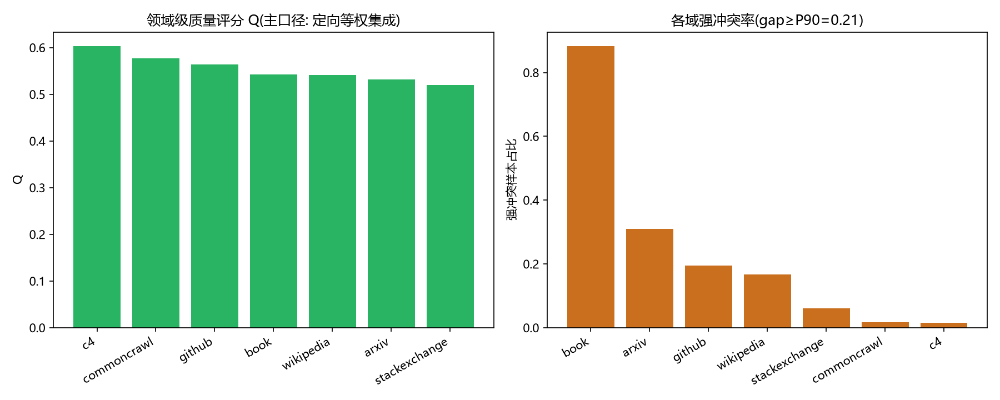

**原始内容验证**：按 Q 十分位统计原文特征，字符中位数从最低分位的 1,196 单调升至最高分位的 19,537，数字字符占比从 1.48% 降至 0.18%——高分文本更长、更完整、噪声更少，评分与"质量"语义一致。

### 4.3 质量冲突：定义、成因与消解

**定义**。初版"样本内 P90−P10 极差≥0.6"的定义在各域冲突率均≈100%，无区分度，弃用。修正为：将 22 维分为语义模型组与启发统计组，定义组间分歧度 gap=|semantic_mean−heuristic_mean|，**强冲突 ⟺ gap≥0.2102**（A1 分布的 P90）；另记录典型成对冲突"高教育价值∧高广告"（全体占 4.96%）。

**冲突率与成因**（扩展集检验）：

| 域 | 强冲突率 | 扩展集对照 | 主因 |
|---|---|---|---|
| book | 88.3% | — | 超长文档（中位 42 万字符）使长度类指标饱和 |
| arxiv | 30.9% | A2 全量 34.8% ✓ | LaTeX 符号（冲突文档中位 1,520 个 vs 非冲突 392 个）推高"非字母占比"等启发指标 |
| github | 19.5% | A3 全量 20.1% ✓ | 代码符号同上 |
| wikipedia | 16.7% | — | 混合成因 |
| stackexchange | 6.0% | — | 问答帖推广与知识内容混杂（成对冲突率 17.6% 为各域最高） |
| commoncrawl / c4 | 1.7% / 1.5% | — | 网页文本两组指标一致性较好 |

指标离群定位进一步互证：句数（29.8%）与词数（24.6%）是最常见的"最偏离指标"，即**过半冲突由长度类统计量引起**。

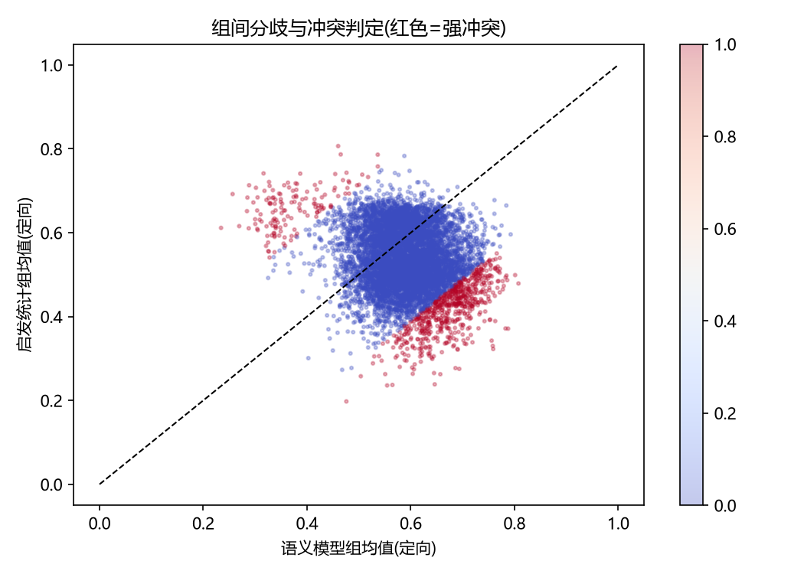

**消解规则与效果**：冲突的本质是少数指标被格式/长度因素污染，故采用去头尾各 4/22 维的截尾均值做鲁棒聚合，等价于自动降权污染指标。效果：全体样本 |ΔQ| 均值 0.024，Q_equal 与 Q_robust 的 Spearman=0.990，域级排序完全不变——消解只对冲突样本做局部修正，评分对聚合规则稳健。

### 4.4 领域配比建模

**数据与预处理**。512 组训练配方（1M 规模）+ 检验集 1M/60M/1B（256/256/64 组）+ 外推表 10B/70B（各 63 组）。配比和∈[0.996,1.003]，回归前按行重归一化。4 个无验证 Loss 的域（nih_exporter、philpapers、enron_emails、europarl）保留其配比列作自变量（影响经份额挤占间接体现），不作因变量。

**模型选择**。Ridge 线性模型检验集 R² 均值约 0.57；梯度提升 GBM 达 0.966–0.993（平均损失 R²=0.979），表明配比→Loss 存在显著非线性与域间交互。最终 **GBM 作预测与寻优模型，Ridge 系数作边际解释**。

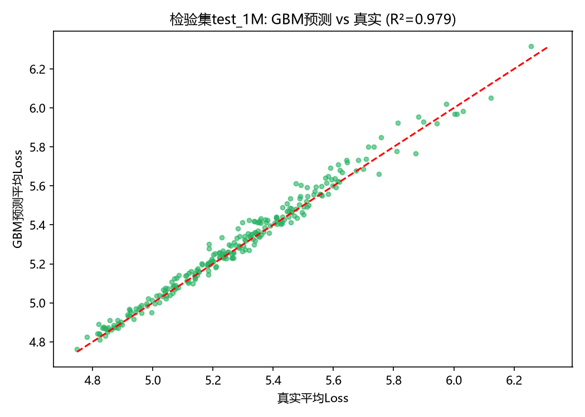

**是否引入质量分 Q 的论证**。按 A16 映射将 6 个 direct/near_direct 域的 Q（其余域取均值缺省）构造质量调整特征 p·Q 加入回归，13 个目标的检验 R² 变化均小于 0.001。原因：Pile 各域经构建期清洗，域间 Q 差异小（0.52–0.58）且为常数，其效应已被域系数吸收；**质量的作用体现在语料构建（过滤）阶段而非配比阶段**，故 Q 留待问题二作为独立因子引入，配比模型不显式含 Q。

**最优配比求解**。目标 min 13 域平均验证 Loss，s.t. Σpᵢ=1, pᵢ≥0。线性目标在单纯形上必然退化到角点解（100% ubuntu_irc，无实际意义），故以 GBM 为目标、SLSQP 四十个 Dirichlet 随机起点寻优，并用 20,000 个随机配比做全局验证。最优配比 p\* 为内点解：stackexchange 17.8%、pubmed_abstracts 14.8%、pile_cc 14.7%、freelaw 14.5%、uspto 9.0% 等——问答与结构化知识文本被加重，arxiv、github 等专项域被降权（目标为 13 域平均 Loss，通用知识域能同时改善多个验证域）。

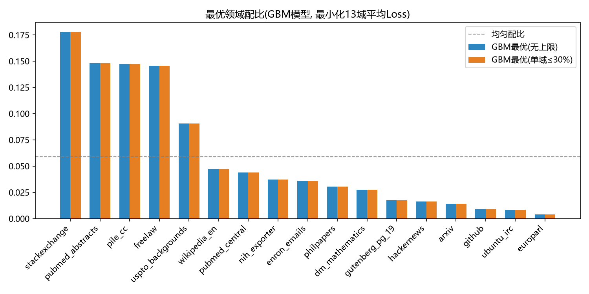

**寻优可靠性**：GBM 目标面呈"高原"——p\* 预测损失 4.722，在 20,000 个随机配比中居前 3.6%，与均匀配比（前 0.6%）、随机全局最优（4.657）差距均在 1.4% 以内，即**大量配比接近最优，配比微调收益有限但方向稳健**。实测验证（检验集中最近邻配方的真实 Loss）：p\* 在 test_1M 达前 4.3%、test_60M 前 3.5%、test_1B 前 15.6%，明显优于均匀配比（前 20.7%/12.1%/14.1%）。

**跨尺度与外推稳健性**。1M 模型直接预测 60M/1B 的 Loss 水平时失效（R² 为负）——Loss 水平随尺度整体下移（5.0→3.6→2.2），配比模型只能在同尺度做绝对预测、跨尺度比较排序。建立尺度无关的 z-score 模型（仅用 train_1M 训练）：test_1M/60M/1B 的排序相关 ρ=0.954/0.928/0.624——**配比规律在真实数据上可迁移，保真度随尺度跨度衰减**。在外推表 est_10B/70B 上所有候选配比均落在高 Loss 分位且排序反转（ρ=−0.43/−0.47），鉴于 est 表系逐配方幂律外推的非观测数据，判断该反转属**外推数据本身的可信边界**，不作为否定配比模型的证据。

**领域影响分析**（Ridge 系数+消融）：从均匀配比移除某域导致的平均 Loss 上升幅度排序——ubuntu_irc(+0.054)、dm_mathematics(+0.040)、hackernews(+0.027) 边际价值最高；arxiv、freelaw、github 的占比高于其边际价值。注意 ubuntu_irc 自身在 13 个验证域内，存在自我评价偏差，解释时已剔除。

### 4.5 问题一小结

建立了"定向归一化→组间平衡等权集成→截尾鲁棒消解→原文验证"的质量评价管线与"GBM 映射+SLSQP 寻优+随机搜索验证+跨尺度排序检验"的配比建模管线，全部结论经扩展集、检验集、外推表三重验证，产出后续问题所需的 Q（域级与样本级）、p\*、配比惩罚因子 m(p) 与"配比规律跨尺度可迁移"的实证依据。

## 五、问题二：跨维度数据融合与广义标度律

### 5.1 经典标度律拟合（B1 主拟合）

以 Chinchilla 形式 L(N,D)=E+A·N^(−α)+B·D^(−β) 在 Pythia 训练日志（1,176 个轨迹点，8 个模型 0.07–12B）上做 Huber 稳健非线性最小二乘（对数残差、30 随机起点）：

| 参数 | 估计值 | 95% Bootstrap CI |
|---|---|---|
| E | 1.6898 | [1.6897, 1.6899] |
| A | 0.3540 | [0.3539, 0.3540] |
| α | 0.3400 | [0.3399, 0.3400] |
| B | 1.2403 | [1.2402, 1.2404] |
| β | 0.2799 | [0.2799, 0.2799] |

α≈0.34、β≈0.28 与 Hoffmann 等（2022）报告值一致，构成独立文献佐证。诊断发现：相对残差 P99 仅 0.016%，题给 B1 表格几乎精确落在幂律曲面上（表格由标度律生成/高度平滑），故不确定性主要通过族外验证评估。

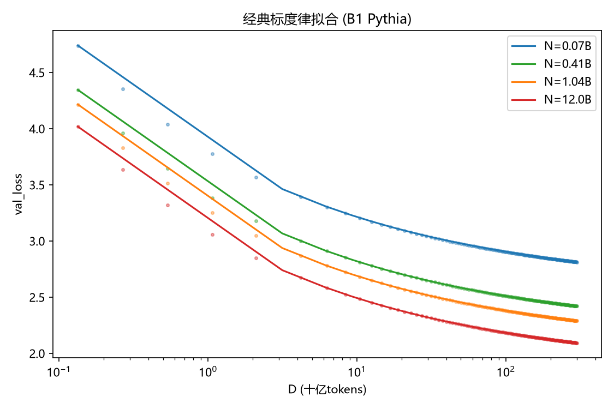

### 5.2 四路验证

| 验证集 | n | R² | Spearman | 结论 |
|---|---|---|---|---|
| B3 插值轨迹（8×500） | 4,000 | 0.9999–1.0000 | 1.000 | 轨迹形状完全吻合 |
| B5 文献基准 | 44 | 0.731 | 0.959 | 跨文献有效 |
| B4 跨族收敛点（12 族） | 57 | 0.604 | 0.983 | 跨族基本有效 |
| B2 Cerebras（族外） | 1,029 | −5.07→**0.385**（单参数再校准后） | 0.788 | 指数跨族稳定，水平参数族间漂移 |

族外分析：Cerebras 观测均值比预测高 1.178（数据分布/评测集差异），仅引入一个族常数 δ=1.178 再校准后 R² 由 −5.07 升至 0.385——**跨族应用须用少量本族点校准不可约损失项**。大模型外推：经典律外推至 128 个 100B–10000B 模型与 B10 估算值 R²=1.000（B10 本身为估算数据，仅作一致性核对），三个数量级外推未见系统性弯曲。

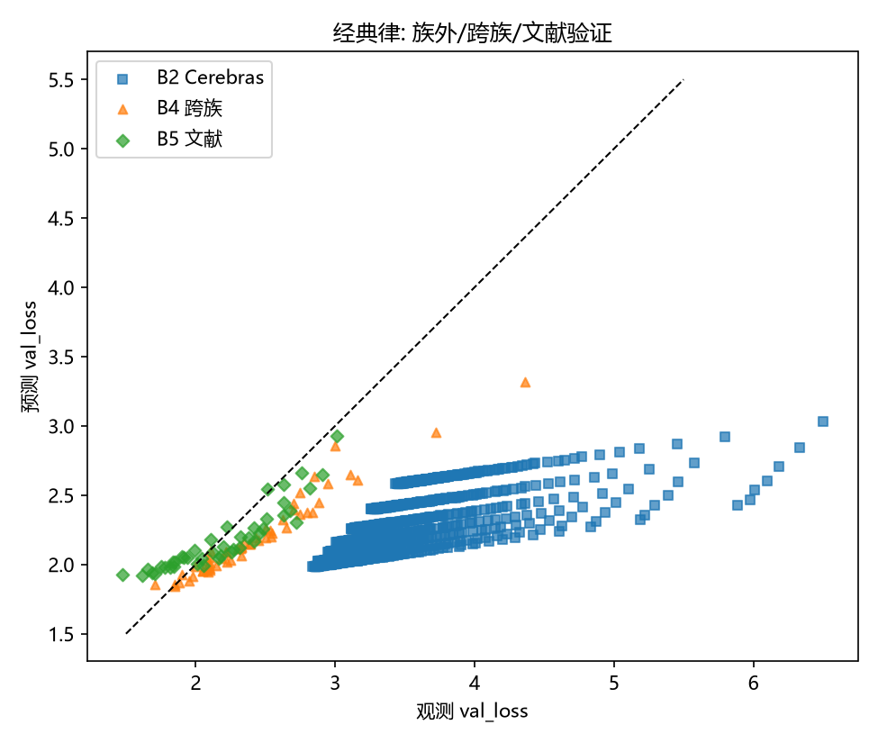

### 5.3 纳入质量 Q 的广义形式

候选三形式均满足"Q→1 时退化为经典形式"（依据：Q∈[0,1] 归一化，Q=1 为质量上界，此时不应再有质量折损）：

- **F1（乘性·有效数据）**：L=E+A·N^(−α)+B/(D^β·Q^γ)——质量按指数放大有效数据；
- F2（加性质量项）：L=E+A·N^(−α)+B·D^(−β)+G·Q^(−γ)；
- F3（线性有效数据）：L=E+A·N^(−α)+B/(D(1+λQ))^β。

B6 拟合 AIC 显示 F2 略优，但 F2 的不可约项坍缩至 E≈4.5×10⁻⁵，与 B1 实测 E=1.69 严重冲突，物理上不可接受。依"与真实数据锚定+退化约束+可解释性"三原则**选定 F1**——其经济学解读为：质量与数据量沿同一通道（有效数据）进入损失函数，完全可替代。

**半合成数据可信度诊断（关键）**：逐 (N,D) 网格点检验 Q–Loss 方向，B6/B7 全部网格点 Spearman<0（均值 −0.922，方向正常），而 **B8 全部网格点 Spearman>0（均值 +0.992，方向完全反转）**，且 Loss 出现 0.5 的人为截断下界，与 B6 的 160 个重叠点平均偏差 1.157。判定 B8 生成过程与 B6/B7 不一致，**不可用于质量项拟合**，作为半合成数据可信度边界的案例报告。

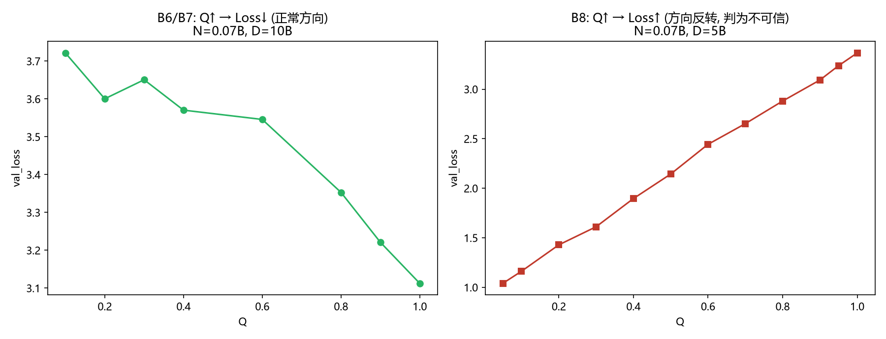

### 5.4 最终广义标度律

F1 在 B6 拟合得 γ=0.0886（B7 独立验证 R²=0.958）。因 B6 半合成数据的损失尺度与 B1 不同，采用分步锚定：E、A、α、B、β 取自真实数据 B1，γ 取自 B6/B7 的相对变化率（对尺度平移不变）。配比 p 经问题一 GBM 模型折算为数据项惩罚因子 m(p)≥1（最优配比 m=1，实测最差配比 m=1.42）。

$$\boxed{L(N,D,Q,p)=1.6898+\frac{0.3540}{N^{0.3400}}+\frac{1.2403\cdot m(p)}{D^{0.2799}\cdot(Q/Q_0)^{0.0886}}}$$

其中 Q₀=0.55（Pile 各域 Q 均值，B1 数据的质量口径）。等价有效数据形式：L=E+A·N^(−α)+B·D_eff^(−β)，**D_eff=D·(Q/Q₀)^(γ/β)·m(p)^(−1/β)**，γ/β=0.317。

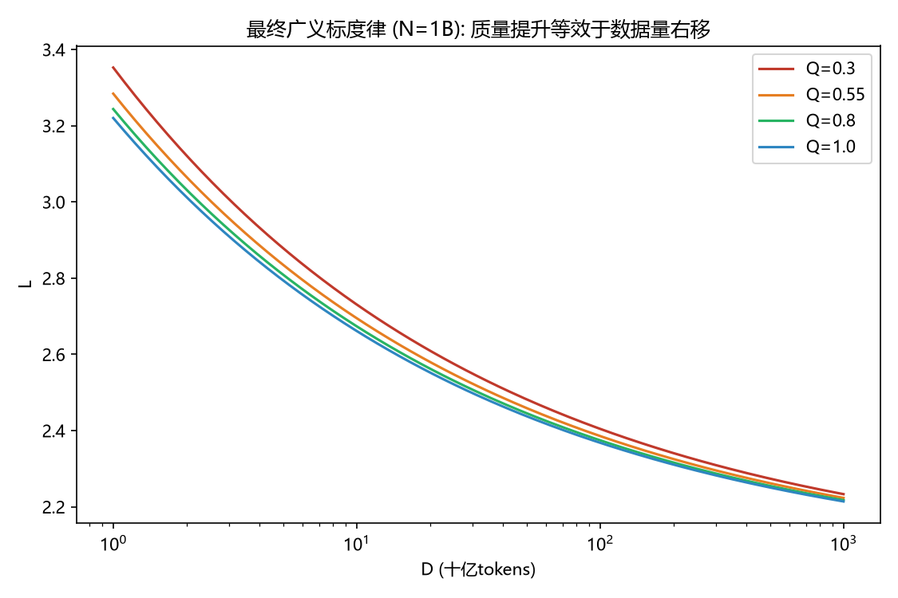

### 5.5 弹性、边际效用与替代条件

各参考点弹性（|∂lnL/∂lnx|）：

| 参考点(N, D=20N, Q=0.55) | L | 不可约项占比 | e_N | e_D | e_Q |
|---|---|---|---|---|---|
| 0.4B, 8B | 2.866 | 59.0% | −0.057 | −0.068 | −0.021 |
| 1B, 20B | 2.580 | 65.5% | −0.047 | −0.058 | −0.018 |
| 7B, 140B | 2.184 | 77.4% | −0.028 | −0.040 | −0.013 |
| 70B, 1400B | 1.937 | 87.3% | −0.015 | −0.024 | −0.008 |

规律：规模越大，不可约损失占比越高，三项弹性均衰减（收益递减）；同点上 |e_D|>|e_N|>|e_Q|。N=1B、D=20B 处各因素投入+1% 的边际收益：ΔL_N=−0.0012、ΔL_D=−0.0015、ΔL_Q=−0.0005。

**质量–规模替代条件**（令 dL=0 推导）：ΔN/N=(γS)/(αP)·(ΔQ/Q)，其中 P=A·N^(−α)、S=B/(D^β·(Q/Q₀)^γ)。代入参数：**Q 提升 0.1 等价于参数量增加 6.8%–9.3%**（替代率随规模上升）——模型越大，买质量相对堆参数越划算。配比维度：最差→最优配比等价数据项 ×1/1.42，即等效数据量约 ×3.5，理论上高于质量提升的上限（(1/0.55)^0.317≈1.21 倍），但受问题一"目标高原"限制实际收益远小于该上限。

### 5.6 问题二小结

广义标度律统一了三个数据源：B1 提供真实锚定的 (E,A,α,B,β)，B6/B7 提供质量指数 γ，问题一提供配比惩罚 m(p)。局限性：B1 近无噪、γ 跨族未验证、质量-配比可分离假设未获全维度实验直接检验，已在文中如实标注。

## 六、问题三：算力约束下的多维资源联合优化与结构性转移

### 6.1 优化模型

$$\min_{N,D,Q}\; L(N,D,Q)=E+\frac{A}{N^{\alpha}}+\frac{B}{D^{\beta}(Q/Q_0)^{\gamma}}$$

$$\text{s.t.}\quad \underbrace{6ND}_{\text{基础训练}}+\underbrace{D\cdot[g(Q)-g(Q_0)]_{+}}_{\text{质量提升}}+\underbrace{\eta N D L_{ctx}}_{\text{注意力}}\;\le\; B,\quad Q_0\le Q\le 1$$

**配比 p 的处理（理由说明）**：题面明确配比调整不增加算力开销，其最优值恒为问题一的 p\*（m=1），p 与 (N,D,Q) 决策可分离，故固定 p=p\* 不作联立寻优——是有依据的简化而非忽略。**L_ctx 外生**，可行取值依据 C7 的 45 个主流开源模型架构：{2048(18 个), 4096(8), 8192(7), 32768(11), 131072(1)}，仅在此五值上做情景与敏感性分析。

**临界值解析推导**：令 η·N·D·L_ctx=6ND ⟹ **L\*=6/η=30,000 tokens**。对照 C7：2048–8192 档处于"注意力次要区"（占比 6.8%–27.3%）；32768 档（Qwen2.5 全系、Mistral）恰好越过临界（109%）；131072 档（Llama-3.1）注意力开销是基础训练的 4.37 倍。

### 6.2 三档预算下的最优配置

| 预算 | N\* | D\* | Q\* | 最优Loss | 训练/质量/注意力份额 |
|---|---|---|---|---|---|
| 10¹⁹（低） | 0.221B | 7.05B | 0.550（不投资） | 2.999 | 93.6%/0%/6.4% |
| 10²²（中） | 5.72B | 258.9B | 0.903 | 2.136 | 88.8%/5.1%/6.1% |
| 10²⁴（高） | 44.3B | 3,475B | 1.000（顶格） | 1.907 | 92.4%/1.3%/6.3% |

与"收入→消费结构"类比完全吻合：低预算先顾温饱（全投规模）、中预算重视教育（开始买质量）、高预算质量顶格后重回规模。质量投资的价值：中预算下优化 Q 比固定 Q₀ 的 Loss 低 0.0071，相当于约 7%–9% 的参数增长（问题二替代率），而成本仅占预算 1%–5%——质量是性价比极高的边际投入。

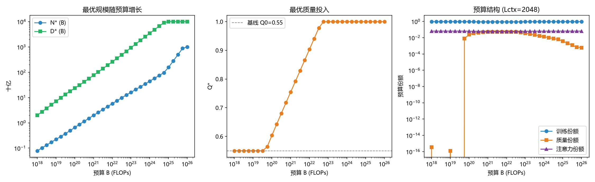

### 6.3 结构性转移：定义与识别

**数学定义**：设最优解 x\*(B) 与预算结构 s(B)=(C_train, C_Q, C_attn)/C_total，称 B 处发生结构性转移，若满足下列任一：**T1**（主导项切换）argmax s(B) 分量改变；**T2**（约束激活切换）KKT 活跃约束集改变（Q\* 触及上界 1 或退回下界 Q₀）；**T3**（份额穿越）某分量份额穿越 0.1%/10%/50% 阈值。

**识别结果**（33 点预算扫描+二分法精确定位）：

| 转移 | 临界预算 | 含义 |
|---|---|---|
| 质量投资激活（T3） | **B\*≈4.6×10¹⁹ FLOPs** | B<B\* 时 Q\*=Q₀ 角点解，买质量不如堆规模 |
| 质量饱和（T2） | **B\*\*≈4.4×10²² FLOPs** | Q\* 触及上界 1，此后预算增量全部投入 N、D |
| 质量份额二次回落 | ~4×10²⁵ | Q=1 封顶后质量成本被动稀释（非策略性变化） |

三个预算档恰好落在三个 regime（规模优先区/质量并进区/质量饱和区）——**算力预算的量级变化引起最优策略的质变**，且转移点可由边际收益均衡条件解析定位。

### 6.4 成本函数形式的影响

| 成本形式 g(Q) | Q\*（B=10²²） | 质量份额 | 最优Loss | 解读 |
|---|---|---|---|---|
| 指数型 10⁷·e^{6Q} | 0.903 | 5.1% | 2.1361 | 边际成本递增，适度投资 |
| 幂函数型 5×10⁹·Q⁴ | 0.892 | 6.8% | 2.1377 | 与指数型相近 |
| 对数渐进型 2×10⁹·ln(1+10Q) | 1.000 | 2.8% | 2.1322 | 边际成本递减，一旦投资就投到顶 |

三种形式的 Loss 差异<0.3%，但配置策略定性不同——**成本函数形式影响策略形态甚于最终收益**，实际建模应优先校准成本函数的曲率。

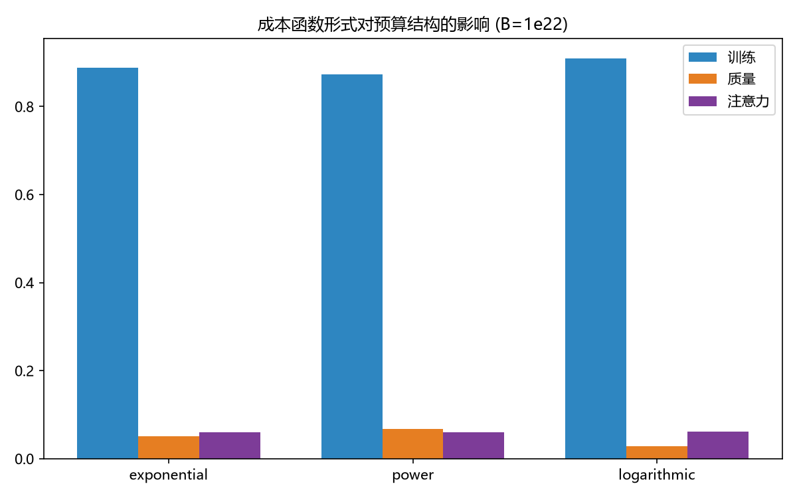

### 6.5 上下文长度敏感性

| L_ctx | C_attn/C_train | N\* | D\* | Q\* | 最优Loss |
|---|---|---|---|---|---|
| 2048 | 6.8% | 5.72B | 258.9B | 0.903 | 2.136 |
| 8192 | 27.3% | 5.29B | 234.8B | 0.917 | 2.148 |
| 32768 | 109.2% | 4.25B | 178.0B | 0.956 | 2.183 |
| 131072 | 436.9% | 2.76B | 107.9B | 1.000 | 2.258 |

L_ctx 越过临界值后注意力开销吞噬近半预算，N\* 缩水 26%、D\* 缩水 31%；且 **L_ctx 越大 Q\* 越高**——规模被挤压时模型自动加大质量投入补偿（质量-规模替代关系的内生体现），128K 上下文下 Q\* 顶格。实践推论：长上下文模型更应配套高质量数据工程。

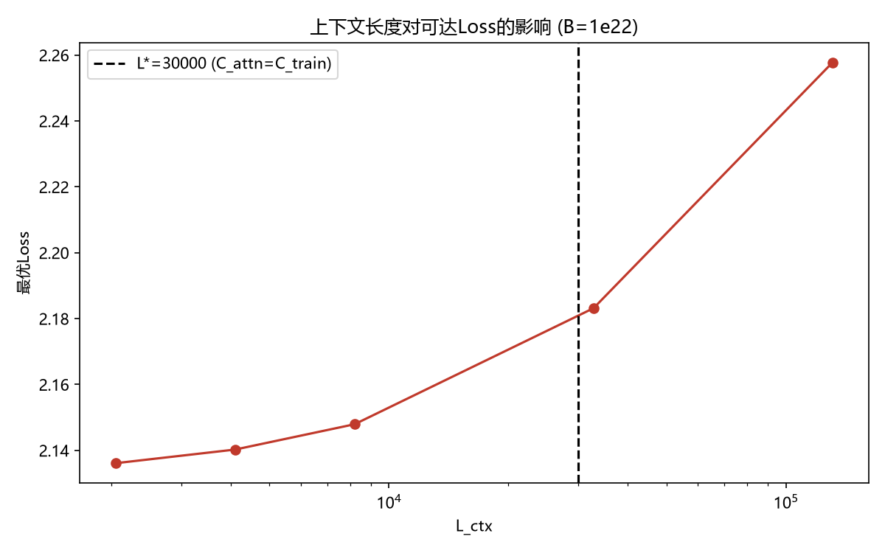

### 6.6 数据墙讨论

B≥10²⁵ 时 D\* 触及 10T tokens 数据上界（现实高质量文本量级），此后 N\* 单边扩张、边际收益加速衰减——"数据墙"在优化模型中自然显现，与题述 OpenScholar-8B 案例的现实转向一致。

## 七、问题四：技术演进分析与前沿预测

### 7.1 口径声明

| 口径 | 选择 |
|---|---|
| 综合能力 | 六维 Benchmark 官方平均分（避免二次加权的主观性） |
| 开源筛选 | 宽口径（主用）：OSI 许可或开放权重社区许可（llama/gemma/openrail 等），2,357 个模型；严口径（稳健性）：仅 OSI，1,765 个 |
| 模型类型 | pretrained（272）与 chat/finetuned（715）分开，回归设 is_chat 哑变量 |
| 时间轴 | 提交日期（能力被公开验证的时刻）；C3 用其自带 Year |
| 桥接 | C6 按 Loss_Comparability 分层：High（7 条，Pythia 同分布）验证形式，Medium（68 条）拓宽量程 |

### 7.2 C8 逐任务聚合分析（必用要求）

解析 1,863 个模型目录（取最新可解析 JSON，7 个损坏条目跳过并记录），得 **1,860 个模型 × 68,860 条逐任务记录**，1,854 个模型六维完整（与《数据说明》口径一致）。

**任务区分度**：时序推理（bbh_temporal_sequences，跨模型 σ=27.1 分）、bbh_ruin_names（24.6）、高等代数（math_algebra_hard，均值仅 20.1%）区分度最高——**时序推理与高等代数是当前能力分层的主战场**；指令遵循类任务 σ 较小，后训练已使其趋于普及。

**一致性验证**（1,858 个匹配模型）：C8 聚合分与 C1 汇总表五维 Spearman∈[0.978, 0.999]、线性 R²∈[0.95, 0.998]（C1 为基线归一化分）；MATH Lvl 5 较弱（ρ=0.81，归一化含难度基线），故 C8 重建分仅用于相对比较。逐任务聚合管线与官方汇总表一致可信。

### 7.3 规模扩张与非规模技术进步的分离

**方法（动力学分解）**：面板回归 Average=β₀+β₁·log₁₀N+β₂·(Year−2022)[+β₃·is_chat]，β₁ 度量规模弹性，β₂ 度量固定规模下的年度技术进步。

**截面估计**（n=4,585，R²=0.43）：**规模弹性 14.50±0.25 分/dex（t=58.3）；技术进步 3.41±0.23 分/年（t=14.6）**。稳健性：C2 短窗给出 logN 弹性 14.74 分/dex（一致）、is_chat=+1.71 分（t=5.1）；C4 算力匹配子集（49 个知名模型，C4 只收录 notable 模型，交集天然有限）给出 logC 弹性 7.58 分/dex，方向一致。

**前沿归因（关键发现）**：2022–2025 年能力前沿（年度 top3 均值）年均提升 +5.68 分，但**前沿模型参数量不升反降**（11.11→10.52 dex）——榜单前沿已被高效小模型占据（OpenScholar-8B 现象的统计印证）。代入分解式：规模贡献≈−2.9 分/年（≈0%），**非规模技术进步贡献≈+5.7 分/年（>100%，即全部净增长）**。这与问题三"算力放缓时质量/配比/训练方法主导"的优化结论互证。

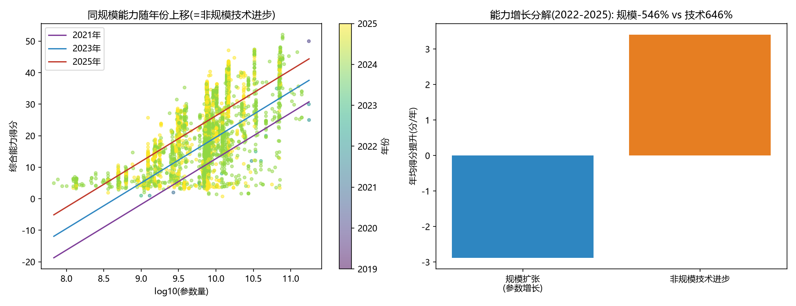

### 7.4 Loss–Benchmark 桥接

对数形式拟合（C6 全部 75 条）：**LB=52.75−44.52·ln(Val_Loss)**，R=−0.504，RMSE=10.06 分。分层诊断：High 子集留一法 RMSE 仅 0.55 分但量程太窄；Medium 子集 Loss 来自不同技术报告、口径混杂（示例：Meta-Llama-3-8B 预测 27.6 分 vs 实测 13.6 分）。结论：**桥接只宜用于宏观趋势换算，±10 分的映射误差会主导 Loss 侧预测精度**，故前沿预测直接建立在 Benchmark 时间序列上，桥接仅作一致性参照（问题三 10²⁴ FLOPs 最优 Loss 1.907 经桥接约 24 分，处于 base 模型区间，与"预训练 Loss 不反映后训练收益"一致）。

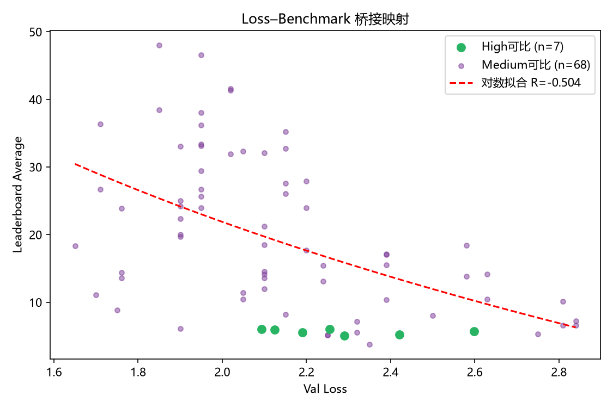

### 7.5 前沿预测（12/24 个月）

三条独立序列趋势一致：年度 top3（2022–2025）线性斜率 7.6 分/年，月度 top5（2024-06~2025-03）10.0 分/年，对数时间减速情景 R=0.78。Bootstrap 3000 次给出 95% 预测区间：

| 预测时点 | 线性持续情景（95% PI） | 算力放缓·减速情景（95% PI） | 月度序列交叉验证 |
|---|---|---|---|
| +12 个月（2026） | 57.8（43.4–72.8） | **53.3（40.5–64.8）** | 54.2（43.2–65.0） |
| +24 个月（2027） | 65.4（46.3–85.5） | **57.1（41.2–71.6）** | 64.2（43.9–84.8） |

**算力增长放缓情景下，开源模型能力前沿 12 个月后约 53–58 分、24 个月后约 57–65 分**；两情景在 +24 个月时约 8 分的差距即"算力是否继续扩张"的政策含义。不确定性来源：可靠趋势点少（年度仅 4 点）、C3 混合口径（2019–2021 数据已剔除）、前沿提交的自选择偏差，PI 半宽 10–20 分，如实呈现。

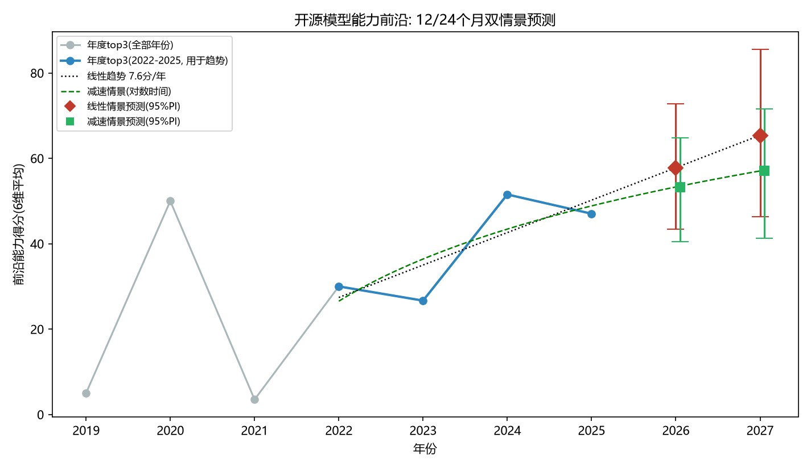

## 八、模型评价与展望

**优点**：①全链路数据驱动，所有参数均有出处、所有结论均有验证集/扩展集/文献交叉检验；②建立了系统的数据可信度诊断流程（方向一致性检验、残差诊断、可比性分层），识别并处置了 B8 方向反转、B1 近无噪、est 表排序反转三处数据陷阱；③广义标度律满足退化约束且与真实数据锚定，形式简洁可解释；④结构性转移有可操作的数学定义与解析定位。

**局限**：①B1 近无噪使参数置信区间过窄，真实不确定性依赖族外验证（族外 R² 0.38–0.73）；②质量指数 γ 取自半合成数据，跨族迁移未验证；③质量-配比可分离假设未获全维度实验直接检验；④C4 与榜单算力匹配仅 49 个模型，算力口径分解为辅助证据；⑤前沿预测趋势点少，预测区间较宽。

**展望**：可在质量成本函数中引入领域异质性（不同域的 g(Q) 不同）；将配比惩罚 m(p) 细化为随尺度变化的函数；用更长时间跨度的多基准面板改进前沿预测的稳健性。

## 参考文献

[1] Hoffmann, J., Borgeaud, S., Mensch, A., et al. Training Compute-Optimal Large Language Models. NeurIPS 35, 2022.
[2] Kaplan, J., McCandlish, S., Henighan, T., et al. Scaling Laws for Neural Language Models. arXiv:2001.08361, 2020.
[3] Bahri, Y., Dyer, E., Kaplan, J., et al. Explaining neural scaling laws. PNAS, 121(27), 2024.
[4] Xia, M., et al. RegMix: Data Mixture as Regression for Language Model Pre-training. ICML 2024.
[5] Biderman, S., et al. Pythia: A Suite for Analyzing Large Language Models Across Training and Scaling. ICML 2023.
[6] Asai, A., et al. Synthesizing scientific literature with retrieval-augmented language models. Nature 650, 857–863, 2026.
[7] Schaeffer, R., Miranda, B., Koyejo, S. Are Emergent Abilities of Large Language Models a Mirage? NeurIPS 36, 2023.
[8] SlimPajama-Meta-rater 质量信号数据集, https://huggingface.co/datasets/opendatalab/SlimPajama-Meta-rater, 访问时间（2026 年 9 月）.
[9] Open LLM Leaderboard v2 评测数据, https://huggingface.co/datasets/open-llm-leaderboard-old/results, 访问时间（2026 年 9 月）.
[10] Epoch AI Models Dataset, https://epoch.ai/data/all_ai_models.csv, 访问时间（2026 年 9 月）.

## 附录

### 附录 A：数据利用清单

| 数据 | 使用方式 | 绑定问题 |
|---|---|---|
| A1（51,230 条） | 全量流式读取，22 指标标量化、质量评价与冲突分析主样本 | 一 |
| A2/A3（221,275 条） | 全量读取，arxiv/github 域级 Q 与冲突结论检验 | 一 |
| A4–A5（512 组） | 配比模型训练 | 一 |
| A6–A11（576 组） | 配比模型检验 | 一 |
| A12–A15（126 组） | 外推稳健性讨论（标注为外推数据） | 一 |
| A16 | 跨域映射参考 | 一 |
| B1（1,176 点） | 经典标度律主拟合 | 二 |
| B2（1,029 点） | 族外验证+单参数再校准（标注半合成） | 二 |
| B3（4,000 点） | 插值轨迹验证 | 二 |
| B4/B5（101 点） | 跨族与文献验证 | 二 |
| B6/B7（810 点） | 质量项拟合/验证（标注半合成） | 二 |
| B8 | 方向反转诊断后剔除（可信度边界案例） | 二 |
| B9/B10（128 点） | 大模型外推一致性核对（标注估算） | 二 |
| C1/C2（4,576 模型） | 能力度量、类型与开源口径、月度前沿 | 四 |
| C3（4,599 条） | 2019–2025 年度前沿与技术进步估计（混合口径已声明） | 四 |
| C4（3,523 条） | 算力/数据量/开源权重字段，49 模型匹配 | 四 |
| C6（75 条） | Loss–Benchmark 桥接（分可比性） | 四 |
| C7（45 模型） | L_ctx 可行取值 {2048,4096,8192,32768,131072} | 三 |
| C8（1,860 目录） | 逐任务聚合：任务区分度、与 C1 一致性验证 | 四 |

### 附录 B：AI 工具使用披露

本研究使用 AI 助手（WorkBuddy）辅助完成：代码框架搭建与调试、文档整理。核心建模决策（熵权退化的识别与处置、冲突定义的迭代、B8 数据陷阱的诊断、广义标度律形式选择、结构性转移定义）均由参赛队基于计算结果分析后确定；全部理论、公式与实验结论均有正式文献或附件数据支撑，AI 输出内容均经核验。使用范围符合赛题《人工智能工具及输出使用规定》。

### 附录 C：过程文件与代码清单

全部过程数据（91 个文件）与可复现脚本（11 个）随附于 KIMI 文件夹：`q1_quality/`（样本级质量分 27.3 万条、冲突分析、归一化参数）、`q1_mixture/`（回归验证、最优配比、外推检验）、`q2_scaling/`（参数 Bootstrap、四路验证、弹性分析）、`q3_optimization/`（最优配置、预算扫描、转移识别）、`q4_evolution/`（C8 聚合 6.9 万条、贡献分解、前沿预测）、`scripts/`（q1_quality.py、q1_quality_refine.py、q1_mixture.py、q1_mixture_v2.py、q1_mixture_verify.py、q2_scaling.py、q2_fix.py、q3_opt.py、q4_c8_aggregate.py、q4_evolution.py、q4_evolution_v2.py、q4_forecast.py），按 README.md 中顺序可一键复现全部结果。
