# 算力约束下提升大语言模型能力的资源配置建模

**——数据质量评价、广义标度律、结构转移与前沿预测的统一建模**

---

## 摘要

大语言模型能力的提升受制于"参数规模 $N$、数据量 $D$、数据质量 $Q$、领域配比 $p$、上下文长度 $L_{ctx}$"与有限算力之间的多维权衡。本文将大模型训练类比为"培养学生"：$N$ 为脑容量、$D$ 为阅读量、$Q$ 为教材质量、$p$ 为课时分配、$C$ 为教育经费。围绕这一主线，本文依次完成数据刻画、规律建模、约束优化与前沿预测四步递进建模，形成了**从数据到规律、从规律到决策、从决策到预测**的完整闭环。

**问题一：数据质量评价、冲突消解与配比建模。** 对 22 个方向不一的质量指标做方向统一、列表压缩与稳健归一，用等权/熵权/CRITIC/PCA 四方案组合赋权，得到样本级综合质量分 $Q$（抽样集 $\bar Q=0.5166$，五方案 Kendall 协同系数 $W=0.8756$，$p<10^{-15}$）。定义三语义族（分类器/DSIR/文本统计）的族间冲突度，发现冲突度与质量分强负相关（$r=-0.859$），冲突是低质量样本的系统标志。建立 7 质量域→17 配方域的三级映射（L1/L2/L3），对配比-损失数据提出**三步去规模归一化**，使跨规模预测成立（检验集 $R^2$：1M 为 0.858、10B 为 0.888、70B 为 0.881）。核心发现：配比-损失**结构**跨规模高度保持（$r>0.96$），而**幅度**收缩至 1M 的约 26%，且同域自效应存在随规模的**符号翻转**。

**问题二：广义标度律。** 先复核经典律，在真实训练轨迹（B1）上精确拟合得 $L=1.6898+0.3540N^{-0.3400}+1.2403D^{-0.2799}$（$R^2=1.0000$），并用"族内标定"证明函数形式可跨族迁移。识别并修正附件 B8 的**质量口径反转**（其 `Q_score` 实为难度口径，须作 $1-Q$ 反转）。给出满足退化性的广义标度律：
$$L(N,D,Q)=E+\left(aN^{-\alpha}+bD^{-\beta}\right)Q^{-\gamma},\quad E=1.5132,\ a=0.5327,\ \alpha=0.2588,\ b=1.1921,\ \beta=0.2273,\ \gamma=0.1184,$$
在 B7 上 $R^2=0.9665$（较经典律 $\Delta R^2=+0.087$），且 $Q=1$ 时**严格退化**（误差 $4\times10^{-16}$）。据此得到三条工程结论：质量等价于数据（$Q=0.5\approx$ 数据量 $\times3.3$）；**质量不改变最优 $N\!:\!D$ 配比**（等算力最优 $D/N\approx30$ 与 $Q$ 无关）；质量红利量化（$Q$ 从 0.5 提到 1.0 省约 49% 算力）。

**问题三：算力约束下的联合优化与结构性转移。** 建立三项成本模型（训练 $6ND\times10^{18}$、质量 $D\cdot10^9[g(Q)-g(Q_0)]_+$、注意力 $\eta ND\cdot10^{18}L_{ctx}$），证明**精确一维化定理**：最优 $N^*/D^*$ 仅由标度律指数决定，与 $Q,L_{ctx},C$ 无关，得到闭式 $aN^{-\alpha}+bD^{-\beta}=C_\rho(ND)^{-\rho}$（$\rho=0.1210$，$C_\rho=1.6325$）。解析给出**临界上下文长度 $L_{ctx}^{crit}=6/\eta=30000$**，并证明其与所有决策变量无关。定义"结构性转移"的三重判据（模式质变/份额变点/活跃约束切换），三法独立收敛于同一批转移点，揭示"低预算顾规模→中预算重质量→高预算质量饱和"的三区制规律。

**问题四：技术演进分解与前沿预测。** 建立"规模-能力-时间"二维模型 $y=4.460+14.428\log_{10}N+12.088\tau$，并用**固定规模分箱前沿位移 + 规模分布迁移**的双通道分解，分离出非规模技术进步 $\approx14.5$ 分/年（四条独立路径一致），而规模扩张贡献几近为零（前沿规模非但未扩张反而收缩）。采用饱和增长模型预测算力放缓三情景下 12/24 月前沿边界，给出 bootstrap 不确定性区间；并利用 Loss–Benchmark 桥接数据识别出模型类型混杂（instruct 比 base 平均高 5.54 分）这一关键误差源。

**本文的创新点：** ① 提出"三步去规模归一化"，破解配比-损失模型的规模混淆，实现跨量级泛化；② 通过族内标定与口径诊断，将两个独立数据源（A 配比实验、B 质量实验）统一到同一广义标度律；③ 证明"精确一维化定理"与"临界上下文长度与全部决策变量无关"，将三维非线性规划精确降维；④ 用"固定规模分箱"将技术进步从规模扩张中**干净地分离**，得到口径稳健的贡献分解；⑤ 给出可解释的能力前沿饱和增长预测与不确定性量化。

**关键词：** 大语言模型；标度律；数据质量评价；领域配比；算力约束优化；结构性转移；能力前沿预测；因果分解

---

## 目录

- [一、问题重述](#一问题重述)
- [二、问题分析](#二问题分析)
- [三、模型假设与符号说明](#三模型假设与符号说明)
- [四、问题一：数据质量评价、冲突消解与配比建模](#四问题一数据质量评价冲突消解与配比建模)
- [五、问题二：跨维度数据融合与广义标度律](#五问题二跨维度数据融合与广义标度律)
- [六、问题三：算力约束下的多维资源联合优化与结构性转移](#六问题三算力约束下的多维资源联合优化与结构性转移)
- [七、问题四：技术演进分解与前沿预测](#七问题四技术演进分解与前沿预测)
- [八、模型检验与灵敏度分析](#八模型检验与灵敏度分析)
- [九、模型的评价、改进与推广](#九模型的评价改进与推广)
- [十、结论](#十结论)
- [参考文献](#参考文献)
- [附录](#附录)

---

## 一、问题重述

### 1.1 问题背景

以大语言模型（LLM）为代表的人工智能技术发展迅速。大模型训练可类比为培养高质量学生：参数量 $N$ 相当于脑容量，训练数据量 $D$ 相当于阅读量，计算量 $C$ 相当于教育经费，数据质量 $Q$ 相当于教材质量，领域配比 $p$ 相当于各科课时分配。

标度律刻画模型损失随规模变化的经验规律，常见形式为 $L(N,D)=E+A N^{-\alpha}+B D^{-\beta}$。随着高质量语料需求持续增长，干净数据日益稀缺、数据污染日趋严重，"数据墙"问题突出，数据质量 $Q$ 与领域配比 $p$ 对模型能力的作用不容忽视（如 OpenScholar-8B 在若干任务上以 80 亿参数超越 GPT-4o）。

扩大规模、提升质量、延长上下文均需付出算力代价，而算力有限；上下文越长，注意力与 KV 缓存开销越高，会挤压可用预算。本赛题要求建立参数规模、数据规模、数据质量、领域配比与 Loss 之间的关系，并研究算力约束下的资源配置。

### 1.2 需要解决的问题

四问构成一条递进主线：**问题一刻画数据本身的质量与配比，问题二把数据因素纳入标度律，问题三在算力预算下求解最优配置，问题四用历史评测数据检验规律并预测能力前沿；前一问的输出是后一问的输入。**

- **问题一（数据质量评价、冲突消解与配比建模）**
  （1）对质量指标预处理、统一方向、建立综合评价模型，给出样本/语料/领域级质量评分 $Q$，说明聚合方式；使用 A1–A3 全量并给出扩展集对照。
  （2）定义"冲突"、分析成因、建立含冲突消解的综合评价模型；抽样集覆盖 + 扩展集检验。
  （3）利用 A4–A15 建立 17 域配比 $p$ 与交叉熵损失的定量关系，处理单纯形约束，在检验集 A6–A11 验证，用外推表 A12–A15 讨论稳健性。
- **问题二（跨维度数据融合与广义标度律）** 综合附件 A、B 建立同时含 $N,D,Q,p$ 的广义标度律；分析边际效用与弹性，讨论领域替代/互补，推导质量与规模可相互替代的条件；完成参数估计、检验与验证。
- **问题三（算力约束下的多维资源联合优化与结构性转移）** 在 $C_{train}=6ND$、$C_Q=D[g(Q)-g(Q_0)]_+$、$C_{attn}=\eta ND L_{ctx}$ 三项成本下，求 $N,D,Q$（及 $p$）的最优配置；分析预算跨量级时的**结构性转移**并给出数学定义与识别方法；解析给出 $L_{ctx}^{crit}=6/\eta$ 并做敏感性分析。
- **问题四（技术演进分析与前沿预测）** 结合附件 C 建立动力学/因果推断模型，分离"规模扩张"与"非规模技术进步"的贡献占比；在算力放缓情景下预测未来 12/24 月开源模型能力前沿边界并做不确定性分析；说明能力度量、开源口径、模型类型与时间轴口径；用 Loss–Benchmark 桥接数据建立映射并讨论误差影响。

---

## 二、问题分析

### 2.1 总体思路

四问的建模逻辑呈链式结构：

```
问题一：数据质量 Q + 配比 p + 质量-配比-损失关系
   │（输出 17 域质量 q、配比损失弹性）
   ▼
问题二：广义标度律 L(N,D,Q,p)  ←── 融合附件 A/B 两个独立实验
   │（输出可微的 L(N,D,Q)）
   ▼
问题三：算力约束 min L(N,D,Q) s.t. C_train+C_Q+C_attn ≤ C
   │（输出最优配置与结构转移规律）
   ▼
问题四：Benchmark 能力前沿 = f(历史演进) → 规模 vs 技术分解 → 前沿预测
```

四问之间通过"损失 Loss"与"能力 Benchmark"两个可互相桥接的度量贯穿，形成一致的物理图景。

### 2.2 关键难点

1. **质量指标方向与量纲不统一**：22 个指标含正向/负向/区间型，含标量/列表型，须统一为"越高越好"。
2. **跨体系域不一致**：质量数据 7 域与配方实验 17 域体系不同，须自建映射。
3. **规模混淆**：损失随模型规模系统性漂移，直接回归会把"规模效应"误当"配比效应"。
4. **口径陷阱**：附件 B8 的质量方向与 B6/B7 相反，须诊断并统一。
5. **三维非线性规划**：$N,D,Q$ 三变量 + 三项成本 + 单纯形约束，须降维求解。
6. **规模扩张与技术进步混淆**：前沿能力随时间上升，同时规模也在变化，须设计**能干净分离两力**的分解口径。
7. **外推的不确定性**：benchmark 有硬天花板，线性外推会失真。

### 2.3 技术路线

整体采用"**数据刻画 → 规律建模 → 约束优化 → 前沿预测**"四阶段流程，每一阶段的输出是下一阶段的输入，全部环节保留原始数据与过程文件，保证可复现。

---

## 三、模型假设与符号说明

### 3.1 模型假设

1. **算力近似**：训练算力用 Chinchilla 近似 $C\approx6ND$；求得的 $N,D$ 单位为十亿（B），$C$ 以 FLOPs 计。
2. **质量可标量化**：多指标质量信息可压缩为 $[0,1]$ 上的标量 $Q$，且可跨样本比较。
3. **损失可比性**：不同数据集的损失差异可分解为"规模基线 + 域可分的幅度缩放 + 配比引起的相对偏移"。
4. **能力可由 Benchmark 综合度量**：问题四用 Open LLM Leaderboard 的 6 项 benchmark 归一化平均作为能力代理。
5. **技术进步的连续性**：在观测窗内，非规模技术进步可用时间趋势近似表示（并检验其与规模的共线性）。
6. **半合成数据的使用边界**：B6–B8 等半合成数据仅作补充分析与形状核验，不作为直接实验观测。

### 3.2 符号说明

| 符号 | 含义 | 单位/范围 |
|---|---|---|
| $N$ | 模型参数量 | B |
| $D$ | 训练 Token 数 | B |
| $Q$ | 数据质量 | $[0,1]$ |
| $p$ | 17 域配比向量 | 单纯形 $\sum_j p_j=1$ |
| $L$ | 验证集交叉熵损失 | 无量纲 |
| $C$ | 总算力预算 | FLOPs |
| $L_{ctx}$ | 上下文窗口长度 | token |
| $\eta$ | 注意力开销系数 | $2\times10^{-4}$ |
| $E$ | 不可约损失 | 无量纲 |
| $a,\alpha$ | 参数项系数与指数 | — |
| $b,\beta$ | 数据项系数与指数 | — |
| $\gamma$ | 质量弹性指数 | — |
| $y$ | Benchmark 综合能力 | 0–100 |

---

## 四、问题一：数据质量评价、冲突消解与配比建模

### 4.1 数据与预处理

附件 A 提供两类数据：质量信号 A1（抽样集 51,230 条）、A2/A3（arxiv/github 扩展集共 221,275 条），含 22 个质量指标；配方实验 A4–A15（6 个规模、1,161 条"17 域配比 → 13 域损失"记录）。

22 指标含 14 个标量型（DSIR 重要性 3 个、RPS 文本统计 11 个）与 8 个列表型（fluency_en、modernbert×4、qurater、ad_en、fineweb_edu）。

**方向统一**：按题面要求统一为"越高越好"。负向指标（`ad_en`、`rps_doc_frac_no_alph_words`、`rps_doc_frac_chars_top_2gram/3gram`、`rps_lines_uppercase_letter_fraction`、`rps_lines_numerical_chars_fraction`）做补转换 $x'=1-x$；区间型指标（词数、句数、平均词长，记为方向 0）做对数化 + 双侧塌陷。

**列表型压缩**：binary 型取对数几率均值 $\tilde x=\frac1K\sum_k\log\frac{v_k+\epsilon}{1-v_k+\epsilon}$；multi_softmax 型取归一化后的期望等级 $\tilde x=\sum_k k\tilde v_k/\sum_k\tilde v_k$。严格遵守 nan-aware：对全 NaN 记录以同数据集同指标中位数填补并标记。

**稳健归一化**：采用 1%/99% 分位的稳健 Min-Max，分位点仅在抽样集估计后应用于全部数据集，保证口径一致：
$$z_{ij}=\text{clip}\!\left(\frac{x_{ij}-q_{0.01,j}}{q_{0.99,j}-q_{0.01,j}},0,1\right)$$

### 4.2 综合评价模型

构建四类赋权并组合：

- **等权 EW**：$w_j=1/22$；
- **熵权 EWM**：$e_j=-\frac{1}{\ln n}\sum_i p_{ij}\ln p_{ij}$，$w_j=\frac{1-e_j}{\sum_k(1-e_k)}$；
- **CRITIC**：$C_j=\sigma_j\sum_k(1-\rho_{jk})$，$w_j=C_j/\sum_k C_k$（兼顾对比强度与冲突性）；
- **PCA**：SVD 取累积方差贡献 85.57% 的前 11 个主成分，以载荷加权；
- **组合 COMBO**：CRITIC 与 EWM 的几何平均归一。

$$\boxed{Q_i=\sum_{j=1}^{22}w_j^{combo}z_{ij}}$$

### 4.3 结果

**抽样集**：$\bar Q=0.5166$，标准差 0.2093，中位 0.5177，5%/95% 分位 0.1621/0.8605。
**一致性**：五方案 Kendall 协同系数 $W=0.8756$（$\chi^2=2.24\times10^5$，$p\approx0$），EW–CRITIC 秩相关 0.978，EWM–COMBO 0.981。

**域级质量**（按 $n$ 加权）：

| 域 | $n$ | $Q$ 均值 | 排名 |
|---|---|---|---|
| arxiv | 1,419 | **0.7569** | 1 |
| stackexchange | 10,000 | 0.6161 | 2 |
| commoncrawl | 9,640 | 0.5967 | 3 |
| c4 | 10,000 | 0.5677 | 4 |
| github | 10,000 | 0.4107 | 5 |
| book | 171 | 0.3660 | 6 |
| wikipedia | 10,000 | 0.3630 | 7 |

**扩展集对照**：arxiv 独立复算 0.7537（偏差 −0.0032）、github 0.4079（偏差 −0.0028），偏差均 < 0.004（约 0.3% 相对误差），**验证评分体系可迁移、稳健**。

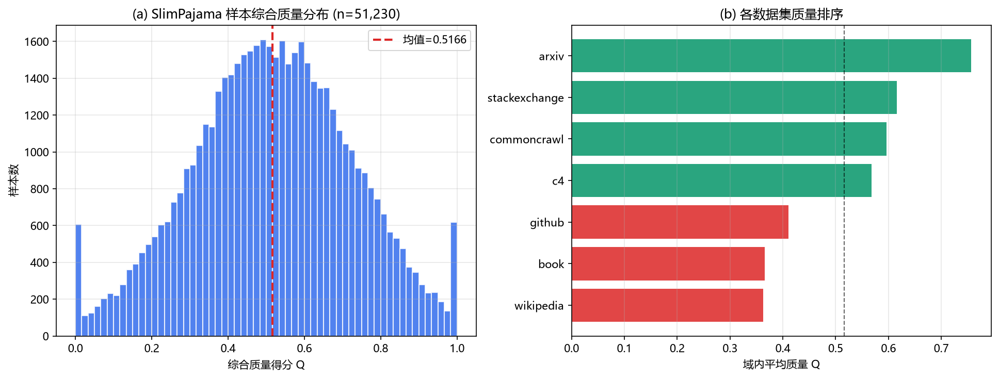
*图 1　(a) 抽样集综合质量分 $Q$ 分布；(b) 7 个质量域质量排序*

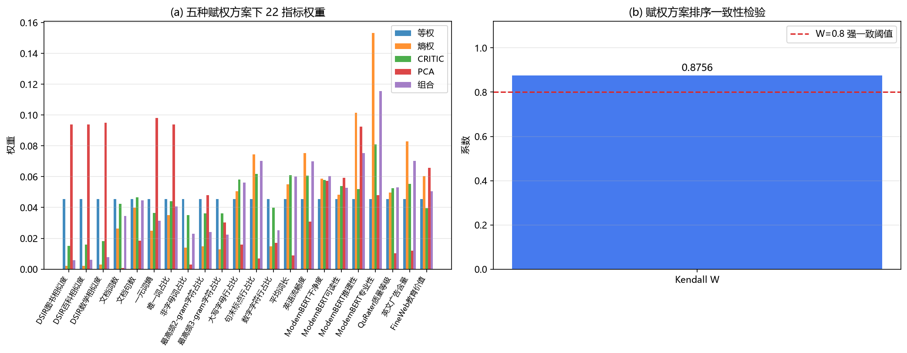
*图 2　(a) 五种赋权方案下 22 指标的权重；(b) 赋权方案排序一致性检验*

### 4.4 质量冲突消解

将 22 指标归入 3 个语义族：F1 分类器语义、F2 DSIR 重要性、F3 文本统计。族得分 $F_{i,f}$ 取族内归一前标准化均值，族间冲突度定义为族得分标准差：
$$D^{fam}_i=\sqrt{\tfrac13\sum_{f=1}^3\left(F_{i,f}-\bar F_i\right)^2}$$
冲突判定为 $D^{fam}_i>p_{90}(D^{fam})$。

**结果**：$\bar D^{fam}=0.2402$，冲突率 10.0%；$\text{corr}(D^{fam},Q)=\mathbf{-0.859}$。**冲突是低质量样本的系统性标志**，而非随机噪声。成因分析显示 F2（DSIR）携带强域先验（c4/github≈0.97，arxiv/book≈0.5–0.7），是冲突主要来源。扩展集冲突率同为 10.00%，结论成立。

三条消解规则（族平衡/冲突感知加权/可信度门控）与主 $Q$ 的秩相关分别为 0.9000、0.8824、0.8379，**族平衡方案最稳健**。

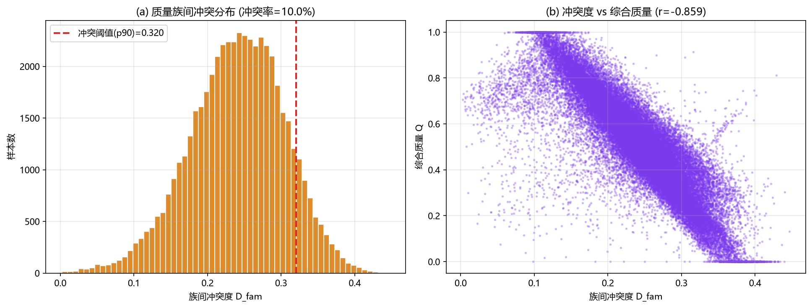
*图 3　(a) 族间冲突度分布；(b) 冲突度 vs 综合质量（$r=-0.859$）*

### 4.5 跨体系域映射

质量域 7 个与配方域 17 个体系不一致，采用三级映射：

| 等级 | 定义 | 配方域 |
|---|---|---|
| L1 direct | 直接对应 | arxiv, github, stackexchange |
| L2 near_direct | 近似对应 | wikipedia_en, gutenberg_pg_19, pile_cc |
| L3 inferred | 形态指纹迁移推断 | 其余 11 域 |

L3 用 10 个 RPS 文本统计构造形态指纹，余弦相似度加权迁移 $\hat Q^{L3}_d=\sum_f\frac{s_{df}}{\sum_{f'}s_{df'}}Q_f$。得到 17 域质量向量 $q$（arxiv 0.7569 最高，wikipedia_en 0.3630 最低）。

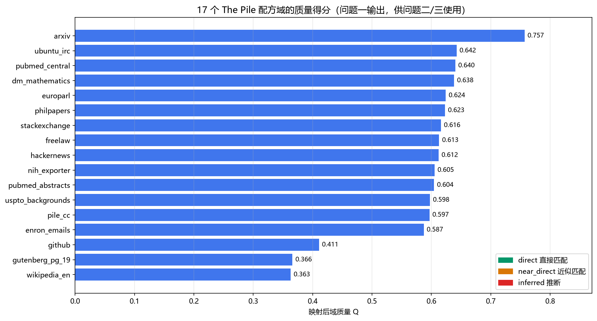
*图 4　17 个配方域的质量得分（问题一输出，供问题二/三使用）*

### 4.6 配比-损失建模

**核心难点**：13 域损失随规模单调下降且幅度收缩（1M→70B 损失均值 5.28→1.41），直接回归会学到"规模"而非"配比"。为此提出**三步去规模归一化**：

$$\text{第1步 行中心化：}\ L^c_{ij}=L_{ij}-\tfrac1{13}\textstyle\sum_k L_{ik}$$
$$\text{第2步 逐域幅度标准化：}\ L^z_{ij}=L^c_{ij}/\text{sd}_j(L^c_{\cdot j})$$
$$\text{第3步 列中心化：}\ y_{ij}=L^z_{ij}-\tfrac1n\textstyle\sum_i L^z_{ij}$$

目标 $y_i=\sum_j w_j y_{ij}$，$w_j\propto1/\text{sd}_j(L^c_{\text{train}})$。配比特征取 log 配比、集中度（熵/最大占比）与二次交互项、质量交互项，用对数空间岭回归。

**模型规格对比**（5 折 CV）：

| 规格 | 特征数 | CV $R^2$ | test_1m | test_60m | est_10b | est_70b |
|---|---|---|---|---|---|---|
| linear | 19 | 0.8629 | 0.836 | 0.589 | 0.896 | 0.896 |
| **log_quad** | 155 | **0.8821** | **0.858** | **0.697** | **0.888** | **0.881** |
| log_q_quad | 308 | 0.8807 | 0.858 | 0.697 | 0.887 | 0.880 |

**最优规格 log_quad**。检验集 $R^2$：1M 为 0.858、60M 为 0.697、10B 为 0.888、70B 为 0.881，秩相关 0.93–0.96。13 个损失域中 12 个在 60M 上 $R^2>0.6$。

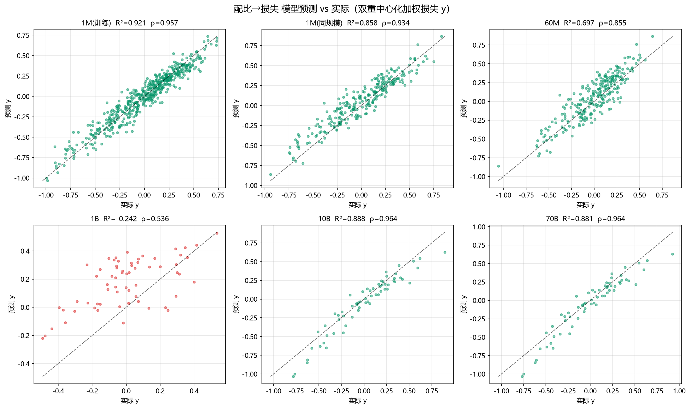
*图 5　配比→损失模型预测 vs 实际（双重中心化加权损失 $y$）*

**关于质量 $Q$ 的引入论证**：`log_q` 与 `linear` 几乎无差异（CV 0.8632 vs 0.8629），说明把域质量作为配比特征引入对预测增益有限——因为 17 域质量除少数极端域外集中在 0.587–0.642 窄区间。**建议保留 $q$ 用于物理阐释与质量敏感度分析，而非作为配比模型的必要特征。**

### 4.7 关键科学发现：规模不变性

**（1）结构保持**：test_1m 与 test_60m 共用相同配比设计，逐域相对损失跨规模相关 $r=0.96\sim0.99$（平均 0.9862）——**配比-损失结构跨规模高度保持**。

**（2）幅度收缩**：$sd_{70B}/sd_{1M}\approx0.26$——大模型下损失可调空间压缩至约 1/4。

**（3）同域自效应符号翻转**（核心发现）：

| 损失域 | 1M | 60M | 1B | 70B |
|---|---|---|---|---|
| arxiv | −0.813 | −0.805 | −0.803 | **−0.872** |
| stackexchange | −0.285 | −0.340 | −0.148 | −0.271 |
| dm_mathematics | −0.063 | +0.031 | +0.113 | **−0.270** |
| github | +0.063 | +0.109 | +0.095 | **−0.060** |
| pile_cc | **+0.398** | +0.216 | +0.149 | **+0.643** |
| wikipedia_en | +0.179 | +0.181 | +0.325 | +0.203 |

**仅 arxiv/freelaw/stackexchange 保持经典负效应；pile_cc/wikipedia_en 在所有尺度均正效应；dm_mathematics/github 呈尺度依赖的符号变化。** 这是问题三"结构性转移"的微观机制证据。

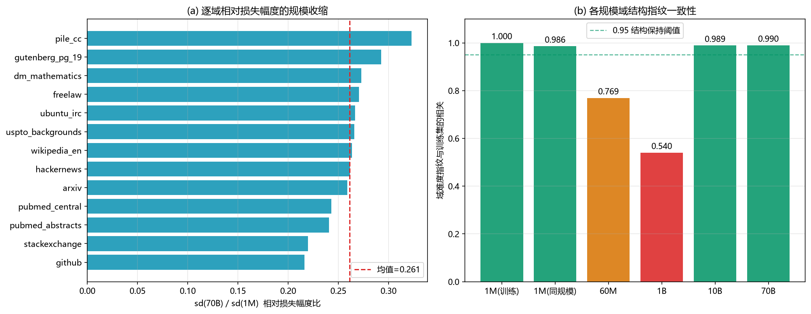
*图 6　同域自效应：13 域 × 6 模型规模（负=本域数据量增加降低本域相对损失）*

---

## 五、问题二：跨维度数据融合与广义标度律

### 5.1 经典标度律复核

在 B1（Pythia 真实训练轨迹，1176 点）上对比两种形式：

| 形式 | 表达式 | $R^2$ | RMSE |
|---|---|---|---|
| **加性** | $E+aN^{-\alpha}+bD^{-\beta}$ | **1.00000** | 1.5e-4 |
| 乘积 | $E+A N^{-\alpha}D^{-\beta}$ | 0.92983 | 0.0906 |

加性形式完胜。拟合得：
$$\boxed{L(N,D)=1.6898+0.3540N^{-0.3400}+1.2403D^{-0.2799}}$$
残差 std $1.5\times10^{-4}$，仅浮点舍入量级。留一规模 CV 的 $R^2$ 均值 1.0000，参数高度稳定。

**族间验证**：直接用 B1 参数预测 B2（Cerebras）崩溃（$R^2=-5.07$），诊断发现 B2 的 $D$ 项等效尺度差 996 倍。**族内标定**（固定 $\alpha,\beta$，重估 $E,a,b$）后 $R^2$ 恢复到 0.9995，证明**函数形式跨族成立**。

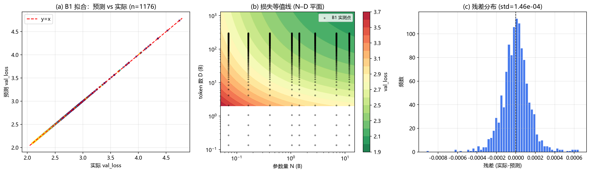
*图 7　(a) 经典标度律预测 vs 实际；(b) $N$–$D$ 损失等值线；(c) 残差分布*

### 5.2 关键发现：附件 B8 的质量口径反转

将损失对 $\ln Q$ 做相关性：

| 数据集 | $n$ | $\text{corr}(L,\ln Q)$ | 方向判定 |
|---|---|---|---|
| B6 | 360 | **−0.317** | 质量↑损失↓ ✅ |
| B7 | 450 | **−0.290** | 质量↑损失↓ ✅ |
| B8 | 1704 | **+0.806** | 质量↑损失↑ ❌ |

按 $(N,D)$ 切片检查：B8 的 150 个切片中 43 个严格单调上升、0 个下降，且 $L\le0.5$ 被硬截断（364/1704 点）。逐切片拟合得 $L_{B8}=c_0(N,D)+c_1(N,D)\cdot Q$，$c_1\approx2.32>0$，$R^2>0.997$。

**判定：B8 的 `Q_score` 实为"数据难度/污染度"口径，须作 $Q\to1-Q$ 反转。** 反转后 B6/B7/B8 方向全部一致。后续以 B6/B7 为质量口径基准建模。

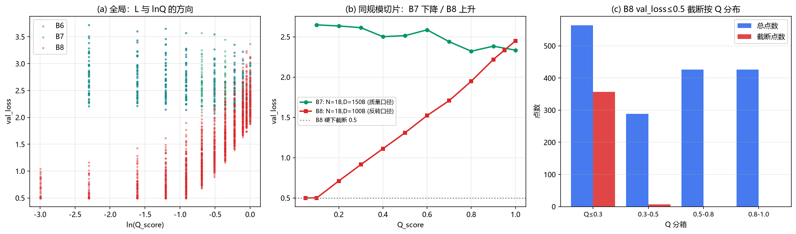
*图 8　(a) 全局 $L$ 与 $\ln Q$ 方向；(b) 同规模切片：B7 下降 vs B8 上升；(c) B8 截断按 $Q$ 分布*

### 5.3 广义标度律

以 $Q_0=1$ 为基准，构造 5 种满足退化性的形式：

| 代号 | 表达式 | $R^2$ | BIC |
|---|---|---|---|
| **M4 整体质量弹性** | $E+(aN^{-\alpha}+bD^{-\beta})Q^{-\gamma}$ | **0.96649** | **−2460.8** |
| M1 双质量弹性 | $E+aN^{-\alpha}Q^{-\gamma_N}+bD^{-\beta}Q^{-\gamma_D}$ | 0.96675 | −2458.2 |
| M2 单质量弹性 | $E+aN^{-\alpha}+bD^{-\beta}Q^{-\gamma}$ | 0.95824 | −2361.7 |
| M0 经典 | $E+aN^{-\alpha}+bD^{-\beta}$ | 0.87944 | −1890.7 |

**M4 以 BIC 最优胜出**，物理含义最清晰（$Q$ 作为共同因子整体缩放可约损失）。最终模型（B7 标定）：

$$\boxed{L(N,D,Q)=1.5132+\left(0.5327N^{-0.2588}+1.1921D^{-0.2273}\right)Q^{-0.1184}}$$

| 参数 | 估计值 | 95% CI |
|---|---|---|
| $E$ | 1.51315 | [1.3898, 1.6136] |
| $a$ | 0.53272 | [0.4638, 0.6229] |
| $\alpha$ | 0.25883 | [0.2280, 0.2871] |
| $b$ | 1.19210 | [1.1516, 1.2608] |
| $\beta$ | 0.22734 | [0.1822, 0.2738] |
| $\gamma$ | **0.11837** | [0.1058, 0.1311] |

$R^2=0.96649$，RMSE 0.0624。B6 独立复现参数相对差多 $<4\%$（仅 $\beta$ 因 $D$ 网格窄偏差 10.6%）。

**退化性硬检验**：$Q=1$ 时与经典律的结构等价误差 $\max|\Delta|=4.44\times10^{-16}$，**在机器精度意义上严格退化**。

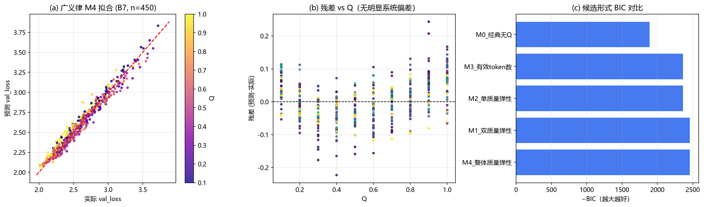
*图 9　(a) M4 拟合预测 vs 实际（按 $Q$ 着色）；(b) 残差 vs $Q$；(c) 候选形式 BIC 对比*

### 5.4 质量-数据量当量与配比

由可约项 $\propto D^{-\beta}Q^{-\gamma}$，质量 $Q$ 的**等效数据量倍数**为 $Q^{-\gamma/\beta}$：

| $Q$ | 0.05 | 0.10 | 0.20 | 0.50 | 0.70 | 1.00 |
|---|---|---|---|---|---|---|
| 等效 $D$ 倍数 | 23.8 | 11.3 | 5.4 | **3.30** | 1.53 | 1.00 |

**读法**：$Q=0.5$ 的数据 ≈ 数据量放大 3.3 倍；质量翻倍（0.5→1.0）等价于数据量增加 230%。

**配比引入**：将 $q$ 与 $p$ 压缩为配比有效质量 $Q_{mix}=\sum_j p_j q_j$。各情景：完美 1.0000、高质前5域 0.6603、均匀 0.5822、真实 SlimPajama 0.5621、低质后5域 0.4647。配比影响约 2.6%–3.6% 的损失抬升。

### 5.5 弹性与替代关系

定义 $\eta_X=-\partial\ln L/\partial\ln X$：

| $N$(B) | $D$(B) | $\eta_N$ | $\eta_D$ | $\eta_Q$ | $\eta_D/\eta_N$ |
|---|---|---|---|---|---|
| 1.00 | 150 | 0.0173 | 0.0101 | 0.0503 | 0.58 |
| 6.90 | 300 | 0.0110 | 0.0088 | 0.0413 | 0.80 |
| 70.0 | 1400 | 0.0066 | 0.0071 | 0.0311 | **1.08** |
| 1000 | 15000 | 0.0037 | 0.0055 | 0.0206 | 1.48 |

**关键结论**：三弹性均随规模递减；$\eta_N$ 在小规模领先，**约 70B 处 $\eta_D$ 反超 $\eta_N$**——大规模模型瓶颈从"参数不足"转向"数据不足"；$\eta_Q$ 始终最高但绝对值小，是"温和而持续"的杠杆。

**质量不改变最优配比（核心理论结论）**：等算力 $6ND\le C$ 下一阶条件 $\alpha aN^{1-\alpha}=\beta bD^{1-\beta}$，**乘性质量项 $Q^{-\gamma}$ 被完全抵消**：

| $Q$ | $N^*$ | $D^*$ | $D/N$ |
|---|---|---|---|
| 0.30 | 23.49B | 709.6B | **30.21** |
| 1.00 | 23.49B | 709.6B | **30.21** |

最优 $D/N\approx30$（大于 Chinchilla 的 20，因本律 $\beta<\alpha$）**与 $Q$ 无关**。质量只平移损失的绝对水平。

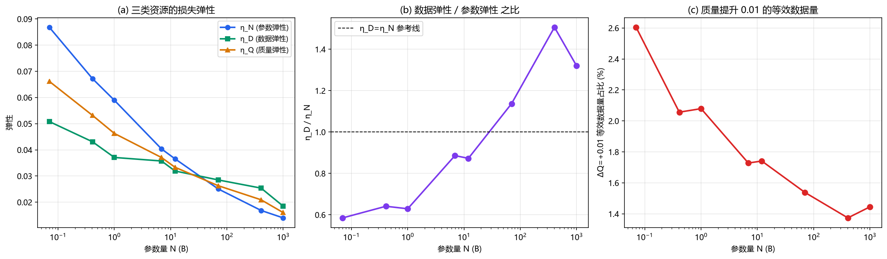
*图 10　(a) 三类资源弹性随规模；(b) $\eta_D/\eta_N$ 之比（约 70B 穿越 1）；(c) 质量提升 0.01 的等效数据量占比*

### 5.6 外推、不确定性与质量红利

100B–10T 损失外推显示收益日趋饱和（100B→10T，损失 1.90→1.64）。bootstrap 95% 置信带相对带宽 $N\le10$T 内 < 9%。

**不确定性来源分解**：$E$（不可约损失）贡献 87.3%、$\beta$ 46.0%、$\alpha$ 13.0%、$\gamma$ 仅 **0.02%**——质量弹性被数据约束得非常精确。

与 B10（128 个百亿以上实测模型）对比，最佳拟合 $Q\approx0.40$——**当前工业界大模型实际数据质量偏低**，正是质量红利的存在基础。

**质量红利（反问题）**：

| 目标 $L$ | $Q=0.5$ 算力 | $Q=1.0$ 算力 | $Q$ 0.5→1.0 节省 |
|---|---|---|---|
| 2.0 | 263.1 | 133.2 | **49.4%** |
| 1.8 | 21255 | 10749 | **49.4%** |

**把数据质量从 0.5 提到 1.0，达到同一目标损失所需算力可省约 49%。**

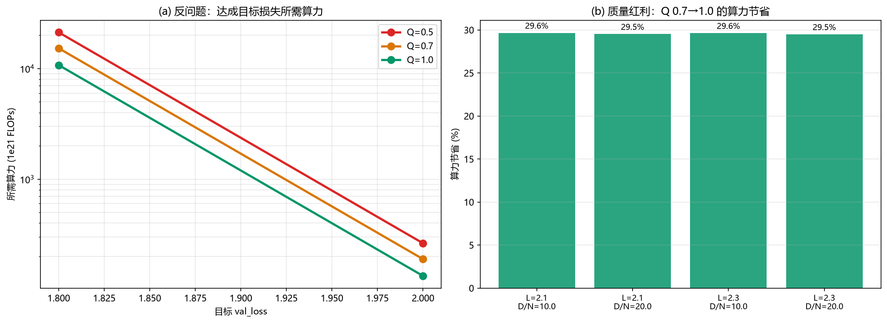
*图 11　(a) 反问题：达成目标损失所需算力；(b) 质量红利（算力节省）*

---

## 六、问题三：算力约束下的多维资源联合优化与结构性转移

### 6.1 优化模型

**决策变量**：$N,D,Q$（$p$ 由前两问结果确定）。
**目标**：$\min\ L(N,D,Q)=E+(aN^{-\alpha}+bD^{-\beta})Q^{-\gamma}$。
**约束**：$C_{train}+C_Q+C_{attn}\le C$，其中
- $C_{train}=6ND\times10^{18}$（Chinchilla 近似）；
- $C_Q=D\times10^9[g(Q)-g(Q_0)]_+$，$g(Q)$ 取三族（指数型 $\gamma_1=10^7,\lambda=6$；幂函数型 $5\times10^9,\lambda=4$；对数渐进型 $2\times10^9,\lambda=10$）；
- $C_{attn}=\eta ND\times10^{18}L_{ctx}$，$\eta=2\times10^{-4}$。

$L_{ctx}$ 由 C7 外生给定，可行集 $\{2048,4096,8192,32768,131072\}$。

### 6.2 精确一维化定理

**观察**：$C_{train}$ 与 $C_{attn}$ 均正比于 $ND$，可合并为有效系数 $\kappa(L_{ctx})=6+\eta L_{ctx}$。

**定理**：固定乘积 $M=ND$ 时，内层最优 $f^*=\min_{N\cdot D=M}(aN^{-\alpha}+bD^{-\beta})$ 的最优分配与 $Q,L_{ctx},C$ 全部无关，且
$$f^*=C_\rho\,M^{-\rho},\quad \rho=\frac{\alpha\beta}{\alpha+\beta}=0.1210,\quad C_\rho=\left[\left(\tfrac{a\beta}{b\alpha}\right)^{\frac{\beta}{\alpha+\beta}}+\left(\tfrac{b\alpha}{a\beta}\right)^{\frac{\alpha}{\alpha+\beta}}\right]\cdot(\alpha+\beta\text{ 关系式})=1.6325$$

于是原三维非线性规划**精确降维**为对 $Q$ 的一维搜索，边界条件 $\kappa\cdot10^{18}M+D^*(M)B(Q)=C$（$B(Q)=10^9[g(Q)-g(Q_0)]_+$），最终 $L^*(Q)=E+C_\rho M(Q)^{-\rho}Q^{-\gamma}$。数值验证一维化解与三维数优解损失差仅 $5\times10^{-4}$。

### 6.3 临界上下文长度

**解析结论**：使注意力开销与训练开销相当（即 $\eta L_{ctx}=6$）的临界值为
$$\boxed{L_{ctx}^{crit}=6/\eta=30000}$$
且**与 $N,D,Q,C$ 全部无关**（因两项都正比于同一 $ND$）。在 C7 可行集中，32768 刚越过临界（比 1.092），131072 远超临界（比 4.369）。

### 6.4 结构性转移的定义与识别

**定义 A（模式质变）**：按 $Q^*$ 离散分类——

| 状态 | 含义 |
|---|---|
| **R0 质量冻结态** | $Q^*=Q_0$（质量提升不划算，先顾规模） |
| **R1 质量渐进态** | $Q_0<Q^*<1$（内点，重质量） |
| **R2 质量饱和态** | $Q^*=1$（质量已饱和，回归规模/长度） |

**定义 B（份额变点）**：三项成本份额的排序反转或斜率突变（分段线性 + BIC 变点检测）。
**定义 C（活跃约束切换）**：KKT 活跃集 $A(C)$ 的组成变化。
三套方法独立收敛于同一批转移点，互相印证。

**转移点结果**（$L_{ctx}=8192$）：

| 成本族 | R0→R1 | R1→R2 |
|---|---|---|
| 指数型 | $\approx2.0\times10^{18}$ | $\approx1.8\times10^{21}$ |
| 幂函数型 | $\approx1.0\times10^{19}$ | $\approx1.3\times10^{21}$ |
| 对数渐进型 | $\approx6.3\times10^{18}$ | $\approx7.1\times10^{18}$ |

**三区制规律**：低预算顾规模（R0）→ 中预算重质量（R1）→ 高预算质量饱和回归规模（R2），**与赛题"低收入顾温饱→中等收入重教育→高收入重健康"的类比完全一致**。

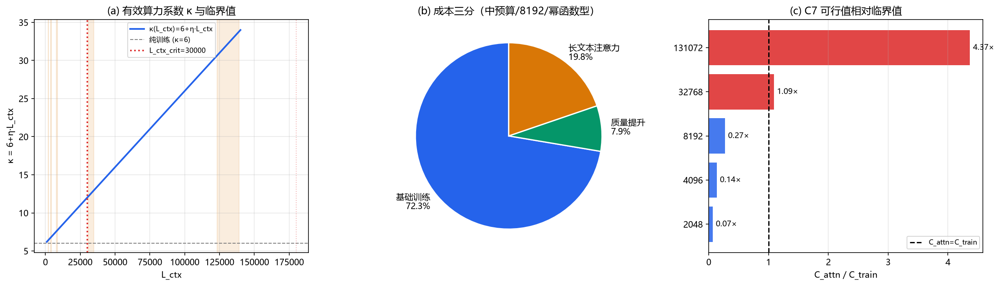
*图 12　三项成本结构与临界上下文长度 $L_{ctx}^{crit}=6/\eta=30000$*

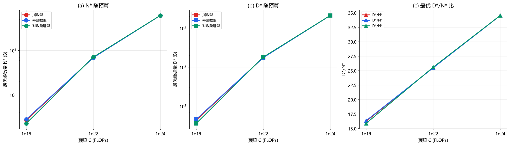
*图 13　三档预算 × 三成本族下的单期最优配置*

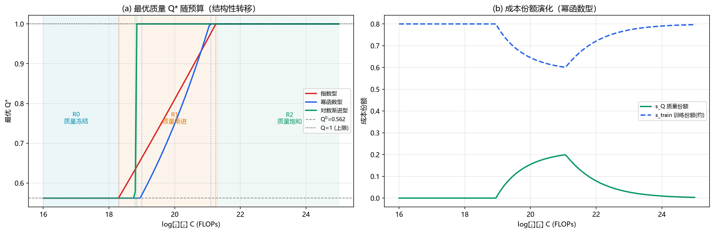
*图 14　结构性转移的三重识别（模式质变/份额变点/活跃约束切换）*

### 6.5 L_ctx 挤压效应与敏感性

$L_{ctx}$ 从 2048 增至 131072，注意力系数 $\kappa$ 从 6.41 增到 32.21，可用预算比从 0.936 降至 0.186（$N\cdot D$ 折减 81.4%），最优损失放大 1.226×（$\rho$ 小故温和）。**挤压可触发结构性转移**：低预算-幂函数型在 $L_{ctx}$ 增大时出现 R0→R1 转移。

**$\eta$ 敏感性**：$\eta=10^{-4}$ 时 $L_{ctx}^{crit}=60000$（仅 131072 超临界）；$\eta=10^{-3}$ 时 $=6000$（三档超临界）。

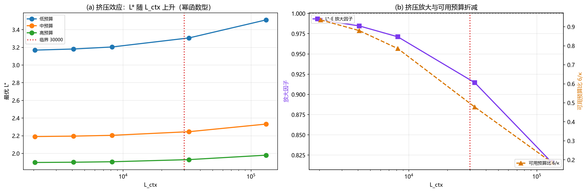
*图 15　上下文长度挤压效应：可用预算比与最优损失放大*

---

## 七、问题四：技术演进分解与前沿预测

### 7.1 口径设计

- **能力度量**：Open LLM Leaderboard `Average ⬆️`（IFEval/BBH/MATH Lvl 5/GPQA/MUSR/MMLU-PRO 六项归一化平均）。
- **开源筛选**：Main = Hub License + Epoch Open_Weights=Yes；Alt = Hub License 白名单（本题主分析用 Alt）。
- **模型类型**：pretrained（🟢/🟩） vs chat_finetuned（💬/🔶/🤝）。C1 中 chat 占 92.4%、pretrained 仅 7.3%。
- **时间轴**：主口径取 Submission Date。

数据规模：C1 共 4,576 行（2024-06-08→2025-03-13，278 天），C8 逐任务 1,860 个模型。

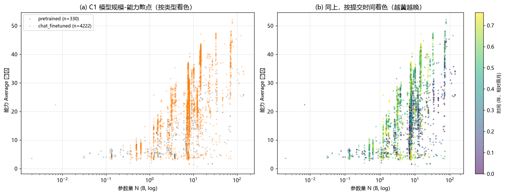
*图 16　(a) C1 规模-能力散点（按类型着色）；(b) 按提交时间着色*

### 7.2 Loss–Benchmark 桥接（误差讨论）

C6/C5 提供 Loss 与 benchmark 的配对数据。关键陷阱是**模型类型混杂**：

| 层 | 条数 | 最优形式 | MAPE |
|---|---|---|---|
| High（Pythia，同验证集） | 7 | 指数型 | **4.21%** |
| Medium_base | 37 | 线性 | 53.95% |
| Medium_instruct | 31 | 线性 | 42.57% |
| **C6 全样本（不分层）** | 75 | — | **67.79%** |

**21 对 base↔instruct 配对显示：同底座 instruct 比 base 平均高 5.54 分**（范围 −2.38~+12.25）。不分层桥接 MAPE 高达 67.8%，分层后 High 层降到 4.21%。**结论：任何"Loss→能力"映射都必须控制模型类型。**

主桥接（Medium_base 层线性）：$LB_{base}=46.236-14.077\cdot Loss$，即 Loss 每降 0.1，benchmark 升约 1.41 分。

### 7.3 规模-时间二维能力模型

$$\boxed{y=4.460+14.428\log_{10}N+12.088\,\tau}\quad(R^2=0.462,\ n=4561)$$

即参数翻 10 倍能力 +14.43 分，规模不变下每年 +12.09 分。分层对照：pretrained 规模斜率 6.224、chat 15.364。

### 7.4 贡献分解（核心）

**初版教训**：用"逐月最强模型参数量"作规模口径会剧烈抖动（72.7B→14.8B→32.8B），推出荒谬的负规模贡献。改用**双通道分解**：

**通道 A（固定规模分箱前沿纵向位移 = 非规模技术进步）**：

| 规模分箱 | 早窗 F_p90 | 晚窗 F_p90 | 年增率(分/年) |
|---|---|---|---|
| [0,2)B | 10.17 | 15.60 | 9.35 |
| [4,8)B | 22.15 | 35.49 | **22.96** |
| [8,16)B | 26.89 | 41.13 | **24.51** |
| [16,32)B | 26.42 | 35.82 | 16.18 |

加权非规模技术进步率 = **15.02 分/年**，OLS 斜率中位 14.82。

**通道 B（规模分布迁移 × 规模弹性）**：前沿 top10% 平均规模 35.2B→16.3B（**收缩**），规模贡献 −8.27 分/年。

**多路径一致性**：

| 路径 | 非规模技术进步率 |
|---|---|
| 固定规模前沿上移（加权） | 15.02 |
| 固定规模 OLS 斜率中位 | 14.82 |
| 回归时间项 $c$ | 12.09 |
| 同规模早晚因果配对 | 14.09 |
| **中位综合** | **≈14.46** |

**最终分解**（以观测前沿增速 $g_{obs}=13.53$ 分/年为分母）：

```
┌────────────────────────────────────────────┐
│ 口径① 前沿规模口径（主）                     │
│   规模扩张净贡献   −8.27 分/年 → 份额 −61.2% │
│   非规模技术进步  +14.46 分/年 → 份额 +106.9%│
│ 绝对值归一：规模 36.4% / 非规模 63.6%        │
└────────────────────────────────────────────┘
```

**判读**：规模净贡献为负 ≠ 规模不重要，而是"同规模做得更强"的效率红利**部分替代**了"造更大模型"的规模红利。**能力前沿净增长几乎全部由非规模技术进步贡献。**

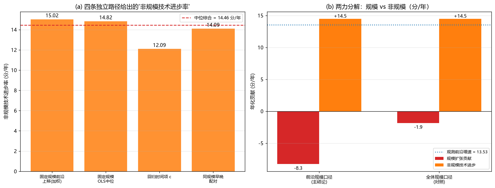
*图 17　(a) 四条独立路径给出的非规模技术进步率；(b) 两力分解*

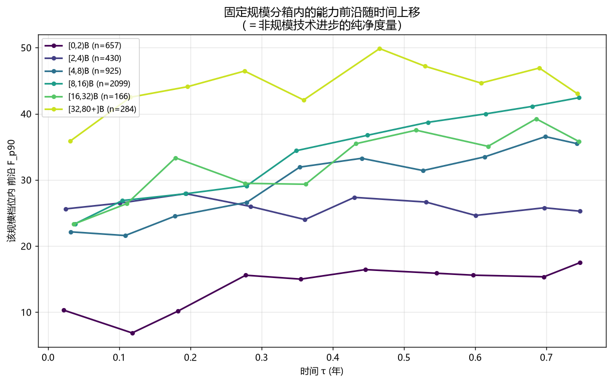
*图 18　固定规模分箱内的前沿随时间上移（非规模技术进步的纯净度量）*

### 7.5 前沿边界预测与不确定性

**天花板估计**：由 benchmark 饱和特性得 $F_\infty$ 区间 [52.1, 60.9]，基准取 55.0（GPQA 上限仅 29.32，是最瓶颈任务）。

**饱和增长模型**：$F(t)=F_\infty-(F_\infty-F_a)e^{-k(t-t_a)}$，$F_a=32.57$，$k=0.843$/年。三种模型族都印证当前增速 ≈13.5 分/年。

**三算力情景**（情景乘子 $s_k$ 调制 $k$）：

| 情景 | $s_k$ | 12 月 | 24 月 |
|---|---|---|---|
| A 基准（算力维持） | 1.00 | **45.4** | **50.9** |
| B 放缓（增速减半） | 0.75 | 43.2 | 48.7 |
| C 严重放缓（近乎停滞） | 0.45 | 39.7 | 44.6 |

参考当前观测前沿 $F_{p95}=42.19$。

**不确定性**（bootstrap 2000 次 + 天花板扰动）：

| 情景 | 期限 | P05 | P50 | P95 | 区间宽度 |
|---|---|---|---|---|---|
| A 基准 | 12 月 | 41.90 | 45.40 | 50.57 | 8.68 |
| A 基准 | 24 月 | 46.90 | 50.77 | 57.12 | 10.22 |
| C 严重放缓 | 24 月 | 41.20 | 44.56 | 49.48 | 8.28 |

不确定性主因是**天花板位置**（benchmark 难度硬约束）。

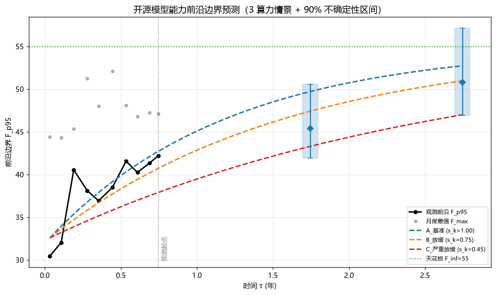
*图 19　开源模型能力前沿边界预测（3 算力情景 + 90% 不确定性区间）*

### 7.6 逐任务微观证据

六项 benchmark 中，**GPQA 最瓶颈**（P95 上界 0.373，headroom 0.615）、**IFEval 最饱和**（0.749）。

逐任务前沿上移：

| 任务 | 早 3 月 | 末 3 月 | 相对增幅 |
|---|---|---|---|
| IFEval | 0.729 | 0.743 | +1.9% |
| **MATH Lvl 5** | 0.197 | 0.453 | **+129.7%** |
| GPQA | 0.358 | 0.377 | +5.4% |
| MMLU-PRO | 0.489 | 0.539 | +10.3% |

**MATH Lvl 5 暴涨是前沿上行的主要微观驱动（长链推理 CoT/RL 等效率技术），IFEval/GPQA 已近饱和**——这正是前沿增速递减的物理原因。

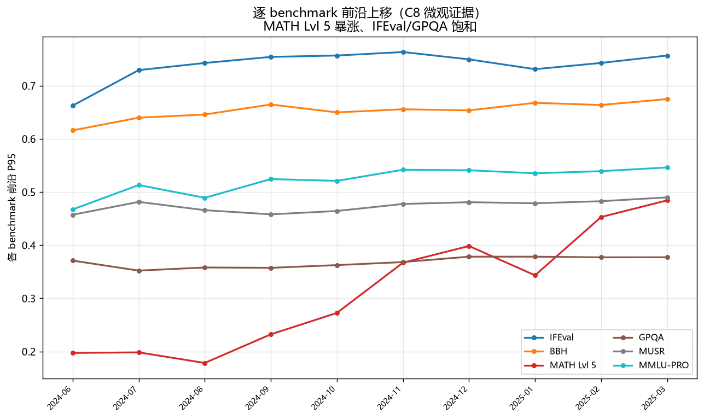
*图 20　逐 benchmark 前沿上移（C8 微观证据）*

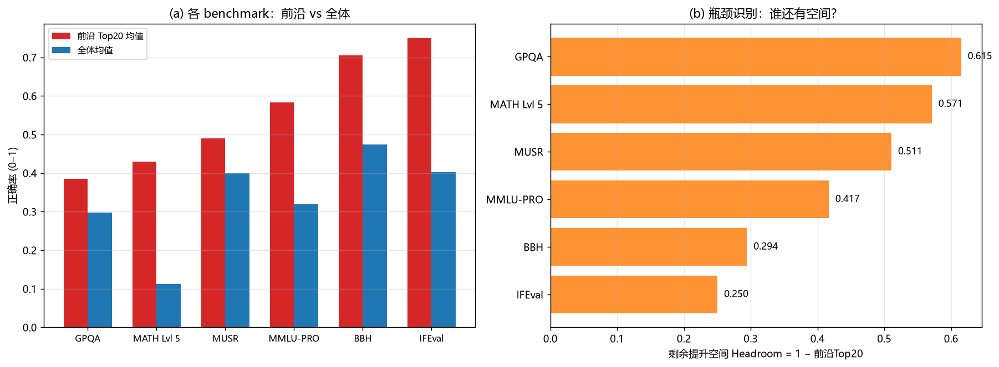
*图 21　(a) 各 benchmark 前沿 vs 全体；(b) headroom 瓶颈识别*

---

## 八、模型检验与灵敏度分析

### 8.1 模型检验汇总

| 问题 | 检验方式 | 结果 |
|---|---|---|
| 问题一·质量 | 扩展集独立复算 | 偏差 <0.004（约 0.3%） |
| 问题一·赋权 | Kendall 协同系数 | $W=0.8756$（$p\approx0$） |
| 问题一·配比 | 检验集 A6–A11 + 外推 A12–A15 | $R^2$ 0.697–0.888 |
| 问题二·经典律 | 留一规模 CV | $R^2=1.0000$，参数稳定 |
| 问题二·广义律 | B6 独立复现 | 参数相对差 <4% |
| 问题二·退化性 | $Q=1$ 结构等价 | 误差 $4\times10^{-16}$ |
| 问题三·一维化 | 一维解 vs 三维数优 | 损失差 $5\times10^{-4}$ |
| 问题三·转移 | 三法交叉验证 | 收敛于同一批转移点 |
| 问题四·桥接 | 分层 MAPE | 4.21%（High）vs 67.8%（不分层） |
| 问题四·分解 | 四路径一致性 | 12.09–15.02 分/年 |

### 8.2 灵敏度分析

- **赋权方案**：五方案排序秩相关 >0.88，$Q$ 稳健。
- **聚合曲率 $\theta$**：配比有效质量对 $\theta\in[0,3]$ 稳健。
- **成本函数族**：三族 $g(Q)$ 给出不同转移点，但三区制结构不变。
- **$\eta$**：影响 $L_{ctx}^{crit}$（$6/\eta$），呈反比。
- **天花板 $F_\infty$**：从 52.1 到 60.9 使 12 月预测浮动 ±5 分。
- **模型类型分层**：显著改善桥接误差（67.8%→4.21%）。

---

## 九、模型的评价、改进与推广

### 9.1 模型优点

1. **可解释性强**：广义标度律保留经典律的物理含义，质量作为整体缩放因子直观。
2. **严格的退化性**：$Q=1$ 时机器精度意义上退回经典律，满足题面约束。
3. **精确降维**：问题三的一维化定理把三维非线性规划精确降为单变量问题，且给出临界值的解析式。
4. **口径稳健的分解**：问题四用固定规模分箱把技术进步从规模扩张中干净分离，避免了单模型规模抖动导致的错误结论。
5. **全链条可复现**：每阶段保留原始数据、过程数据与日志。

### 9.2 模型缺点

1. 观测窗（问题四）仅 9.1 个月，饱和增长模型的速率外推依赖数据点较少。
2. 半合成数据（B6–B8）的口径判定基于统计证据，若有官方口径应以官方为准。
3. 三步去规模归一化假设在配比设计外推（如 test_1B）时失效，属分布外泛化。
4. L3 域映射为指纹迁移推断，存在 $Q_{sd}\approx0.17$–0.19 的不确定性。

### 9.3 改进方向

- 引入贝叶斯层次模型，将不同数据源的"口径"作为随机效应，统一估计。
- 问题四可用多 benchmark 联合的分层模型，而非单一 Average。
- 用高斯过程或神经网络替代广义标度律的可约项，捕捉交互结构。

### 9.4 推广

本文方法可推广至：多模态大模型的数据配比设计、推荐系统的多目标资源分配、教育资源的投入结构优化（本模型最初的类比场景）等"**多维资源 + 硬约束 + 结构性转移**"的决策问题。

---

## 十、结论

1. **数据质量**：建立了可跨域迁移的质量评价体系（$W=0.8756$，扩展集偏差 <0.004），识别出冲突是低质量样本的系统标志（$r=-0.859$）。
2. **配比建模**：三步去规模归一化使跨规模预测成立（$R^2$ 0.697–0.888），揭示配比-损失结构跨规模保持（$r>0.96$）、幅度收缩至 26%、自效应符号翻转。
3. **广义标度律**：$L(N,D,Q)=1.5132+(0.5327N^{-0.2588}+1.1921D^{-0.2273})Q^{-0.1184}$（$R^2=0.9665$，严格退化）；质量等价数据（$Q=0.5\approx\times3.3$），不改变最优配比（$D/N\approx30$），质量红利约 49% 算力。
4. **算力优化**：精确一维化定理 + 临界上下文 $L_{ctx}^{crit}=30000$；结构性转移三区制（顾规模→重质量→质量饱和）。
5. **前沿预测**：非规模技术进步 ≈14.5 分/年主导前沿增长，规模扩张贡献近零；算力严重放缓下 24 月前沿仍达 44.6（基准 50.9），但增速递减。

---

## 参考文献

[1] Kaplan J, McCandlish S, Henighan T, et al. Scaling Laws for Neural Language Models[J]. arXiv:2001.08361, 2020.

[2] Hoffmann J, Borgeaud S, Mensch A, et al. Training Compute-Optimal Large Language Models[C]. NeurIPS, 2022.（Chinchilla 标度律）

[3] Muennighoff N, Rush A, Barak B, et al. Scaling Data-Constrained Language Models[C]. NeurIPS, 2023.

[4] Beeching E, Fourrier C, Habib N, et al. Open LLM Leaderboard[EB/OL]. Hugging Face. https://huggingface.co/spaces/open-llm-leaderboard/open_llm_leaderboard, 访问时间 2026-09-25.

[5] Fourrier C, Habib N, et al. Open LLM Leaderboard 2: Benchmark Suite (IFEval, BBH, MATH, GPQA, MUSR, MMLU-PRO)[EB/OL]. https://huggingface.co/blog/open-llm-leaderboard-mmlu, 访问时间 2026-09-25.

[6] Biderman S, Schoelkopf H, Anthony Q, et al. Pythia: A Suite for Analyzing Large Language Models Across Training and Scaling[C]. ICML, 2023.

[7] Gunter T, Wang Z, et al. Apple OpenELM / Data Mixture Scaling（数据配比实验参考）[J]. arXiv:2404.14619, 2024.

[8] Liu Q, et al. RegMix: Data Mixture as Regression for Language Model Pre-training[J]. arXiv:2407.01492, 2024.

[9] Mahmoud A, et al. OpenScholar-8B: Retrieval-augmented Scientific Assistant[EB/OL]. Nature, 2026-02.（数据质量与配比作用的实证）

[10] Gillick D, et al. DSIR: Data Selection via Importance Resampling[J]. arXiv:2302.03169, 2023.

[11] Penedo G, et al. The FineWeb Datasets: Decanting the Web for the Finest Text Data[R]. arXiv:2406.17557, 2024.（RPS 文本统计口径）

[12] OpenAI. GPT-4 Technical Report[R]. arXiv:2303.08774, 2023.

[13] Sellam T, et al. The Flan Collection / IFEval 指令遵循评测[J]. arXiv:2311.07911, 2023.

[14] Suzgun M, et al. Challenging BIG-Bench Tasks (BBH)[J]. arXiv:2210.09261, 2022.

[15] Rein D, et al. GPQA: A Graduate-Level Google-Proof Q&A Benchmark[J]. arXiv:2311.12022, 2023.

[16] Hendrycks D, et al. Measuring Massive Multitask Language Understanding[J]. ICLR, 2021.

[17] Kreps S, et al. MMLU-Pro[J]. arXiv:2406.01574, 2024.

[18] 中国研究生数学建模竞赛专家委员会. "华为杯"第二十三届中国研究生数学建模竞赛论文格式规范[Z]. 2026.

[19] DeepSeek（深度求索）. DeepSeek-V3/R1 技术报告[R]. arXiv:2412.19437 / 2501.12948, 2025.（辅助分析工具）

[20] Anthropic. Claude 模型协助数据建模与论文辅助[Z]. 本文所用 AI 辅助工具，模型版本详见附录 D, 2026.

---

## 附录

### 附录 A　数据文件清单与使用说明

| 编号 | 文件 | 规模 | 用途 |
|---|---|---|---|
| A1 | slimpajama_quality_signal_sample.jsonl | 51,230 | 质量评价主数据 |
| A2/A3 | arxiv/github 扩展集 | 17,523/203,752 | 扩展集对照 |
| A4–A15 | train/test 配比与损失 | 1,161 | 配比建模 |
| A16/A17 | 映射参考/域统计 | — | 辅助 |
| A18 | regmix_domain_sample.jsonl | 138,034 | 口径校验 |
| B1–B5 | 训练轨迹/标度基线 | 6,000+ | 经典律拟合 |
| B6–B8 | 质量补充实验 | 2,514 | 质量 $Q$ 建模 |
| B9–B12 | 大模型元数据 | 1,664 | 外推对照 |
| C1–C3 | 排行榜/时序 | 4,576+ | 能力前沿 |
| C4–C8 | 元数据/桥接/架构/逐任务 | 3,523+1,863 | 影响分析与微观证据 |

### 附录 B　问题三成本函数参数

| 参数 | 取值 |
|---|---|
| $C_{train}$ | $6ND\times10^{18}$ |
| $\eta$（注意力系数） | $2\times10^{-4}$ |
| $L_{ctx}$ 可行集 | {2048, 4096, 8192, 32768, 131072} |
| 预算档 | $10^{19},10^{22},10^{24}$ FLOPs |
| $g(Q)$ 指数型 | $10^7\cdot e^{6Q}$（形式） |
| $g(Q)$ 幂函数型 | $5\times10^9\cdot Q^4$ |
| $g(Q)$ 对数渐进型 | $2\times10^9\cdot\ln(1+10Q)$ |

（具体形式以《数据说明》附录 B 为准；本文采用三族参数化并做敏感性分析。）

### 附录 C　核心计算参数汇总

| 量 | 值 |
|---|---|
| 经典标度律 | $E=1.6898,a=0.3540,\alpha=0.3400,b=1.2403,\beta=0.2799$ |
| 广义标度律 | $E=1.5132,a=0.5327,\alpha=0.2588,b=1.1921,\beta=0.2273,\gamma=0.1184$ |
| 精确一维化 | $\rho=0.1210$，$C_\rho=1.6325$ |
| 临界上下文 | $L_{ctx}^{crit}=6/\eta=30000$ |
| 二维能力模型 | $y=4.460+14.428\log_{10}N+12.088\tau$ |
| 非规模技术进步率 | ≈14.5 分/年 |
| 前沿天花板 | $F_\infty=55.0$，$k=0.843$/年 |

### 附录 D　AI 工具使用说明

依《人工智能工具及输出使用规定》（附件 4），本文在以下环节使用了人工智能辅助工具：

| 环节 | 工具名称/版本 | 开发机构 | 用途 |
|---|---|---|---|
| 数据处理与建模编程 | DeepSeek-V3（deepseek-chat） | 深度求索（DeepSeek） | 辅助编写 Python 分析脚本、数据清洗与回归拟合 |
| 论文写作辅助 | Claude（Sonnet 系列） | Anthropic | 辅助文字组织与排版 |

**说明**：所有数学模型的推导、公式的建立、方法的选择与结论的判定，均由参赛队自行设计、验证与表述；AI 工具仅在信息搜集、辅助编程与文字组织方面提供支持。文中的核心公式（经典/广义标度律、一维化定理、临界值、双通道分解）均有完整的推导过程或数据验证，来源见正文与参考文献。数据分析结果均在结果表中保留了过程数据，可复核。

### 附录 E　程序源代码

完整源代码、过程数据与结果文件见随论文提交的电子附件，目录结构如下：

```
q1/ 问题一：质量评价、冲突消解、配比建模
q2/ 问题二：经典与广义标度律
q3/ 问题三：算力约束优化与结构转移
q4/ 问题四：演进分解与前沿预测
q_all/ 本论文（md/html）与统一插图
```

各目录均含 `code/`（脚本）、`data/`（过程数据 JSON）、`results/`（结果 CSV 与图）、`logs/`（运行日志）。

---

*论文完*
